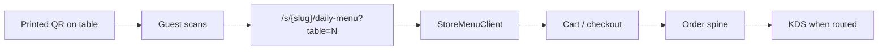

# QR code ordering plan — OS Kitchen

**Policy:** `qr-code-ordering-plan-v1`  
**Date:** 2026-06-02  
**Owner:** Product + Storefront + FOH Engineering  
**Scope:** Guest scan-to-order via storefront QR — **not** kiosk hardware or third-party QR aggregators  
**Status:** **Phase 1 shipped (basic)** — **table→KDS wiring partial · no staging E2E PASS · pilot NO-GO**

This document defines the **QR ordering strategy**: what guests can do today, what operators can configure, what remains roadmap, and how sales should describe scan-to-order vs Toast/TouchBistro table apps.

**Honesty rule:** QR **generation and daily-menu ordering** exist, but **full table-service integration** (floor plan, pay-at-table, certified rush-hour path) does **not**. [`sales-limitation-sheet.md`](./sales-limitation-sheet.md): floor plan / realtime table state is **BETA — not live occupancy**.

**Related:** [`qr-ordering-pilot-story.md`](./qr-ordering-pilot-story.md) · [`feature-maturity-matrix.md`](./feature-maturity-matrix.md) · [`POS_ARCHITECTURE.md`](./POS_ARCHITECTURE.md) · [`gift-cards-loyalty-plan.md`](./gift-cards-loyalty-plan.md) · [`toast-gap-analysis.md`](./toast-gap-analysis.md) · [`offline-pos-plan.md`](./offline-pos-plan.md)

---

## Executive summary

| Dimension | Today (June 2026) |
|-----------|-------------------|
| **QR generation** | Shipped — `/dashboard/storefront` · `QRGenerator` |
| **QR API** | `POST /api/storefront/qr` → PNG data URL |
| **Guest URL** | `/s/{slug}/daily-menu?table={id}` |
| **Table badge** | UI label only on daily menu page |
| **Cart / checkout** | Standard storefront path — `StoreMenuClient` |
| **Order → KDS** | Via normal storefront order spine — **table metadata gap** |
| **Table service / floor plan** | **`preview`** — not production-certified |
| **Pay-at-table / tab** | Bar tabs **preview** — separate from QR |
| **Self-service kiosk** | **Roadmap Q4 2026** — per marketing FAQ |
| **Live operator proof** | **0** paying customers |

**Safe headline:** “Generate QR codes that open your published daily menu — guests order from their phone; table number shows on the menu page.”

**Forbidden:** “Full-service QR table service,” “Realtime floor plan sync,” “Toast QR parity,” “Kiosk ordering live.”

---

## Guest journey today

| Step | Shipped? | Gap |
|------|:--------:|-----|
| Scan opens menu | ✅ | Storefront must be **published** |
| Table number visible | ✅ | Display-only — `table` query param |
| Add to cart | ✅ | Same as web preorder |
| Payment | ✅ if Stripe Connect configured | Otherwise manual/external per pilot |
| Table on `Order` record | ⚠️ Partial | Must verify metadata on checkout — **Phase 2** |
| Expo “Table N” on KDS ticket | ⚠️ Partial | Depends on order metadata wiring |
| Split check / tab | ❌ | [`BILL_SPLITTING.md`](./BILL_SPLITTING.md) — POS preview |

**Code paths:**

| Component | Path |
|-----------|------|
| QR generator UI | `components/storefront/qr-generator.tsx` |
| Admin embed | `app/dashboard/storefront/page.tsx` |
| QR API | `app/api/storefront/qr/route.ts` |
| Guest menu | `app/s/[storeSlug]/daily-menu/page.tsx` |
| Menu client | `components/storefront/store-menu-client.tsx` |

---

## Maturity phases

| Phase | Name | Scope | Status | Sales |
|:-----:|------|-------|--------|-------|
| **1** | **QR → daily menu** | Generate QR, optional table param, storefront checkout | **Shipped** | “QR menu ordering — BETA” |
| **2** | **Table metadata on orders** | Persist `table` on order + KDS ticket label | Planned H2 2026 | “Table number on kitchen ticket” |
| **3** | **Table service integration** | Link QR to floor plan / `table-service` | **`preview`** | Do not sell floor plan parity |
| **4** | **Pay-at-table** | Stripe checkout at table, close tab | Roadmap 2027 | Not in pilot SOW |
| **5** | **Kiosk mode** | Dedicated fullscreen tablet flow | **Q4 2026 target** | FAQ says “planned” — not live |
| **6** | **Offline / degraded QR** | Menu cache when guest offline | Tied to [`offline-pos-plan.md`](./offline-pos-plan.md) | Defer |

---

## Phase 2 — Table metadata (target H2 2026)

Gate before claiming “orders route to kitchen with table number”:

| # | Task | Owner |
|---|------|-------|
| 2.1 | Pass `table` from daily menu → cart session (cookie/localStorage) | Eng |
| 2.2 | Attach `tableId` / `tableLabel` on `OrderCreateInput` at storefront checkout | Eng |
| 2.3 | KDS ticket renders table label when present | Eng |
| 2.4 | Staging E2E: scan URL → order → KDS bump | QA |
| 2.5 | Print QR runbook for operators (size, placement, Wi‑Fi) | CS |
| 2.6 | Marketing audit — qualify “built-in QR” claims on solution pages | Marketing |

**Acceptance:** One design-partner venue runs 20 QR orders with correct table on KDS — pilot notes artifact.

---

## Phase 3 — Floor plan linkage (preview → beta)

Depends on [`feature-maturity-matrix.md`](./feature-maturity-matrix.md) **Tables and restaurant service** (`preview`):

| Item | Detail |
|------|--------|
| **Floor plan editor** | BETA — not realtime occupancy |
| **Table entity** | `services/restaurant/table-service.ts` |
| **QR binds to table UUID** | Replace free-text table id in URL |
| **Server assignment** | Roadmap — not Phase 3 MVP |
| **Honesty** | No “live floor plan” until occupancy sync proven |

**Disqualify** full-service operators needing TouchBistro-grade table management day-one.

---

## Phase 5 — Kiosk (Q4 2026)

From `lib/marketing/solution-page-faq.ts`:

> “Dedicated self-service kiosk flow is planned for Q4 2026; QR ordering is available now.”

| Kiosk vs QR | QR (now) | Kiosk (future) |
|-------------|----------|----------------|
| Device | Guest phone | Fixed tablet |
| UX | Mobile web menu | Fullscreen, limited SKU |
| Payment | Storefront checkout | Stripe Terminal at stand |
| Branding | Storefront theme | Kiosk skin |

Do **not** merge kiosk and QR in sales copy until Phase 5 ships.

---

## Operator setup (Phase 1)

1. Publish storefront (`/dashboard/storefront` → Published on).  
2. Configure daily menu / catalog.  
3. Open **QR menu codes** card → enter optional table number → **Generate QR**.  
4. Download PNG or copy link — print and laminate.  
5. Ensure guest Wi‑Fi or cellular data — **no offline menu cache**.  
6. Train staff: QR orders appear in same order hub as web preorders.

**Env:** `NEXT_PUBLIC_APP_URL` must match production domain for correct QR URLs.

---

## Sales & marketing guardrails

| Claim | Verdict |
|-------|---------|
| “QR ordering built in” | ✅ With BETA + published storefront caveat |
| “Orders go straight to KDS” | ⚠️ Only if order routing configured — not automatic for all SKUs |
| “Table management included” | ❌ Preview only |
| “Replace Toast QR” | ❌ No parity claim |
| “Kiosk ordering” | ❌ Planned Q4 2026 |

**Marketing pages to keep honest:** `lib/marketing/solution-landing-content.ts`, `landing-content.ts`, `hero-ab-variants.ts` — run through [`sales-safe-claims-registry.md`](./sales-safe-claims-registry.md).

**Approved demo script:**

> “Print a QR per table. Guest scans, sees Table 5, orders from the daily menu. The ticket hits your kitchen display like other web orders — we’re wiring explicit table labels on tickets in the next release.”

---

## Competitive context

| Platform | QR / mobile order | OS Kitchen |
|----------|-------------------|------------|
| **Toast** | Order & Pay integrated with POS | Storefront QR — **no Toast Pay parity** |
| **Square** | QR on receipts, Online ordering | Similar guest-phone model — **no Square Online claim** |
| **TouchBistro** | Tableside + floor plan | We lack floor plan certification |
| **ChowNow / Olo** | Aggregator | We are **first-party storefront**, not marketplace |

**Wedge:** Commissary / meal-prep with **dine-in QR add-on**, not fine-dining table service replacement.

---

## Metrics (post-pilot)

| Metric | Target | Notes |
|--------|--------|-------|
| QR scans / week | Baseline | UTM or `?table=` analytics — Phase 2 |
| Scan → order conversion | > 15% | Published menu quality |
| Orders with table metadata | 100% after Phase 2 | Audit field |
| KDS misroute (wrong station) | < 2% | Same as web orders |
| Support tickets “QR broken” | Track | Wi‑Fi / unpublished storefront |

**June 2026:** No production usage — **SKIPPED**. [`pilot-gono-go-summary.json`](../artifacts/pilot-gono-go-summary.json) **NO-GO**.

---

## Risks & mitigations

| Risk | Mitigation |
|------|------------|
| Marketing overclaims table service | This plan + limitation sheet |
| Unpublished storefront → 404 scan | Pre-flight checklist on QR card |
| Table param spoofing | Phase 3 UUID binding |
| Guest payment friction | Stripe Connect setup docs |
| QR orders bypass approval gates | Respect storefront checkout rules |

---

## Related documents

| Doc | Use |
|-----|-----|
| [`feature-maturity-matrix.md`](./feature-maturity-matrix.md) | Tables = preview |
| [`sales-limitation-sheet.md`](./sales-limitation-sheet.md) | Floor plan caveat |
| [`BILL_SPLITTING.md`](./BILL_SPLITTING.md) | Split checks — POS |
| [`offline-pos-plan.md`](./offline-pos-plan.md) | No offline guest menu |
| [`freemium-tier-plan.md`](./freemium-tier-plan.md) | Storefront on Starter+ |

---

## Revision history

| Version | Date | Change |
|---------|------|--------|
| `qr-code-ordering-plan-v1` | 2026-06-02 | Initial plan — Task 119 |

**Next action:** Phase 2 table metadata on checkout · staging E2E · audit solution landing QR claims.
