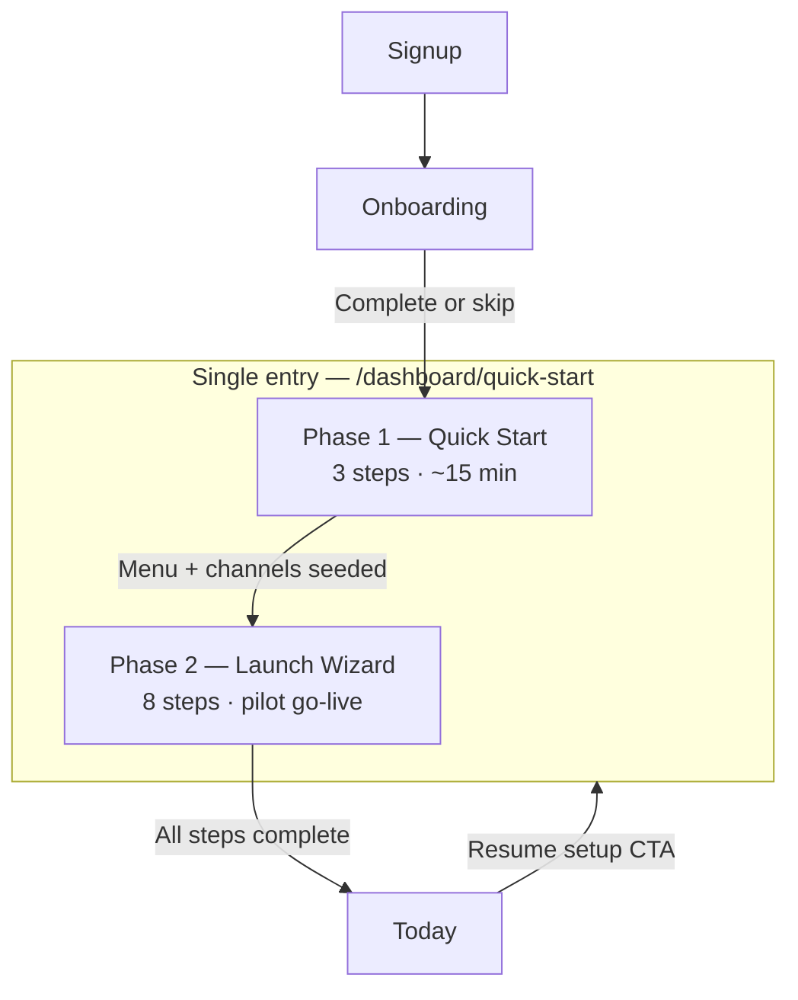

# Quick Start — single entry IA

**Version:** 1.0 · **June 2026  
**Policy:** `quick-start-single-entry-ia-v1`  
**Scope:** Merge `/dashboard/quick-start` (day-0 seed) and `/dashboard/launch-wizard` (pilot go-live) into one discoverable onboarding spine.  
**Related:** [`navigation-ia-audit.md`](./navigation-ia-audit.md), [`mobile-375px-audit.md`](./mobile-375px-audit.md)

---

## Executive summary

| Metric | Today | Target (single entry) |
|--------|------:|----------------------:|
| Onboarding entry routes | **4** | **1** canonical hub |
| Sidebar links for setup | 1 (`Launch wizard`) | 1 (`Quick Start`) |
| Day-0 wizard steps | 3 (Quick Start) | 3 — unchanged UX |
| Pilot go-live steps | 8 (Launch Wizard) | 8 — nested phase 2 |
| Today page setup strips | 3 (checklist, launch strip, briefing) | 2 (unified strip + checklist collapse) |

**Verdict:** Operators currently discover setup through **four parallel paths**. Pilot GTM should expose **one canonical route** — `/dashboard/quick-start` — with Launch Wizard as **phase 2** inside the same shell after account onboarding completes.

---

## Problem — fragmented entry points

```mermaid
flowchart LR
  subgraph today [Current — 4 paths]
    A["/onboarding"]
    B["/dashboard/quick-start"]
    C["/dashboard/launch-wizard"]
    D["Today checklist + strip"]
  end
  A -->|"onboardingCompleted"| Today
  B -->|"redirect if done"| Today
  C --> Sidebar
  D --> Deep links
```

| Route | Component | When shown | Steps | Audience |
|-------|-----------|------------|------:|----------|
| `/onboarding` | `OnboardingWizard` | `onboardingCompleted === false` | Adaptive flow | All new accounts |
| `/dashboard/quick-start` | `QuickStartWizard` | Optional from onboarding banner; redirects if onboarding done | 3: type → channels → menu | Owner (day-0) |
| `/dashboard/launch-wizard` | `LaunchWizardView` | Sidebar Setup group; Today strip | 8: profile → pilot readiness | Owner (pilot) |
| Today embedded | `GettingStartedChecklist` + `LaunchWizardTodayStrip` | First 30 days; owner briefing | 6–8 checklist items + wizard progress | Owner |

**Pain points:**
1. **Quick Start** is not in sidebar — only linked from `/onboarding` banner.
2. **Launch Wizard** is sidebar-visible but sounds like a different product from "Quick Start."
3. **Getting Started checklist** on Today duplicates Launch Wizard steps (menu, POS, storefront, integrations).
4. Sales demos must explain two wizards with overlapping goals.

---

## Target IA — single entry hub

**Canonical route:** `/dashboard/quick-start`  
**Sidebar label:** `Quick Start` (replaces `Launch wizard` in Setup group)  
**Launch Wizard:** Phase 2 tab/section inside Quick Start hub — not a separate nav item.



### Phase map

| Phase | ID | Steps | Source module | Completion signal |
|-------|-----|------:|---------------|-------------------|
| **1 — Quick Start** | `quick-start` | 3 | `QuickStartWizard` | `applyQuickStartAction` → menu + settings seeded |
| **2 — Launch** | `launch-wizard` | 8 | `LaunchWizardView` | `summarizeLaunchWizardProgress().percent === 100` |

### Phase 1 steps (unchanged)

| # | Step | UI | Persists |
|---|------|-----|----------|
| 1 | Restaurant type | `QuickStartWizard` — type cards | `BusinessType` + menu template |
| 2 | Channels | POS / QR / website / delivery | `onboardingAdaptiveJson` channel intent |
| 3 | Starter menu | Name + 1–N items or template | `Menu` + `Product` rows |

**Route today:** `app/dashboard/quick-start/page.tsx`  
**Gate:** Redirects to `/dashboard/today` if `onboardingCompleted` — **change in Wave 1:** allow return via sidebar for owners who skipped items.

### Phase 2 steps (Launch Wizard — unchanged logic)

From `lib/launch-wizard/launch-wizard-era19-policy.ts`:

| # | Step ID | Title | Deep link |
|---|---------|-------|-----------|
| 1 | `business-profile` | Business profile | `/dashboard/settings` |
| 2 | `menu-catalog` | Menu & catalog | `/dashboard/menus/new` |
| 3 | `storefront` | Storefront | `/dashboard/storefront` |
| 4 | `pos` | POS | `/dashboard/pos/terminal` |
| 5 | `kds-production` | KDS & production | `/dashboard/production` |
| 6 | `integrations` | Integrations | `/dashboard/integration-health` |
| 7 | `go-live-proof` | Go-live proof | `/dashboard/go-live` |
| 8 | `pilot-readiness` | Pilot readiness | `/dashboard/implementation` |

**Route today:** `app/dashboard/launch-wizard/page.tsx`  
**Wave 1:** Render inside Quick Start hub as tab `?phase=launch` or embedded section below phase 1 completion card.

---

## Navigation changes (Wave 1)

| Location | Before | After |
|----------|--------|-------|
| Sidebar Setup group | `Launch wizard` → `/dashboard/launch-wizard` | `Quick Start` → `/dashboard/quick-start` |
| `/dashboard/launch-wizard` | Primary page | **301 redirect** → `/dashboard/quick-start?phase=launch` |
| `/onboarding` banner | Link to Quick Start | Unchanged — still promotes fast path |
| Command palette | Both entries if indexed | Single `Quick Start` entry |
| Today `LaunchWizardTodayStrip` CTA | `/dashboard/launch-wizard` | `/dashboard/quick-start?phase=launch` |
| Getting Started checklist footer | Scattered hrefs | Optional link: "Open Quick Start hub" |

**File to update (implementation backlog):** `lib/navigation/final-navigation-groups.ts` line ~218.

---

## Today page — de-duplication

| Strip | Keep? | Rationale |
|-------|:-----:|-----------|
| `GettingStartedChecklist` | ✅ Collapse by default after phase 1 | Lightweight nudge; hide when Launch Wizard >50% |
| `LaunchWizardTodayStrip` | ✅ Merge CTA to single hub | Progress bar stays; href unified |
| `OwnerDailyBriefingHero` | ✅ | Operational — not setup |
| Onboarding redirect gate | ✅ | `/onboarding` until profile complete |

**Rule:** If `LaunchWizardTodayStrip` is visible, collapse `GettingStartedChecklist` to "Next step" card only (see `getting-started-focus-era18`).

---

## Persona flows

### New owner (happy path)

1. Signup → `/onboarding` (business name, type, operating model)
2. Banner → **Quick Start** phase 1 (3 steps, ~15 min)
3. Land on `/dashboard/today` with unified setup strip pointing to phase 2
4. Complete Launch Wizard steps over pilot week
5. Checklist auto-hides; Today becomes operations-first

### Returning owner (skipped setup)

1. Sidebar → **Quick Start**
2. Phase 1 shown as complete (read-only summary) or "Edit starter menu"
3. Phase 2 highlights next blocked step with honest BETA/SKIPPED badges

### Staff / non-owner

- No Quick Start sidebar entry (owner-only gate — same as Launch Wizard RBAC today)
- Deep links from Launch Wizard steps respect `PermissionDeniedCard`

---

## Overlap matrix — checklist vs Launch Wizard

| Getting Started item | Launch Wizard step | Merge action |
|---------------------|-------------------|--------------|
| Create first menu | `menu-catalog` | Single progress source: menu count |
| Connect sales channel | `integrations` | Same `integrationConnection` signal |
| Receive first order | — | Stays checklist-only (operational milestone) |
| Try POS | `pos` | Same `pos_first_use` event |
| Add team member | — | Checklist-only |
| Publish storefront | `storefront` | Same published count |

**Implementation note:** `loadGettingStartedStatus` and `loadLaunchWizardModel` already share Prisma signals — Wave 2 can expose one `loadSetupProgress()` aggregator.

---

## URL contract (Wave 1)

| URL | Behavior |
|-----|----------|
| `/dashboard/quick-start` | Phase 1 if incomplete; else phase 2 overview |
| `/dashboard/quick-start?phase=launch` | Launch Wizard view (embedded `LaunchWizardView`) |
| `/dashboard/quick-start?phase=launch&mode=compact` | Compact strip mode (from go-live banner) |
| `/dashboard/launch-wizard` | Redirect → `?phase=launch` |
| `/dashboard/launch-wizard?from=go-live` | Redirect → `?phase=launch&from=go-live` |

---

## Sales & support guidance

**Say:** "One Quick Start hub — 15 minutes to a working menu and POS, then a guided launch checklist for pilot go-live."

**Do not say:** "Two separate wizards" or "Launch wizard is a different product."

**Demo script entry:** Sidebar → Quick Start → show phase 1 completion card → expand phase 2 blocked step → deep link to Integration Health.

---

## Verification

```bash
# Routes exist
test -f app/dashboard/quick-start/page.tsx && echo OK quick-start
test -f app/dashboard/launch-wizard/page.tsx && echo OK launch-wizard

# Launch wizard step count
rg -c 'LAUNCH_WIZARD_STEP_IDS' lib/launch-wizard/launch-wizard-era19-policy.ts

# Sidebar entry (pre-migration — still launch-wizard)
rg "launch-wizard|quick-start" lib/navigation/final-navigation-groups.ts

# E2E
npx playwright test e2e/quick-start-wizard.spec.ts
```

---

## Implementation waves

| Wave | Scope | Effort |
|------|-------|--------|
| **W1 — IA doc + redirects** | This doc; update Today strip hrefs; 301 launch-wizard → quick-start | S |
| **W2 — Unified shell** | Tabbed Quick Start page hosting both wizards | M |
| **W3 — Nav rename** | Sidebar label + command palette | S |
| **W4 — Progress aggregator** | Single API for checklist + launch wizard | M |

**DES-07 delivers Wave 1 documentation.** Code merge is DES-09+ backlog (nav maturity / command palette UX).

---

## Changelog

| Date | Cycle | Change |
|------|-------|--------|
| 2026-06-03 | 25 (DES-07) | Initial single-entry IA — merge quick-start + launch-wizard |
