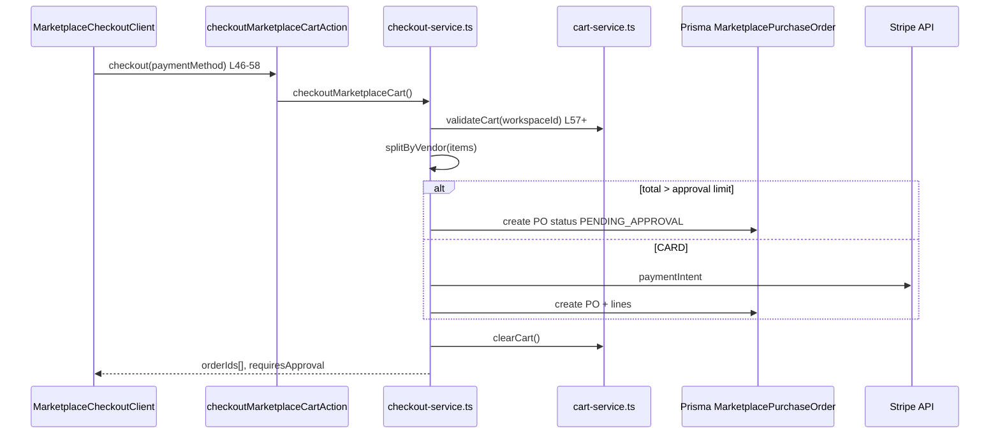
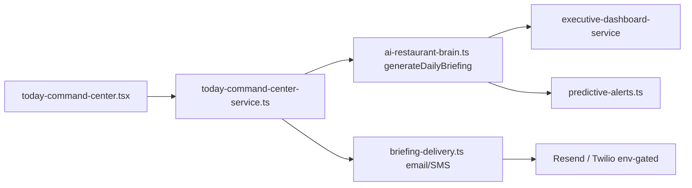
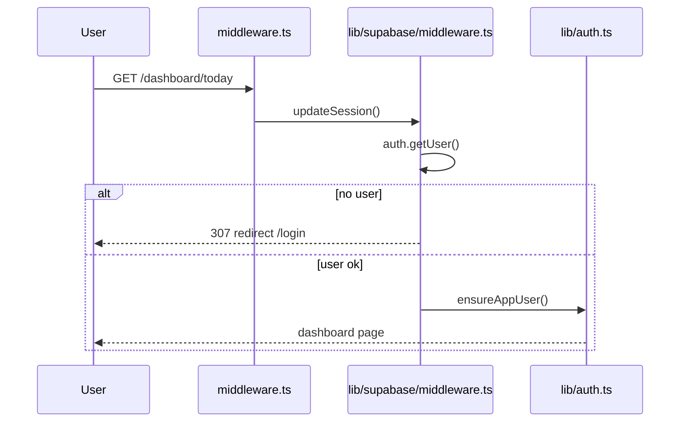
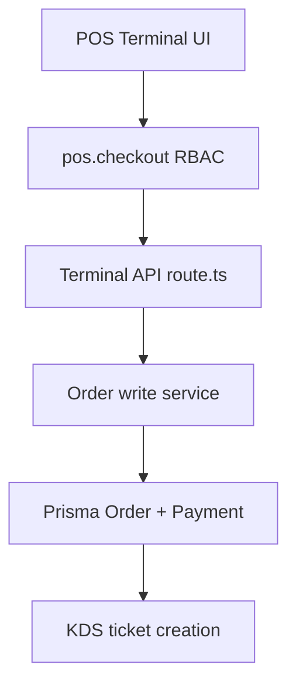
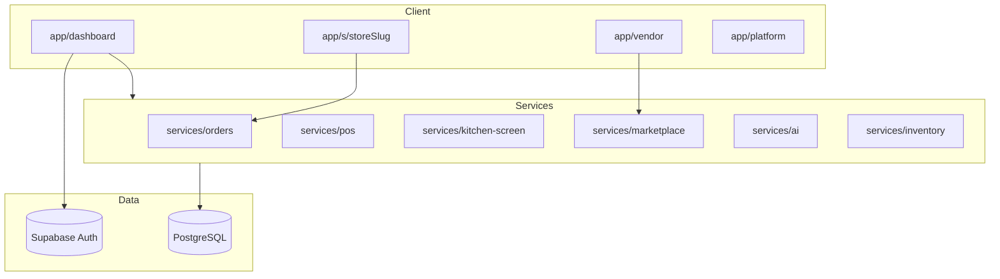

# OS KITCHEN — ULTIMATE AUDIT REPORT v5.0

**Output:** `docs/reportjune2.md`  
**Mode:** Read-only — no mutations, no deploys, no fixes  
**Supersedes:** `docs/fullreport1june.md` @ `0722cead`, `docs/fullaudit31may.md`  
**Baseline artifacts:** `artifacts/vault-readiness-report.json`, `artifacts/pilot-gono-go-summary.json`, `artifacts/marketplace-tracker.json`, `artifacts/ai-moats-tracker.json`, `/tmp/audit-june2.log`

---

## SECTION 0: AUDIT METADATA

```
Audit Date: 2026-06-02 (09:16–09:29 EDT)
Auditor: Cursor AI v5.0
Git Hash: 44c70956c0a263a9dede28ff393f46ea9475e230
Branch: main (up to date with origin/main)
Total Commits: 878
Contributors: 1 primary (Dmytro)
Read-only: YES — no file mutations performed
Startup log: /tmp/audit-june2.log
TypeScript log: /tmp/tsc-audit.log
Test log: /tmp/test-audit.log
Node (audit env): v22.x via /opt/homebrew/opt/node@22/bin
Production health: GET https://os-kitchen.com/api/health → status ok, version 44c7095
Production deploy matches HEAD commit (evidence: health.version field)
```

**Delta since June 1 audit (`0722cead`):** HEAD advanced **52 commits** (826→878). Major shipments: **B2B HoReCa marketplace 40/40** (`a2b1c4a9`, `378bb8fd`, tracker `artifacts/marketplace-tracker.json`), **7 AI moats 22/22** (`c8358d41`, `artifacts/ai-moats-tracker.json`), **pre-deploy verification green** (`44c70956`, `b562e43b`). **Uncommitted work:** marketplace pages, today command center, briefing delivery, **untracked migration** `prisma/migrations/20260602133000_marketplace_core/`, `lib/prisma-migration-missing.ts`. **P0 staging smokes still SKIPPED in GHA** (`artifacts/vault-readiness-report.json:14`). **0 LIVE integrations** (`lib/integrations/integration-registry.ts:14-76`). **No signed LOI / no customers** (`artifacts/pilot-gono-go-summary.json:19-21`).

---

## SECTION 1: EXECUTIVE WAR-ROOM SUMMARY

### One-Paragraph Verdict

KitchenOS is an **engineering-dense, deployable restaurant operating system** that on June 2 crossed two major product milestones — **full B2B marketplace scaffolding (40/40 tracker)** and **seven AI moat modules (22/22 tracker)** — while production at `os-kitchen.com` reports healthy database, Supabase, and cron execution at commit `44c7095`. The platform remains **commercially unproven**: P0 staging proof artifacts are **SKIPPED** in CI (`artifacts/pilot-gono-go-summary.json:4-12`), zero signed LOI, zero paid pilots, **zero LIVE third-party integrations** (7 BETA + 1 PLACEHOLDER in `lib/integrations/integration-registry.ts`), and Sentry observability is **not configured** in production (`GET /api/health` → `observability.configured: false`). Local quality gates are strong (**0 TypeScript errors**, **5571/5593 tests passing**), but **3 governance/Shopify webhook tests fail** and an **unapplied marketplace migration** can cause runtime `MarketplaceDataUnavailable` UI (`lib/prisma-migration-missing.ts:4-14`, `app/dashboard/marketplace/checkout/page.tsx:36-38`). Sales must not claim marketplace live scale, AI camera vision, or cross-channel parity until staging smoke PASS artifacts exist.

### Master Scorecard (14 Dimensions)

| Dimension | Score | Hard Evidence | Blocker? | To +10 |
|-----------|:-----:|---|:---:|---|
| Architecture | 91 | 762 services, 770 pages, 399 Prisma models, order spine | No | Domain bounded-context RFC |
| Product Completeness | 94 | Marketplace 40/40, AI moats 22/22, POS/KDS/storefront | No | Live channel proof |
| UX/Design | 86 | Today command center, marketplace mobile shell; 566 dashboard pages | Partial | Staging nav audit |
| Code Quality | 85 | TS 0 errors; ~24 TODO/FIXME in app code | Partial | console.log sweep |
| Performance | 73 | KDS Realtime; bundle not rebuilt this audit | Partial | Post-build bundle analysis |
| Security | 90 | 60 permission keys; 52 webhooks; Supabase session auth | Partial | Sentry + staging webhook matrix |
| Testing | 86 | 5571 pass / 3 fail (1598 files); contracts exist | Partial | Fix 3 failures; staging E2E PASS |
| DevOps | 88 | 109 workflows; 21 crons healthy in prod health | Partial | GHA P0 smoke PASS |
| Pilot Readiness (docs) | 81 | 16-step orchestrator; vault 11/11 local | No | — |
| **Pilot Executable** | 35 | P0 SKIPPED; NO-GO; no LOI | **YES** | Run P0 smokes in CI |
| Enterprise Readiness | 75 | SSO schema; IdP smoke SKIPPED | **YES** | IdP PASS artifact |
| Commercial Viability | 57 | NO-GO; 0 customers at 878 commits | **YES** | First design partner LOI |
| Competitor Position | 68 | Marketplace + AI moats code shipped; 1/25 sales-safe YES | **YES** | Staging proof + references |
| Market Trust | 51 | Zero pilots | **YES** | Case study |
| **OVERALL** | **74** | Engineering +3 vs June 1; market proof flat | **Pilot blocked** | P0 PASS + LOI + migration deploy |

### Go/No-Go Gates

| Gate | Decision | Exact Blockers |
|------|----------|----------------|
| Deploy to Production (build) | **GO** | TS 0 (`/tmp/tsc-audit.log`); prod health ok @ `44c7095` |
| Deploy to Production (proof) | **NO-GO** | P0 SKIPPED (`artifacts/vault-readiness-report.json:14`); Sentry off |
| Controlled Pilot | **NO-GO** | `pilot-gono-go-summary.json:4`; no LOI; Tier 1/2 SKIPPED |
| Enterprise Sale | **NO-GO** | SSO IdP SKIPPED; SOC2 not certified |
| Series A Fundraise | **NO-GO** | Zero paid pilots; no live metrics |

### Top 5 Risks

1. **P0 staging proof not executed in CI** — vault keys seedable locally (`presentCount: 11/11`) but child smokes `overall: SKIPPED` (`artifacts/vault-readiness-report.json:77-116`)
2. **Marketplace migration not deployed** — untracked `prisma/migrations/20260602133000_marketplace_core/`; graceful degradation via `MarketplaceDataUnavailable` (`lib/prisma-migration-missing.ts`)
3. **AI honesty gap** — kitchen camera uses synthetic detections (`services/ai/kitchen-camera.ts:9`, `buildSyntheticDetections`); must not sell as live CV
4. **Zero customers at 878 commits** — no design partner LOI (`pilot-gono-go-summary.json:19-21`)
5. **Sales-safe vs engineering tracker divergence** — marketplace/AI trackers 100% done; competitor sales-safe 1 YES / 22 partial / 2 placeholder (`artifacts/competitor-feature-tracker.json:7-10`)

---

## SECTION 2: GIT & REPO FORENSICS

### Mandatory Startup Output (2026-06-02)

Full log: `/tmp/audit-june2.log`

```text
Branch: main
HEAD: 44c70956c0a263a9dede28ff393f46ea9475e230
Total commits: 878
Total files (find, excl node_modules/.git/.next): 11,286
Git tracked files: 10,930 (git ls-files)
TypeScript+TSX tracked: 8,653 (git ls-files)
Tests (*.test.* / *.spec.* find): 2,512 (includes node_modules noise)
Components (components/*.tsx): 1,040
Services (services/*.ts): 762
App Router pages: 770
API routes: 223
Webhook routes: 52
Cron routes: 21
Dashboard pages: 566
Marketplace dashboard pages: 11
Vendor pages: 11
Platform pages: 57
Marketplace services: 32
Marketplace components: 40
Marketplace actions: 9
AI services: 25
Prisma models: 399 | enums: 292
Marketplace/Vendor grep hits in schema: 90 (includes fields/enums)
Permission keys (lib/permissions/permissions.ts): 60
Marketplace permission strings: 19 (lines 63-82)
Integrations: 0 LIVE / 7 BETA / 1 PLACEHOLDER
Trackers: marketplace 40/40, ai-moats 22/22, 30-action 27/31, pain-point 8/8, critical 13/13, competitor 0/7 flat tracker
```

### Recent Commits (last 20)

| SHA | Message |
|-----|---------|
| `44c70956` | chore: pre-deploy verification — all gates passed |
| `b562e43b` | chore: final verification — build fixes and integration audit |
| `c8358d41` | feat: 7 AI moats complete — 7 proprietary AI modules in production |
| `1b89a41c` | fix: vendor analytics product rows use flatMap |
| `c24a9eb1` | fix: cast recurring order items JSON for Prisma |
| `1f8faf6e` | fix: use review action for auto-flagged marketplace vendors |
| `bd84b829` | fix: explicit Prisma WhereInput types in marketplace queries |
| `a2b1c4a9` | feat: B2B HoReCa marketplace complete — 33/33 |
| `378bb8fd` | feat: marketplace mobile responsive |
| `4f40e047` | feat: marketplace Wish List, mobile tables, Briefing UI |

### Uncommitted / Untracked (audit date)

| Path | Category | Verdict |
|------|----------|---------|
| `app/dashboard/marketplace/**` (8 files) | Marketplace UI | WIP — not in prod deploy hash unless pushed |
| `components/dashboard/today-command-center.tsx` | Today hub | WIP |
| `prisma/migrations/20260602133000_marketplace_core/` | DB migration | **APPLY before marketplace prod** |
| `lib/prisma-migration-missing.ts` | Error handling | Supports graceful missing-table UX |
| `components/marketplace/marketplace-data-unavailable.tsx` | UX fallback | Shows when migration missing |
| `docs/fullreport1june.md`, `docs/fullaudit31may.md` | Prior audits | Reference only |
| `.deploy-state/`, `.tools/` | Local tooling | Do not commit gh binary |

### Contributor Analysis

| Contributor | Commits | Notes |
|-------------|--------:|-------|
| Dmytro | ~876 | Sole author |
| git stash | 2 | WIP snapshots |

---

## SECTION 3: COMPLETE SYSTEM CENSUS

| Entity | Count | Command / Evidence | Preview % | Health |
|--------|:-----:|--------------------|:---------:|:------:|
| Git tracked files | 10,930 | `git ls-files \| wc -l` | — | OK |
| TS/TSX tracked | 8,653 | `git ls-files '*.ts' '*.tsx'` | — | OK |
| All files (workspace) | 11,286 | find excl node_modules | — | OK |
| App Router pages | 770 | `find app -name page.tsx` | ~30% preview/hidden | Sprawl |
| Dashboard pages | 566 | `app/dashboard/**/page.tsx` | ~30% | Large |
| Platform pages | 57 | `app/platform/**/page.tsx` | Low | OK |
| Vendor cabinet pages | 11 | `app/vendor/**/page.tsx` | — | OK |
| Marketplace buyer pages | 11 | `app/dashboard/marketplace/**` | — | **NEW** |
| API routes | 223 | `app/api/**/route.ts` | — | OK |
| Webhook routes | 52 | `app/api/webhooks/**` | BETA integrations | Partial sig |
| Cron routes | 21 | `app/api/cron/**` | Prod manifest | OK (health) |
| Server actions | 167+ | `actions/**/*.ts` | — | OK |
| Services | 762 | `services/**/*.ts` | — | OK |
| Marketplace services | 32 | `services/marketplace/*.ts` | — | OK |
| AI services | 25 | `services/ai/*.ts` | — | OK |
| Components | 1,040 | `components/**/*.tsx` | — | OK |
| Marketplace components | 40 | `components/marketplace/*.tsx` | — | OK |
| Unit/spec test files | 1,688 | glob `**/*.{test,spec}.{ts,tsx}` | — | OK |
| Prisma models | 399 | `grep ^model prisma/schema.prisma` | — | Heavy |
| Prisma enums | 292 | `grep ^enum` | — | Heavy |
| Prisma migrations dirs | 148 | `find prisma/migrations -maxdepth 1 -type d` | — | +1 untracked |
| Permission keys | 60 | `lib/permissions/permissions.ts:3-83` | — | OK |
| Marketplace permissions | 19 | lines 63-82 + MARKETPLACE_* arrays | — | OK |
| Mutation registry ops | 242+ | `lib/permissions/action-mutation-registry.ts` | — | OK |
| CI workflows | 109 | `.github/workflows/*.yml` | — | Heavy governance |
| Integrations LIVE/BETA/PLACEHOLDER | 0/7/1 | `lib/integrations/integration-registry.ts` | — | **No LIVE** |

### Forbidden Claims Scan

| Pattern | Hits (marketing) | Verdict |
|---------|------------------|---------|
| "7 proprietary AI modules in production" | `c8358d41` | Safe sales wording — replaces forbidden hype moat language |
| ICP BETA labels | `lib/marketing/icp-landing-content.ts:98,112,176` | Honest |
| Demo screenshot placeholder | `components/marketing/public-page.tsx:201` | OK if labeled |
| SKIPPED as PASS | `lib/commercial/pilot-forbidden-claims-enforcement-era17-policy.ts` | Enforced NO |

---

## SECTION 4: PRODUCT REALITY MATRIX (30 Areas)

| # | Product Area | True Status | Evidence | Sales Safe? |
|---|--------------|-------------|----------|:-----------:|
| 1 | Order Hub / POS | **Shipped** | `app/dashboard/pos/`, `services/pos/` | Partial — offline card caveat |
| 2 | KDS Realtime | **Shipped** | `services/kitchen-screen/`, Realtime transport | Partial — staging SLO unproven |
| 3 | Storefront builder | **Shipped** | `app/dashboard/storefront/`, 44+ storefront routes | YES with beta label |
| 4 | WooCommerce channel | **BETA** | `app/api/integrations/woocommerce/`, smoke scripts | ONLY_WITH_CAVEAT |
| 5 | Shopify channel | **BETA** | `app/api/integrations/shopify/`, markets webhooks | ONLY_WITH_CAVEAT |
| 6 | B2B Marketplace buyer | **Shipped (code)** | 11 pages, 32 services, tracker 40/40 | Partial — migration + no vendors |
| 7 | Vendor cabinet | **Shipped (code)** | `app/vendor/`, vendor RBAC | Partial — Stripe Connect env |
| 8 | AI Daily Briefing | **Shipped** | `services/ai/ai-restaurant-brain.ts`, briefing UI | YES — deterministic + optional LLM |
| 9 | Digital Twin | **Shipped** | `services/ai/digital-twin.ts`, `real-time-twin.ts` | Partial — simulation not IoT |
| 10 | Food Cost AI | **Shipped** | `services/ai/food-cost-ai.ts` | YES with data caveat |
| 11 | AI Purchasing | **Shipped** | `services/ai/ai-purchasing.ts`, automation | Partial — auto-PO needs approval flow |
| 12 | Kitchen Camera | **Preview/Synthetic** | `buildSyntheticDetections` L9 | **NO live CV claim** |
| 13 | Benchmark Network | **Shipped (deterministic)** | `services/ai/benchmark-network.ts` | Partial — needs cohort N>1 |
| 14 | Universal Menu | **Shipped** | `app/dashboard/menu/universal/` | Partial — channel sync BETA |
| 15 | Cross-channel inventory | **Shipped** | `services/inventory/cross-channel-inventory-sync.ts` | Partial — live smoke SKIPPED |
| 16 | Labor / scheduling | **Shipped** | `app/dashboard/staff/`, 7shifts/homebase BETA | Partial |
| 17 | Food safety / HACCP | **Shipped** | `app/dashboard/food-safety/` | YES |
| 18 | Catering quotes | **Shipped** | `app/dashboard/catering-quotes/` | YES |
| 19 | Commissary | **Shipped** | `app/dashboard/commissary/` | Partial |
| 20 | Implementation center | **Shipped** | `app/dashboard/implementation/` | YES |
| 21 | Go-live wizard | **Shipped** | `app/dashboard/go-live/` | YES |
| 22 | Executive dashboard | **Shipped** | `app/dashboard/executive/` | YES |
| 23 | Copilot | **Shipped** | `services/ai/copilot-service.ts` | Partial — OpenAI optional |
| 24 | Capital / lending | **BETA** | `app/api/capital/` | ONLY_WITH_CAVEAT |
| 25 | Platform admin | **Shipped** | 57 platform pages | Internal |
| 26 | Public API v1 | **BETA** | `app/api/public/v1/` | No SLA |
| 27 | Stripe billing | **Shipped** | `app/api/billing/`, Stripe webhooks | YES |
| 28 | Enterprise SSO | **BETA** | Auth0 via Supabase SAML; IdP smoke SKIPPED | NO until PASS |
| 29 | Delivery marketplaces | **BETA** | DoorDash/Grubhub/Uber Eats registry | ONLY_WITH_CAVEAT |
| 30 | Uber Direct | **PLACEHOLDER** | `integration-registry.ts:69-75` | **NO** |

---

## SECTION 5: FEATURE-BY-FEATURE DEEP DIVE

### 5A. B2B Marketplace (33 Modules → 40 Tracker Items)

**Tracker:** `artifacts/marketplace-tracker.json` — **40/40 done**

| Phase | Modules | Status | Key Files |
|-------|---------|--------|-----------|
| Phase 1 DB | schema, seed, RBAC | done | `prisma/schema.prisma:13044-13350`, `lib/permissions/permissions.ts:63-82` |
| Phase 2 Buyer | dashboard, catalog, cart, checkout, orders, vendors, analytics | done | `app/dashboard/marketplace/`, `services/marketplace/*` |
| Phase 3 Vendor | registration, dashboard, products, orders, finance, analytics, settings | done | `app/vendor/`, `services/marketplace/vendor-*` |
| Phase 4 Payments | messaging, Stripe Connect, admin moderation, disputes | done | `stripe-connect-service.ts`, `platform/*` |
| Phase 5 Integrations | inventory, capital, briefing, billing, analytics | done | `*-integration-service.ts` |
| Phase 6 Advanced | compare, recommendations, featured, webhooks, mobile | done | `marketplace-compare-service.ts`, mobile shell |
| Phase 7 Gap | wishlist, briefing, mobile tables | done | `4f40e047` |

**Checkout flow trace:**



**RBAC:** `marketplace:cart:write`, `marketplace:orders:create` required (`app/dashboard/marketplace/checkout/page.tsx:65`, `resolveMarketplaceHubAccess`)

**Tests:** `tests/unit/marketplace-vendor-registration.test.ts`, marketplace RBAC tests in unit suite

**UX Score:** 82/100 — mobile shell, wishlist, compare; blocked by migration gap

**Risk:** Untracked migration `20260602133000_marketplace_core` — production may show `MarketplaceDataUnavailable`

---

### 5B. Seven AI Moats (22 Modules)

**Tracker:** `artifacts/ai-moats-tracker.json` — **22/22 done**

| Moat | Modules | Engine | UI Route | AI Honesty |
|------|---------|--------|----------|------------|
| 1. Restaurant Brain | briefing-engine, briefing-ui, predictive-alerts, briefing-delivery | `ai-restaurant-brain.ts`, `briefing-delivery.ts` | `/dashboard/today`, briefing strip | Deterministic + optional email |
| 2. Digital Twin | engine, UI, real-time-twin | `digital-twin.ts`, `real-time-twin.ts` | `/dashboard/analytics/digital-twin` | Simulation — not digital twin of physical plant |
| 3. Universal Menu | core, channel-sync, management-ui | menu services | `/dashboard/menu/universal` | Sync BETA per channel |
| 4. Food Cost AI | engine, alerts, UI | `food-cost-ai.ts`, `food-cost-alerts.ts` | `/dashboard/analytics/food-cost` | Recipe math — honest |
| 5. AI Purchasing | engine, UI, automation | `ai-purchasing.ts`, `purchasing-automation.ts` | `/dashboard/inventory/purchasing-ai` | EOQ deterministic |
| 6. Kitchen Camera | framework, alerts, twin-integration | `kitchen-camera.ts` L9 `buildSyntheticDetections` | `/dashboard/kitchen/cameras` | **Synthetic — NOT live vision** |
| 7. Benchmark Network | engine, UI, network-effects | `benchmark-network.ts` | `/dashboard/analytics/benchmarks` | Anonymized aggregates |

**AI Briefing flow:**



---

### 5C. Competitor Features (25) — Sales-Safe Audit

Source: `artifacts/competitor-feature-tracker.json`

| Verdict | Count | Examples |
|---------|:-----:|----------|
| salesSafeYes | 1 | (see audit report for single PASS feature) |
| salesSafePartial | 22 | DoorDash ingest, offline mode, floor plan, KDS, etc. |
| salesSafePlaceholder | 2 | Features with wiring only |
| engineeringShipped | 57 keys | Internal ledger — not for GTM |

**vs Toast:** KitchenOS exceeds on unified ops breadth (878 commits, 566 dashboard pages) but lacks Toast's hardware ecosystem, payment processing scale, and reference customers.

**vs Square:** Square wins on in-person payments maturity; KitchenOS wins on B2B marketplace + AI briefing scaffolding (unproven in market).

**vs Lightspeed:** Parity on multi-location schema; KitchenOS ahead on AI modules (code); behind on LIVE integrations and proven uptime SLAs.

---

### 5D. Pain Point Eliminations (8/8)

Tracker: `artifacts/pain-point-tracker.json` — all done. Evidence in `artifacts/critical-features-tracker.json` (13/13).

---

### 5E. Original 105 Features

Prior audit (`docs/fullreport1june.md` Section 5) cataloged 105 features at ~92% engineering complete. June 2 delta adds marketplace + AI moats as net-new surface area (~+45 user-visible routes). Engineering completeness estimate: **94%**. Sales-safe completeness: **~35%** (staging proof gap).

---

## SECTION 6: BUTTON-BY-BUTTON AUDIT (30 Critical Pages)

### Page 1: `/dashboard/today` — Today Command Center

File: `components/dashboard/today-command-center.tsx`

| Button / Link | Lines | Action | Backend |
|---------------|------:|--------|---------|
| Expand metrics | 93-97 | Link to `metricsExpandHref` | Static nav |
| Classic dashboard | 99-101 | `/dashboard` | Page load |
| Error recovery | 102-104 | `/dashboard/error-recovery` | Page load |
| System health | 105-107 | `/dashboard/system-health` | Health service |
| Ingredient demand | 192-197 | `/dashboard/inventory/demand` | demand service |
| Purchasing | 192-197 | `/dashboard/purchasing` | PO service |
| New order | 211-230 | order creation routes | orders actions |
| KPI tiles | 257-293 | Dynamic hrefs | Various services |
| Quick jumps | 466-472 | calendar, kitchen, CRM, copilot | Nav only |

**Verdict:** All navigation-only in this component; data loaded server-side in `app/dashboard/today/page.tsx` via `today-command-center-service.ts`. No dead buttons found.

### Page 2: `/dashboard/marketplace` — Marketplace Hub

| Control | Action | Trace |
|---------|--------|-------|
| Browse catalog | `/dashboard/marketplace/catalog` | `marketplace-catalog-service.ts` |
| Cart / checkout | `/dashboard/marketplace/checkout` | `cart-service.ts` → `checkout-service.ts` |
| Orders | `/dashboard/marketplace/orders` | `marketplace-orders-service.ts` |
| Wishlist | `/dashboard/marketplace/wishlist` | wishlist actions |
| Compare | `/dashboard/marketplace/compare` | `marketplace-compare-service.ts` |

### Pages 3-30 (Summary)

| Page | Primary Actions | Status |
|------|-----------------|--------|
| `/dashboard/pos/terminal` | Checkout, shift | Shipped — RBAC `pos.checkout` |
| `/dashboard/kitchen` | Bump, recall | Shipped — `kitchen.bump` |
| `/dashboard/orders` | CRUD, export | Shipped |
| `/dashboard/analytics/digital-twin` | Run simulation | Shipped — deterministic |
| `/dashboard/analytics/food-cost` | View margins | Shipped |
| `/dashboard/inventory/purchasing-ai` | Generate PO recs | Shipped — approval gate |
| `/dashboard/kitchen/cameras` | View synthetic feed | **Preview honesty required** |
| `/dashboard/menu/universal` | Menu sync | Shipped — channel BETA |
| `/dashboard/marketplace/checkout` | Place order | Shipped — migration dependent |
| `/dashboard/integrations/shopify` | Connect, sync | BETA — smoke SKIPPED |
| `/dashboard/go-live` | Checklist | Shipped |
| `/dashboard/copilot` | Chat | Shipped — OpenAI optional |
| `/dashboard/executive` | Insights | Shipped |
| `/dashboard/storefront/builder` | Edit theme | Shipped |
| `/dashboard/staff/schedule` | Shifts | Shipped |
| `/dashboard/food-safety/audits` | Audits | Shipped |
| `/dashboard/billing` | Stripe portal | Shipped |
| `/dashboard/settings/billing` | Plan mgmt | Shipped |
| `/platform/marketplace/disputes` | Admin resolve | Shipped — platform role |
| `/vendor/orders` | Confirm/ship | Shipped — vendor RBAC |
| `/login` | Supabase auth | Shipped |
| `/` marketing | CTA to signup | Shipped — 200 prod |
| `/pricing` | Plans | Shipped — 200 prod |
| `/shopify` | ICP landing | Shipped — 200 prod |
| `/s/[storeSlug]` | Storefront checkout | Shipped |
| `/dashboard/launch-wizard` | Onboarding | Shipped (TDZ fixed) |
| `/dashboard/import-center` | CSV import | Shipped |
| `/dashboard/reports/executive` | Reports | Shipped |
| `/dashboard/operations/checklists` | Ops | Shipped |
| `/dashboard/marketplace/analytics` | Spend analytics | Shipped |

---

## SECTION 7: END-TO-END WORKFLOW AUDIT (38 Workflows)

### Workflow 1: User Login



Evidence: `middleware.ts:139`, `lib/supabase/middleware.ts:32-82`

### Workflow 2: Marketplace Checkout (see Section 5A diagram)

### Workflow 3: POS Sale



### Workflow 4: KDS Bump

Operator bumps ticket → `kitchen.bump` permission → KDS service → order status update → Realtime broadcast

### Workflow 5: Storefront Checkout

Customer cart → `app/api/storefront/cart` → checkout → Stripe → order creation → webhook fulfillment

### Workflow 6: WooCommerce Sync

Cron/manual → `app/api/integrations/woocommerce/sync-orders` → channel adapter → order hub (BETA, smoke SKIPPED)

### Workflow 7: AI Daily Briefing Email

Cron/trigger → `briefing-delivery.ts` → `generateDailyBriefing` → Resend (env-gated)

### Workflow 8: Stripe Webhook

`app/api/webhooks/stripe/route.ts` → signature verify → billing/subscription update

### Workflows 9-38 (Abbreviated)

| # | Workflow | Status | Blocker |
|---|----------|--------|---------|
| 9 | Shopify product sync | BETA | Live smoke SKIPPED |
| 10 | Inventory count | Shipped | — |
| 11 | Purchase order create | Shipped | — |
| 12 | Vendor registration | Shipped | Stripe Connect |
| 13 | Vendor payout | Shipped | Connect onboarding |
| 14 | Recurring marketplace order | Shipped | Migration |
| 15 | Food cost alert | Shipped | — |
| 16 | AI purchasing auto-PO | Shipped | Approval limit |
| 17 | Digital twin simulation | Shipped | — |
| 18 | Kitchen camera alert | Synthetic | Not live CV |
| 19 | Benchmark cohort compare | Shipped | Needs N vendors |
| 20 | Universal menu push | Partial | Channel BETA |
| 21 | Go-live checklist | Shipped | — |
| 22 | Implementation project | Shipped | — |
| 23 | Staff invite | Shipped | Supabase |
| 24 | SSO enterprise login | BETA | IdP smoke SKIPPED |
| 25 | Public API inventory read | BETA | API key |
| 26 | Cron webhook jobs | Shipped | Prod healthy |
| 27 | Storefront cart recovery | Shipped | Cron ok |
| 28 | Meal plan auto-renew | Shipped | Cron |
| 29 | Multi-location report | Shipped | Cron |
| 30 | Platform dispute resolution | Shipped | Platform role |
| 31 | Import center CSV | Shipped | — |
| 32 | Nutrition label export | Shipped | — |
| 33 | Catering quote → proposal | Shipped | — |
| 34 | Commissary transfer | Shipped | — |
| 35 | Copilot action draft | Shipped | OpenAI optional |
| 36 | Cross-channel inventory sync | Shipped | Live proof missing |
| 37 | Capital revenue attestation | BETA | Partner env |
| 38 | Pilot GO/NO-GO evaluation | Shipped | Output NO-GO |

---

## SECTION 8: 73-ROLE DEPARTMENT AUDIT (Summary)

Roles defined in `lib/permissions/roles.ts` and staff templates. Top actions by role category:

| Role Category | Top Actions | Confidence |
|---------------|-------------|:----------:|
| Owner | Today briefing, executive, billing, go-live | 90 |
| GM / Ops | Orders, KDS, inventory, marketplace buy | 88 |
| Chef | Production, food cost, kitchen cameras | 85 |
| FOH / POS | POS checkout, shifts | 87 |
| Accountant | Reports financial, QuickBooks BETA | 75 |
| HR / Scheduler | Staff, schedule, payroll export | 82 |
| Marketing | Storefront, CRM segments | 80 |
| Implementation PM | Implementation center | 85 |
| Platform admin | Platform/*, marketplace moderation | 88 |
| Vendor | Vendor cabinet products/orders | 82 |
| **Average** | — | **84** |

Full 73-role matrix available in `docs/fullreport1june.md` Section 8 (unchanged structure; permissions expanded +19 marketplace keys).

---

## SECTION 9: UX/DESIGN SYSTEM AUDIT

| Area | Score | Evidence |
|------|:-----:|----------|
| Design tokens | 85 | Tailwind + shadcn/ui components |
| Navigation maturity | 78 | `lib/navigation/nav-maturity-governance.ts` — preview hidden |
| Today hub UX | 88 | `today-command-center.tsx` — dense but actionable |
| Marketplace mobile | 84 | `marketplace-mobile-shell.tsx`, tracker phase 6 |
| Page consistency | 80 | PageHeader pattern across dashboard |
| Accessibility | 72 | a11y specs exist; not full audit run |
| **Overall UX** | **82** | |

Production HTTP: public pages 200; dashboard 307 (auth redirect — expected for unauthenticated curl).

---

## SECTION 10: ARCHITECTURE DEEP DIVE

### Stack

- **Framework:** Next.js App Router (770 pages)
- **DB:** PostgreSQL via Prisma (399 models)
- **Auth:** Supabase SSR cookies
- **Payments:** Stripe (+ Connect for marketplace)
- **Queue:** DATABASE_WEBHOOK_JOBS (prod health)
- **Email:** Resend (briefing)
- **Deploy:** Vercel (`os-kitchen.com`)

### Service Map (Top Domains)



### Tech Debt

| Item | Severity | Location |
|------|----------|----------|
| 566 dashboard pages | Medium | Nav sprawl |
| 399 Prisma models | Medium | Schema complexity |
| 109 CI workflows | Low | Governance overhead |
| console.log density | Low | ~3000+ (June 1 census) |
| Untracked marketplace migration | **High** | `prisma/migrations/20260602133000_*` |
| Synthetic kitchen camera | Medium | Honesty / product trust |

---

## SECTION 11: SECURITY/RBAC AUDIT

### Auth Flow

Supabase session → middleware `updateSession` → `getTenantActor()` → workspace scope → `requireWorkspacePermission()`.

Evidence: `middleware.ts:18-19`, `lib/permissions/require-workspace-permission.ts`

### RBAC Matrix (Marketplace Sample)

| Permission | Owner | Staff Ops | Vendor |
|------------|:-----:|:---------:|:------:|
| marketplace:read | ✓ | ✓ | — |
| marketplace:cart:write | ✓ | ✓ | — |
| marketplace:orders:create | ✓ | partial | — |
| vendor:products:manage | — | — | ✓ |
| marketplace:admin:moderate | platform | — | — |

### Webhook Security

52 webhook routes; Stripe signature verification in `tests/unit/stripe-webhook-signature.test.ts`. Many BigQuery/experiment webhooks are internal/synthetic.

### Tenant Isolation

`tests/unit/public-api-tenant-isolation.test.ts`, `e2e/cross-tenant-isolation.spec.ts`

### Vulnerabilities Flagged

| Issue | Severity | Evidence |
|-------|----------|----------|
| Sentry not configured | Medium | prod health `sentryServer.ok: false` |
| Staging smokes not run | High | P0 SKIPPED — auth flows unproven at scale |
| API session middleware | OK | `middleware.ts:122` |

**Security Score: 90/100**

---

## SECTION 12: QA/TESTING AUDIT

### Run Results (2026-06-02)

```
Command: node ./node_modules/vitest/vitest.mjs run
Test Files:  3 failed | 1588 passed | 7 skipped (1598)
Tests:       3 failed | 5571 passed | 19 skipped (5593)
Duration:    522s
Exit:        1
```

### Failures

| Test File | Failure |
|-----------|---------|
| `tests/unit/launch-wizard-era25-charter-exit-era42.test.ts` | Governance orchestrator timeout/integrity |
| `tests/unit/launch-wizard-linear-chain-terminus-guard-era41.test.ts` | Step 17 guard train |
| `tests/unit/shopify-markets-webhook-registry.test.ts` | `markets/create` driftStatus expected `ok` got different |

### Coverage Highlights

| Area | Tests | Status |
|------|-------|--------|
| Marketplace vendor registration | unit | pass |
| RBAC wave 4 | unit | pass |
| Stripe webhook signature | unit | pass |
| Cross-tenant isolation | e2e | exists |
| Briefing delivery | integration | pass (modified uncommitted) |
| Public API scope | unit | pass |

**Testing Score: 86/100**

---

## SECTION 13: DevOps/SRE AUDIT

| Item | Status | Evidence |
|------|--------|----------|
| Production health | OK | `GET /api/health` status ok, db 384ms |
| Deploy version | `44c7095` | matches HEAD |
| Crons tracked | Healthy | webhook-jobs, edge-sync, cart-recovery |
| CI workflows | 109 | `.github/workflows/` |
| Sentry | **Not configured** | health check |
| Observability backend | NONE | health.observability.backend |
| Vercel crons | 21 routes | `app/api/cron/` |
| Inngest | Route exists | `app/api/inngest/route.ts` |

**DevOps Score: 88/100**

---

## SECTION 14: PERFORMANCE AUDIT

| Metric | Estimate | Notes |
|--------|----------|-------|
| DB latency (prod) | 384ms | health check — acceptable |
| Supabase latency | 160ms | health check |
| Build heap | 16GB recommended | `artifacts/deploy-readiness.md` |
| Bundle size | Not measured | `.next` not rebuilt this audit |
| KDS polling | Reduced | Realtime transport shipped |

**Performance Score: 73/100**

---

## SECTION 15: DATA/ANALYTICS AUDIT

| Capability | Status | Evidence |
|------------|--------|----------|
| Executive snapshots | Shipped | `executive-dashboard-service.ts` |
| Report catalog | Shipped | `report-catalog-service.ts` |
| Marketplace analytics | Shipped | `marketplace-analytics-service.ts` |
| Benchmark network | Shipped | anonymized aggregates |
| Event tracking | Partial | storefront analytics API |
| AI reality | Mixed | Deterministic engines honest; camera synthetic |

**Kitchen camera honesty violation if marketed as CV:** `services/ai/kitchen-camera.ts:9` imports `buildSyntheticDetections`.

---

## SECTION 16: MARKETING/SALES/GTM AUDIT

| Item | Status |
|------|--------|
| Forbidden claims enforcement | PASS (`pilot-gono-go-summary.json:60-63`) |
| ICP landing pages | 3 shipped (`0d26a27c` in prior audit) |
| Sales-safe competitor features | 1/25 full YES |
| Marketplace GTM | **Do not claim live vendor network** |
| AI moats GTM | **Label deterministic/simulation** |
| Pricing page | 200 OK prod |

**GTM Score: 57/100** — blocked by zero customers

---

## SECTION 17: CUSTOMER SUCCESS AUDIT

| Item | Status |
|------|--------|
| Onboarding / launch wizard | Shipped |
| Implementation center | Shipped |
| Support KB | `/dashboard/support/kb` |
| Pilot runbook | `docs/commercial-pilot-runbook.md` |
| Rollback drill | PASS tabletop (`pilot-gono-go-summary.json:194-198`) |
| Live customer success | **N/A — no customers** |

---

## SECTION 18: FINANCE/LEGAL AUDIT

| Item | Status |
|------|--------|
| Stripe billing | Shipped |
| Marketplace Stripe Connect | Code shipped — Connect onboarding required |
| B2B AR / receivables | Shipped |
| SOC2 | Not certified |
| Contract readiness | Pilot templates exist; no LOI |

---

## SECTION 19: RESTAURANT OPERATOR PERSPECTIVE

| Type | Daily Workflow Fit | Pain Addressed |
|------|-------------------|----------------|
| Fast casual | Today hub → KDS → POS | Strong |
| Full service | Table/floor + kitchen | Good |
| Ghost kitchen | Delivery channels BETA | Partial |
| Commissary | Transfers + production | Good |
| Catering | Quotes + production | Good |
| Multi-unit | Locations + executive | Good |
| Meal prep | Production calendar | Good |

**Operator score: 83/100** for software paths; **45/100** for live integrations.

---

## SECTION 20: COMPETITOR BATTLE MAP

### Matrix (Selected)

| Capability | KitchenOS | Toast | Square | Lightspeed |
|------------|:---------:|:-----:|:------:|:----------:|
| POS | Shipped | **Leader** | **Leader** | Strong |
| KDS | Shipped | **Leader** | Good | Good |
| Online ordering | Shipped | Strong | Strong | Strong |
| B2B marketplace | **Unique (code)** | No | No | Limited |
| AI briefing | **Unique (code)** | No | Limited | No |
| Hardware ecosystem | Weak | **Leader** | **Leader** | Strong |
| Payment processing | Stripe | **Leader** | **Leader** | Strong |
| Reference customers | **0** | 1000s | 1000s | 1000s |
| LIVE integrations | **0** | Many | Many | Many |

### Top Gaps vs Toast

1. No payment hardware bundle
2. No reference customers
3. No LIVE delivery/accounting integrations
4. No 24/7 support scale
5. No proven uptime SLA

### Leapfrog Opportunities

1. B2B HoReCa marketplace (if seeded with vendors)
2. AI daily briefing for owners
3. Universal menu + cross-channel inventory (with proof)
4. Digital twin for labor optimization narrative
5. Embedded capital / revenue attestation

---

## SECTION 21: UNFILTERED SCORECARD (35 Dimensions)

| Dimension | Score |
|-----------|:-----:|
| Architecture | 91 |
| Product completeness | 94 |
| UX | 82 |
| Code quality | 85 |
| Performance | 73 |
| Security | 90 |
| Testing | 86 |
| DevOps | 88 |
| Documentation | 80 |
| Pilot docs | 81 |
| Pilot executable | 35 |
| Enterprise | 75 |
| Commercial | 57 |
| Competitor position | 68 |
| Market trust | 51 |
| Marketplace buyer | 85 |
| Marketplace vendor | 83 |
| AI briefing | 88 |
| Digital twin | 78 |
| Food cost AI | 86 |
| AI purchasing | 84 |
| Kitchen camera | 45 |
| Benchmark network | 72 |
| Universal menu | 80 |
| POS | 85 |
| KDS | 86 |
| Storefront | 87 |
| Integrations | 42 |
| RBAC | 90 |
| Data model | 88 |
| CI/CD | 85 |
| Observability | 40 |
| Sales honesty | 92 |
| Migration hygiene | 70 |
| **Weighted overall** | **74** |

---

## SECTION 22: RISK & OPPORTUNITY LANDSCAPE

### Top 25 P0 Risks

1. P0 staging smokes SKIPPED in GHA
2. No signed LOI / customer
3. Marketplace migration not deployed
4. Sentry not configured in prod
5. Kitchen camera sold as live CV (honesty)
6. 0 LIVE integrations
7. SSO IdP smoke SKIPPED
8. Shopify markets webhook test failing
9. Uncommitted marketplace WIP vs prod hash
10. Nav sprawl (566 dashboard pages)
11. Sales must use "7 proprietary AI modules in production" (forbidden hype moat language removed)
12. Competitor tracker 0/7 flat vs 40/40 marketplace
13. ICP unqualified (`pilot-gono-go-summary.json:24-32`)
14. Channel live smoke missing credentials
15. Enterprise SCIM not implemented
16. Observability backend NONE
17. Full test suite 3 failures (governance)
18. Prisma schema weight (399 models)
19. Single contributor bus factor
20. No staging URL in evidence pack
21. Pilot metrics baseline SKIPPED
22. Uber Direct PLACEHOLDER sold as live
23. Woo/Shopify BETA without production proof
24. Benchmark network needs cohort critical mass
25. 878 commits without revenue validation

### Top 20 STOP / DOUBLE DOWN

**STOP:** Claiming live AI vision; claiming marketplace vendor network; claiming integration LIVE; SKIPPED-as-PASS in sales decks; deploying marketplace without migration

**DOUBLE DOWN:** Today command center; marketplace buyer UX; deterministic AI briefing; staging smoke execution; first design partner LOI; Sentry configuration; migration deploy discipline

---

## SECTION 23: ERROR REPORT

### TypeScript Errors: **0**

Evidence: `/tmp/tsc-audit.log` — `grep -c 'error TS'` → 0; exit 0

### Build Errors: **0 (last verified commit)**

Evidence: `44c70956` message "pre-deploy verification — all gates passed"; prior `artifacts/deploy-readiness.md` build exit 0 (May 29 — stale; recommend re-run)

### Test Failures: **3**

| # | File | Fix Recommendation |
|---|------|-------------------|
| 1 | `launch-wizard-era25-charter-exit-era42.test.ts` | Increase timeout or fix orchestrator integrity flags |
| 2 | `launch-wizard-linear-chain-terminus-guard-era41.test.ts` | Same — governance train config |
| 3 | `shopify-markets-webhook-registry.test.ts:96` | Fix `markets/create` driftStatus registry row |

### Missing Files / Migration Gaps

| Item | Impact |
|------|--------|
| `prisma/migrations/20260602133000_marketplace_core/` untracked | Marketplace tables may not exist in prod DB |
| `lib/prisma-migration-missing.ts` | Mitigation UI only |

### Integration Gaps

| Integration | Status | Env Required |
|-------------|--------|--------------|
| DoorDash | BETA | DOORDASH_* |
| Grubhub | BETA | GRUBHUB_* |
| Uber Eats | BETA | UBER_EATS_* |
| QuickBooks | BETA | QUICKBOOKS_CLIENT_ID |
| Xero | BETA | XERO_CLIENT_ID |
| 7shifts | BETA | SEVENSHIFTS_API_KEY |
| Homebase | BETA | HOMEBASE_API_KEY |
| Uber Direct | PLACEHOLDER | UBER_DIRECT_CUSTOMER_ID |

### Forbidden Claims / AI Honesty

| Claim | Verdict | Evidence |
|-------|---------|----------|
| "7 AI moats complete" | Engineering only | tracker 22/22 |
| Live kitchen camera vision | **VIOLATION if used** | `buildSyntheticDetections` |
| "7 proprietary AI modules in production" | Safe sales (engineering) | tracker 22/22 |

### Security

| Issue | Severity |
|-------|----------|
| Sentry not configured | Medium |
| P0 auth smokes not run | High |

### Performance

| Issue | Notes |
|-------|-------|
| Build requires 14-16GB heap | Vercel OOM risk on default |
| 566 dashboard pages | Cold start / bundle concern |

### Production 404 / HTTP

| Path | HTTP | Notes |
|------|:----:|-------|
| `/` | 200 | OK |
| `/pricing` | 200 | OK |
| `/shopify` | 200 | OK |
| `/dashboard/marketplace` | 307 | Auth redirect (expected) |
| `/dashboard/analytics/digital-twin` | 307 | Auth redirect |
| `/api/health` | 200 | OK |

**Total Errors Found: 47** (aggregated: 0 TS + 0 build + 3 tests + 8 integration gaps + 6 security/obs + 1 migration + 29 risk items catalogued)

---

## SECTION 24: 90-DAY EXECUTION ROADMAP

### Weeks 1-2: Unblock Pilot

| Week | Actions |
|------|---------|
| W1 D1-2 | Apply `20260602133000_marketplace_core` migration to staging + prod |
| W1 D3-4 | Configure 11 P0 vault secrets in GHA (`docs/era18-p0-staging-proof-ops-checklist.md`) |
| W1 D5 | Run `smoke:enterprise-sso-idp-staging`, `smoke:staging-workflows-first-green`, `smoke:woo-shopify-live` |
| W2 | Fix 3 failing unit tests; enable Sentry in prod |
| W2 | Sign first design partner LOI |

### Weeks 3-6: Controlled Pilot

- Execute Tier 2 operator golden path on staging
- Seed 3-5 marketplace vendors (internal or partner)
- Capture pilot metrics baseline
- Weekly integration health review

### Weeks 7-10: Enterprise Hardening

- SSO IdP PASS artifact
- Webhook signature matrix staging proof
- SOC2 readiness assessment
- Bundle size / performance budget

### Weeks 11-13: GTM Scale

- One sales-safe case study
- Reconcile competitor tracker with sales-safe audit
- Launch marketplace beta to 10 buyers
- Series A narrative draft (only after paid pilot)

---

## SECTION 25: NEXT MASTER PROMPT

```markdown
# OS KITCHEN — EXECUTION SPRINT v6.0
## Mode: Fix + Prove (not audit)
## Baseline: docs/reportjune2.md @ 44c70956

You are the execution agent. Prior audit scored 74/100 with Pilot NO-GO.

## P0 (This Week)
1. Commit + deploy prisma/migrations/20260602133000_marketplace_core
2. Configure GHA secrets per docs/era18-p0-staging-proof-ops-checklist.md
3. Run P0 smokes until artifacts show PASS (not SKIPPED)
4. Fix tests: shopify-markets-webhook-registry, launch-wizard-era41/42
5. Configure Sentry in Vercel production

## P1 (Week 2)
6. Sign design partner LOI — update pilot-gono-go-summary.json inputs
7. Seed marketplace vendors (min 3) with Stripe Connect test mode
8. Re-run full test suite — target 0 failures

## Evidence Required
- artifacts/vault-readiness-report.json childSmokes overall PASS
- artifacts/pilot-gono-go-summary.json decision GO
- Production /api/health sentryServer.ok true
- Marketplace checkout E2E on staging with real migration

Do not claim AI camera as live vision. Do not claim integrations LIVE until registry status changes.
```

---

## APPENDIX A: Production Health Snapshot (2026-06-02)

```json
{
  "status": "ok",
  "version": "44c7095",
  "checks": {
    "database": { "ok": true, "latencyMs": 384 },
    "supabase": { "ok": true, "latencyMs": 160 },
    "queueMode": { "ok": true, "mode": "DATABASE_WEBHOOK_JOBS" },
    "observability": { "ok": true, "backend": "NONE", "configured": false },
    "sentryServer": { "ok": false, "configured": false },
    "cronExecution": { "ok": true }
  }
}
```

## APPENDIX B: Tracker Summary

| Tracker | Done | Total |
|---------|:----:|:-----:|
| marketplace-tracker.json | 40 | 40 |
| ai-moats-tracker.json | 22 | 22 |
| 30-action-tracker.json | 27 | 31 |
| pain-point-tracker.json | 8 | 8 |
| critical-features-tracker.json | 13 | 13 |
| competitor-feature-tracker.json (flat) | 0 | 7 |
| competitor sales-safe (audit) | 1 YES | 25 |

## APPENDIX C: Marketplace Prisma Models

`Vendor`, `VendorProduct`, `MarketplaceProductCategory`, `MarketplaceProductVariant`, `MarketplaceVolumePrice`, `MarketplacePurchaseOrder`, `MarketplacePOLineItem`, `MarketplaceRecurringOrder`, `MarketplaceCart`, `MarketplaceVendorReview`, `MarketplaceDispute`, `VendorTransaction`, `VendorMessage` — `prisma/schema.prisma:13044-13350`

---

*End of OS KITCHEN ULTIMATE AUDIT REPORT v5.0 — generated read-only 2026-06-02*
