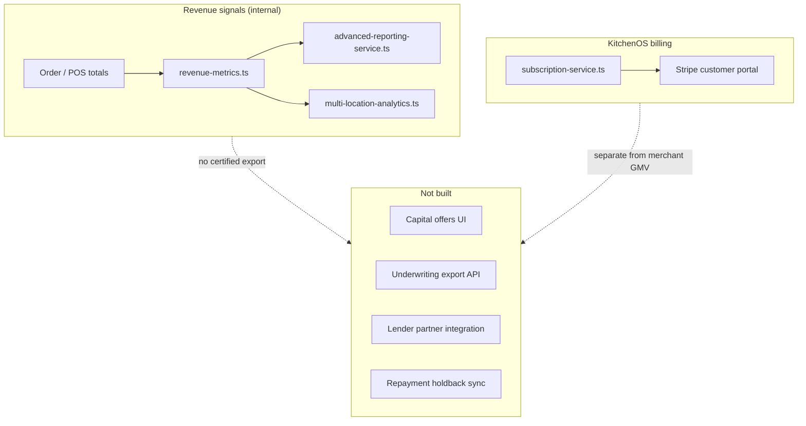

# Restaurant Capital RFC — Merchant Financing & Revenue-Based Lending

**Status:** Draft for engineering review — **not implemented**  
**Audience:** Product, Commercial, Finance, Legal, Security, Partnerships  
**Tracker:** `restaurant-capital-rfc` (competitor parity cycle 22)  
**Related:** [`app-marketplace-rfc.md`](./app-marketplace-rfc.md) · [`services/analytics/advanced-reporting-service.ts`](../services/analytics/advanced-reporting-service.ts) · [`lib/analytics/revenue-metrics.ts`](../lib/analytics/revenue-metrics.ts) · [`services/billing/subscription-service.ts`](../services/billing/subscription-service.ts) · [`docs/KITCHENOS_FINAL_PRODUCT_AND_COMPETITOR_ANALYSIS.md`](./KITCHENOS_FINAL_PRODUCT_AND_COMPETITOR_ANALYSIS.md)

---

## Summary

**Toast Capital**, **Square Capital**, and **Shopify Capital** offer merchants working-capital products — often **revenue-based financing (RBF)** or term loans — underwritten from POS/payment volume data and repaid via daily sales holdbacks. KitchenOS collects rich **operational and revenue signals** (orders, POS, multi-location analytics, Stripe billing) but has **no capital product**, no lender partnerships, no underwriting pipeline, and no regulated lending disclosures in-product.

This RFC documents the competitive gap, regulatory constraints, data assets available for underwriting, and recommends a **phased, non-lender path**: educational hub + partner referrals → verified revenue export API for lenders → optional embedded pre-qualified offers via licensed partners.

**Recommendation:** Do **not** market “restaurant capital,” “instant funding,” or “revenue-based loans” until Phase 1 (partner referral + honesty copy) ships with legal review. KitchenOS must **not** originate loans without licenses and compliance program.

---

## Problem

| Requirement | Merchant expectation | KitchenOS today |
|-------------|---------------------|-----------------|
| Fast working capital for equipment / payroll gaps | Pre-qualified offer in POS dashboard | No capital UI |
| Underwriting from sales history | Platform shares verified GMV | Revenue in analytics — **not lender-certified** |
| Transparent repayment (% of daily sales) | Holdback schedule visible | N/A |
| Multi-location rollup | Consolidated revenue for groups | `multi-location-analytics.ts` — ops only |
| Trust / regulated disclosures | State-specific lending notices | Not designed |
| Stripe / bank payout linkage | Payment processor facilitates repayment | Stripe used for **KitchenOS subscription** + storefront checkout — not capital rails |

**Competitive context:** Square Capital and Toast Capital are cited in mid-market RFPs as “platform stickiness.” Operators facing cash-flow gaps (seasonal catering, ghost kitchen expansion) expect their ops system to **surface options** even when KitchenOS is not the lender.

**Honesty:** `docs/allreport30may.md` explicitly lists “Square capital/lending” as a **defer / non-goal** for pilot — this RFC scopes *if/when* to revisit without overstating readiness.

---

## Competitor reference (high level)

| Platform | Model | Underwriting inputs | KitchenOS analog |
|----------|--------|---------------------|------------------|
| **Toast Capital** | RBF / loans via partner banks | Toast POS GMV, tenure, category | POS + order hub revenue |
| **Square Capital** | RBF from Square payments | Card volume on Square | Storefront Stripe + POS totals (partial) |
| **Shopify Capital** | RBF for Shopify merchants | Shopify Payments GMV | N/A unless Shopify-primary |
| **PayPal Working Capital** | % of PayPal sales | PayPal ledger | Not integrated |
| **Traditional MCA brokers** | Merchant cash advance (high APR) | Bank statements + POS exports | Manual CSV export only |

**Regulatory note:** Products may be structured as **commercial loans**, **RBF purchases of receivables**, or **state-licensed lending** depending on jurisdiction. KitchenOS must treat all paths as **partner-led** unless Legal approves a licensed entity.

---

## Current KitchenOS architecture



| Component | Path | Capital relevance |
|-----------|------|-------------------|
| Revenue aggregation | `lib/analytics/revenue-metrics.ts` | GMV basis for offers |
| Advanced reporting | `services/analytics/advanced-reporting-service.ts` | Trends, anomalies |
| Multi-location | `services/analytics/multi-location-analytics.ts` | Group underwriting |
| Delivery analytics | `services/analytics/delivery-channel-analytics.ts` | Channel mix risk |
| Billing | `services/billing/subscription-service.ts` | **Platform** subscription — not merchant lending |
| Storefront checkout | Stripe Connect patterns (storefront) | Potential repayment rail — **not capital-wired** |
| Marketing honesty | `lib/marketing/pricing-faq.ts`, claims registry | Must block capital claims |

**Storage gap:** No `CapitalOffer`, `LendingApplication`, `LenderPartner`, or `RevenueAttestation` models.

---

## Options compared

### Option A — Partner referral hub only (recommended Phase 1)

Static “Financing resources” page linking to **licensed lenders / brokers** (e.g. restaurant-focused lenders, SBA resources). No data sharing; no pre-qualification.

| Pros | Cons |
|------|------|
| Lowest legal risk | No competitive parity with Toast/Square embedded offers |
| 1–2 weeks (content + legal review) | Revenue from financing = $0 |
| Honest pilot positioning | Merchants still export CSV manually |

Deliverables:

- `/dashboard/growth/capital` or section on `/dashboard/analytics` — **“Resources, not offers”**
- `docs/commercial/capital-partner-disclosures.md`
- Marketing claims blocklist entry: `capital`, `instant funding`, `loan approval`

---

### Option B — Verified revenue export for lenders (recommended Phase 2)

Merchant-initiated **PDF/JSON attestation** of trailing 3–12 month GMV with workspace signature hash; optional secure link for lender under NDA.

| Dimension | Assessment |
|-----------|------------|
| Effort | **3–5 weeks** — report generator, audit log, expiring links |
| Risk | Medium — data accuracy disputes; define “verified” narrowly |
| Depends on | Revenue metrics consistency, timezone boundaries |

Attestation payload (draft):

```json
{
  "workspaceId": "uuid",
  "periodStart": "2025-06-01",
  "periodEnd": "2026-05-31",
  "grossOrderRevenue": 842120.45,
  "orderCount": 12480,
  "currency": "USD",
  "locationsIncluded": ["uuid-1", "uuid-2"],
  "generatedAt": "2026-05-31T12:00:00Z",
  "signature": "hmac-sha256(...)"
}
```

**Honesty:** Label as **“KitchenOS revenue summary”** — not a credit score, not a lending decision.

---

### Option C — Embedded pre-qualified offers via lender API (Phase 3)

Partner (licensed lender) pulls attestation + merchant consent; returns offer iframe or deep link; KitchenOS displays **“Offers from [Partner]”** with required disclosures.

| Dimension | Assessment |
|-----------|------------|
| Effort | **8–12 weeks** — OAuth to lender, consent UI, offer webhooks |
| Risk | High — marketing-as-lending, UDAAP, state licensing |
| Prerequisite | Legal program + partner contract + Phase 2 attestation |

Repayment holdback **stays on lender/processor** — KitchenOS does not debit merchant accounts.

---

### Option D — KitchenOS-native lending / RBF (not recommended)

KitchenOS originates or funds advances directly.

| Dimension | Assessment |
|-----------|------------|
| Effort | **12+ months** + licensed entity |
| Risk | Very high — banking regulations, capital requirements, collections |
| Fit | **Out of scope** for OS Kitchen product company in pilot era |

---

## Recommended phased roadmap

| Phase | Scope | Exit criteria | Sales honesty |
|-------|--------|---------------|---------------|
| **0 (this RFC)** | Document gap + options | RFC merged; tracker done | “No capital product” |
| **1** | Resource hub + legal disclosures | Page live; claims registry updated | “Financing resources — third-party” |
| **2** | Revenue attestation export | Merchant downloads signed summary | “Verified revenue export beta” |
| **3** | One lender partner embedded offers | Consent + offer display in dashboard | “Financing offers via [Partner]” |
| **4** | Multi-lender marketplace (optional) | Compare offers — rare in restaurant POS | “Capital marketplace pilot” |

---

## Underwriting data inventory (Phase 2+)

Signals KitchenOS **can** compute today (quality varies):

| Signal | Source | Caveats |
|--------|--------|---------|
| Trailing GMV | `Order.total`, revenue statuses | Includes unpaid / pay-later orders per policy |
| Order velocity | Order counts by week | Seasonality not normalized |
| Cancellation rate | Advanced reporting | Definition must match lender |
| Channel mix | Delivery analytics | Aggregator fees not netted |
| Location count | `locationId` on orders | Incomplete if staff skip location tags |
| Tenure on platform | Workspace `createdAt` | Not same as business age |
| Subscription payment history | Stripe billing | **Platform** payments ≠ restaurant GMV |

Signals **not** available without new integrations:

- Bank balances / cash flow
- Personal credit (FCRA)
- Processor holdback status (unless partner API)
- Tax returns / P&L

---

## Proposed data model (Phase 2–3)

```prisma
// Illustrative — Phase 0 only

model RevenueAttestation {
  id           String   @id @default(uuid())
  workspaceId  String
  periodStart  DateTime
  periodEnd    DateTime
  payloadJson  Json
  signature    String
  expiresAt    DateTime
  createdBy    String
  createdAt    DateTime @default(now())
}

model CapitalPartnerReferral {
  id           String   @id @default(uuid())
  workspaceId  String
  partnerSlug  String
  consentAt    DateTime
  offerId      String?  // partner reference
  status       String   // viewed | applied | funded | declined
}
```

Phase 1 requires **no migration** — static content only.

---

## Legal, compliance & security

| Topic | Requirement |
|-------|-------------|
| Not a lender | All copy: KitchenOS **does not make credit decisions** |
| Referral fees | Disclose if KitchenOS receives referral compensation |
| UDAAP / fair lending | No discriminatory targeting; equal access to resources |
| State lending ads | Partner provides disclosure templates per state |
| Data sharing | Explicit merchant consent before API pull |
| PII | Attestations aggregate GMV — minimize customer-level export |
| Audit | `recordAuditLog` on attestation generate + share |
| Marketing | Add patterns to `lib/governance/marketing-claims-governance-policy.ts` |

Engage counsel **before Phase 3**. Phase 1–2 are lower risk but still need review.

---

## API & permissions (Phase 2+)

| Action | Permission | Notes |
|--------|------------|-------|
| View resources hub | Authenticated owner/manager | Read-only |
| Generate attestation | `analytics.export` or `billing.manage` | Owner-only recommended |
| Share link with lender | `workspace.admin` + consent modal | Time-limited URL |
| Receive offer webhook | Partner HMAC | Phase 3 |

---

## Testing strategy

| Layer | Coverage |
|-------|----------|
| Unit | GMV aggregation windows match advanced reporting |
| Integration | Attestation signature verify / tamper detection |
| Legal QA | Copy review checklist per phase |
| Honesty | CI grep — no “instant approval” in marketing without flag |
| E2E | Generate attestation → download → verify hash (smoke) |

---

## Risks & open questions

1. **Accuracy liability** — If attestation GMV ≠ bank deposits, merchants blame KitchenOS. Mitigate with definitions + “gross order volume” label.
2. **Pay-later / unpaid orders** — `REVENUE_STATUSES` includes pre-payment states; lenders may want **collected cash** only.
3. **Stripe Connect gap** — Storefront payouts may not flow through KitchenOS ledger; underwriting may under-represent DTC revenue.
4. **Conflict with pilot honesty** — Capital features can imply platform maturity; gate behind `pilot_ready` commercial flag.
5. **Broker reputation** — Partner with restaurant-friendly lenders; avoid predatory MCA defaults.

**Open questions for product:**

- Is capital a **sales wedge** or **post-PMF retention** play?
- Should Phase 2 attestation be **free** or part of Growth/Enterprise tier?
- Any pilot merchant demand signal vs. app marketplace priority?

---

## Conscious non-goals (pilot)

- KitchenOS as lender of record or balance-sheet RBF
- Personal credit pulls (FCRA) inside product
- Automatic repayment holdbacks from POS without lender/processor contract
- Crypto / DeFi collateral
- Tax or accounting advice bundled with offers
- Guaranteeing approval rates in marketing

---

## References

- [Toast Capital (overview)](https://pos.toasttab.com/toast-capital)
- [Square Loans / Square Capital](https://squareup.com/us/en/banking/loans)
- [Shopify Capital](https://www.shopify.com/capital)
- KitchenOS: `services/analytics/advanced-reporting-service.ts`
- KitchenOS: `docs/app-marketplace-rfc.md` (platform partnership patterns)
- KitchenOS: `docs/allreport30may.md` — capital listed as explicit defer

---

## Decision log

| Date | Decision |
|------|----------|
| 2026-05-31 | RFC accepted as Phase 0; no lending origination; recommend Option A → B for first commercial slices |
