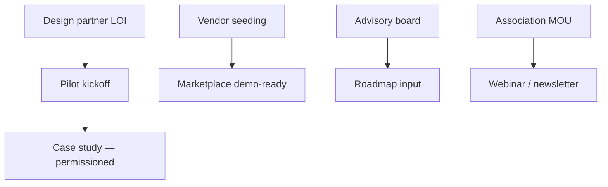

# Restaurant industry partnerships strategy — OS Kitchen

**Policy:** `restaurant-partnerships-strategy-v1`  
**Date:** 2026-06-02  
**Owner:** Founder + Marketing + PM  
**Scope:** B2B partnerships that accelerate **design partners**, **marketplace supply**, and **credibility** — not reseller channels at scale  
**Status:** **Strategy only** — **0 signed operator LOIs · 0 association MOUs · pilot NO-GO**  
**Related:** [`loi-design-partner-template.md`](./loi-design-partner-template.md) · [`vendor-seeding-strategy.md`](./vendor-seeding-strategy.md) · [`CUSTOMER_ADVISORY_BOARD.md`](./CUSTOMER_ADVISORY_BOARD.md) · [`linkedin-content-plan.md`](./linkedin-content-plan.md) · [`local-partner-network-onboarding.md`](./local-partner-network-onboarding.md)

This document defines **which restaurant-industry partnerships OS Kitchen pursues**, **in what order**, and **what we offer vs require** — without claiming existing alliances we do not have.

**Honesty rule:** Do **not** name associations, consultants, or brands as “partners” until a signed LOI/MOU is on file. Use *“in conversation”* or *“exploring”* internally only.

---

## Strategic goals (Q3–Q4 2026)

| Goal | Target | Proof |
|------|--------|-------|
| **Operator design partners** | 3 signed LOIs | [`pilot-gono-go-summary.json`](../artifacts/pilot-gono-go-summary.json) |
| **Marketplace vendors** | 5 approved suppliers on staging | [`vendor-seeding-execution.md`](./vendor-seeding-execution.md) |
| **Advisory voices** | 5–10 operators (non-customer) | [`CUSTOMER_ADVISORY_BOARD.md`](./CUSTOMER_ADVISORY_BOARD.md) |
| **Industry visibility** | 1 co-hosted webinar or panel | [`webinar-strategy.md`](./webinar-strategy.md) (Task 110) |
| **Referral intros** | 2 qualified operator intros/month | CRM / founder log |

**Not in scope (2026):** National franchise HQ deals, exclusive POS reseller agreements, paid “certified partner” badges.

---

## Partnership taxonomy

| Tier | Type | OS Kitchen gets | Partner gets | Contract |
|:----:|------|-----------------|--------------|----------|
| **P0** | Design partner (operator) | Weekly feedback, staging proof, case study rights (optional) | Pilot pricing credit, roadmap influence | [`loi-design-partner-template.md`](./loi-design-partner-template.md) |
| **P0** | Marketplace vendor (supply) | Catalog depth, checkout proof | Buyer access, Stripe Connect path | Vendor terms + onboarding |
| **P1** | Customer advisory board | Product direction, beta access | Network, early features | Advisory application + NDA |
| **P1** | Referral / agency partner | Qualified operator intros | Referral fee (TBD) | Partner portal terms (placeholder) |
| **P1** | Local partner network | Regional consultant intros | Referral credit + co-delivery | [`local-partner-network-onboarding.md`](./local-partner-network-onboarding.md) |
| **P2** | Industry association / commissary network | Newsletter, event slot, credibility | Member benefit listing | MOU / sponsorship (paid or in-kind) |
| **P2** | Consultant / integrator | Implementation help for pilots | Co-delivery revenue share | SOW per engagement |
| **P3** | Hardware / camera OEM | Device compatibility story | Software listing | [`hardware-partner-program.md`](./hardware-partner-program.md) (Task 113) |

---

## Priority partner segments

### Operators (design partners)

| Segment | Why now | Outreach channel | Disqualifiers |
|---------|---------|------------------|---------------|
| **Commissary / meal prep** | Fits order hub + production + Today CC | LinkedIn, warm intro | >5 locations without enterprise scope |
| **Ghost / cloud kitchen** | Multi-channel + integration pain | Operator communities | Requires LIVE delivery day-one |
| **Shopify / Woo restaurant** | Channel ICP — `/shopify` | E-com operator groups | No kitchen ops engagement |
| **Single-location full-service** | Classic pilot ICP | Local networks | No weekly owner availability |

**Ideal profile:** Same as LOI template — ≤5 locations, weekly sync, accepts BETA labels.

### Supply (marketplace)

| Segment | Examples (personas) | Link |
|---------|----------------------|------|
| Packaging & disposables | EcoPack-style suppliers | [`vendor-seeding-strategy.md`](./vendor-seeding-strategy.md) |
| Cleaning & sanitation | Janitorial HoReCa distributors | `/vendor` landing |
| Equipment (stretch) | Long cycle — design partner only | Sales limitation sheet |

### Industry & ecosystem

| Partner type | Examples (targets to research) | Value exchange |
|--------------|-------------------------------|----------------|
| **Regional restaurant associations** | State restaurateur orgs, indie operator coalitions | Member discount + educational webinar |
| **Commissary / shared kitchen networks** | Kitchen incubators, shared-space operators | Bundle OS Kitchen for tenants — pilot only |
| **Culinary / ops consultants** | Independent restaurant tech consultants | Referral fee + co-branded pilot |
| **Financing / capital partners** | Already disclosed as resources not lenders | No partnership claim — link only |

**Do not pursue yet:** National franchise brands (Task 122 roadmap), POS hardware OEM exclusives.

---

## Phased execution

### Phase 0 — Foundation (June 2026)

| # | Action | Owner |
|---|--------|-------|
| 0.1 | Publish honest ICP pages (`/shopify`, `/vendor`) | Marketing |
| 0.2 | LOI + design-partner email sequence ready | PM |
| 0.3 | Advisory board route live — `/advisory-board` | Marketing |
| 0.4 | CRM tracker: partner name, tier, status, next step | Founder |
| 0.5 | Forbidden-claims review on all outreach copy | Marketing |

### Phase 1 — First 3 operator LOIs (July–Aug 2026)

| Week | Focus |
|------|-------|
| 1–2 | Warm outreach: 20 qualified operators (LinkedIn + intro) |
| 3–4 | 5 discovery calls → 3 LOI drafts |
| 5–6 | Countersign 1–3 LOIs → staging workspace provision |
| 7–8 | Pilot kickoff per [`pilot-execution-checklist.md`](./pilot-execution-checklist.md) |

**Parallel:** Vendor seeding E0–E1 ([`vendor-seeding-execution.md`](./vendor-seeding-execution.md)).

### Phase 2 — Ecosystem visibility (Sep–Oct 2026)

| Initiative | Success metric |
|------------|----------------|
| 1 association MOU or guest newsletter | 1 published mention with honest BETA copy |
| 1 co-hosted webinar | 30+ registrations, 5 qualified leads |
| Advisory board at 5 members | Monthly 45-min product review |
| First permissioned operator quote | Legal-approved, not fabricated |

### Phase 3 — Referral scale (Q4 2026+)

Enable agency/referral partners only after **≥1 successful pilot conversion** — document economics in partner portal roadmap.

---

## Outreach playbook (operators)

### Discovery call agenda (30 min)

1. Operator context — locations, channels, pain  
2. Demo Today Command Center + honest AI limits  
3. BETA integration expectations — [`sales-limitation-sheet.md`](./sales-limitation-sheet.md)  
4. Design partner terms — weekly sync, staging first  
5. Next step: LOI or disqualify with reason  

### Email intro (short)

Use [`design-partner-email-sequence.md`](./design-partner-email-sequence.md) — never attach fake logos or “as seen in” claims.

### Qualification scorecard

| Criterion | Weight | Pass threshold |
|-----------|:------:|:--------------:|
| ICP fit (≤5 loc, ops engaged) | 30% | ≥80% |
| Weekly availability | 25% | Owner/COO committed |
| Channel need (Shopify/Woo/delivery) | 20% | ≥1 relevant |
| Accepts BETA posture | 15% | Verbal yes |
| Timeline (kickoff < 60 days) | 10% | Yes |

**Score ≥ 75:** LOI track · **< 75:** nurture or decline politely.

---

## Association & commissary partnership template

**Before MOU:**

| Term | OS Kitchen offer | Ask |
|------|------------------|-----|
| Member benefit | 90-day pilot credit (document in LOI) | Newsletter blurb + 1 webinar slot |
| Co-marketing | “Design partner program” — not “preferred POS” | Approved copy only |
| Data | No member list without GDPR/consent | Aggregated intro via association |

**MOU must include:** mutual disclaimer that OS Kitchen is pre-revenue BETA; no endorsement of LIVE integrations; right to review public copy.

---

## Vendor (supply) partnership track

Separate from operator LOIs — see [`vendor-seeding-strategy.md`](./vendor-seeding-strategy.md).

| Stage | Operator side | Vendor side |
|-------|---------------|---------------|
| Demo-ready | 0 LOIs OK for internal demo | 3 vendors staging |
| Pilot | ≥1 LOI operator buying on marketplace | 5 vendors, 50+ SKUs |
| Production | Paid pilot + finance sign-off | Live Connect only after DoD |

Recruit vendors via `/vendor` + direct outreach to regional distributors — link UTM `utm_campaign=vendor_recruit`.

---

## Legal & claims gates

| Activity | Gate |
|----------|------|
| Public “partner” logo | Signed MOU + marketing approval |
| Case study | Signed release + [`case-study-template.md`](./case-study-template.md) |
| Webinar co-brand | Copy review — no LIVE integration claims |
| Referral fees | Written partner agreement |
| Association member discount | Documented in LOI commercial note |

**Registry:** All public partnership language must pass [`sales-safe-claims-registry.md`](./sales-safe-claims-registry.md).

---

## Roles & RACI

| Activity | Founder | PM | Marketing | Legal |
|----------|:-------:|:--:|:---------:|:-----:|
| Operator outreach | **A/R** | C | C | I |
| LOI negotiation | **A** | R | I | C |
| Vendor recruitment | C | R | **A** | I |
| Association MOU | **A** | C | R | R |
| Advisory board | C | R | **A** | I |
| Public announcement | C | C | R | **A** |

---

## Metrics & review

| Metric | Frequency | Owner |
|--------|-----------|-------|
| LOIs signed | Weekly | Founder |
| Discovery calls / LOI conversion | Bi-weekly | PM |
| Vendor approvals | Weekly | Ops |
| Partnership-sourced inbound | Monthly | Marketing |
| Advisory attendance | Monthly | PM |

Align Q3 targets with [`q3-2026-okrs.md`](./q3-2026-okrs.md) Objective 1 (design partners).

---

## Risks & mitigations

| Risk | Mitigation |
|------|------------|
| Over-claiming “partnership” | Internal CRM status: lead / LOI / MOU / live only |
| Operator expects LIVE integrations | Limitation sheet + BETA badges in demo |
| Association wants exclusivity | Decline until product-market proof |
| Vendor no-shows after approval | Backup roster per vendor-seeding strategy |
| Logo misuse | Legal approval checklist |

---

## Related documents

| Doc | Use |
|-----|-----|
| [`design-partner-email-sequence.md`](./design-partner-email-sequence.md) | Operator nurture |
| [`pilot-execution-checklist.md`](./pilot-execution-checklist.md) | Post-LOI ops |
| [`customer-success-playbook.md`](./customer-success-playbook.md) | Pilot lifecycle |
| [`restaurant-partnerships-strategy.md`](./restaurant-partnerships-strategy.md) | This doc |
| [`linkedin-content-plan.md`](./linkedin-content-plan.md) | Social outreach |
| [`hardware-partner-program.md`](./hardware-partner-program.md) | Task 113 — OEM track |
| [`local-partner-network-onboarding.md`](./local-partner-network-onboarding.md) | Task 75 — local consultant onboarding |

---

## Revision history

| Version | Date | Change |
|---------|------|--------|
| `restaurant-partnerships-strategy-v1` | 2026-06-02 | Initial strategy — Task 108 |

**Next action:** Build CRM tracker · send design-partner sequence to 10 warm leads · schedule 3 discovery calls.
