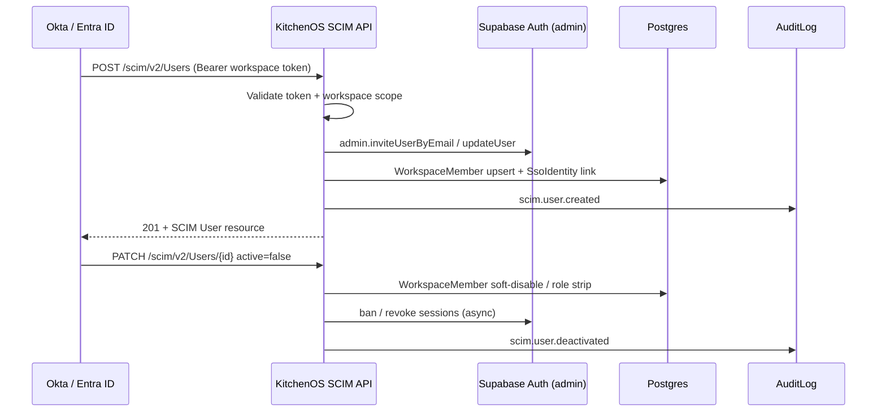

# SCIM Provisioning RFC — Enterprise User Lifecycle

**Status:** Draft for engineering review — **not implemented**  
**Audience:** Enterprise engineering, Security, Procurement, DevOps  
**Policy:** `era16-enterprise-sso-r2-pilot-v1` (`ENTERPRISE_SSO_R2_SCIM_DELIVERY_STATUS = "not_implemented"`)  
**Related:** [`enterprise-sso-r2-pilot-design.md`](./enterprise-sso-r2-pilot-design.md) · [`enterprise-sso-idp-staging-smoke-plan.md`](./enterprise-sso-idp-staging-smoke-plan.md) · [`enterprise-procurement-pack.md`](./enterprise-procurement-pack.md)

---

## Summary

KitchenOS R2 enterprise SSO delivers **session bridge only** (Supabase SAML/OIDC). **SCIM 2.0 user provisioning is not implemented.** Buyers must not be told SCIM is live until this RFC’s exit criteria pass.

This RFC defines a **RFC 7644–aligned** SCIM service for workspace-scoped staff lifecycle: create, update, deactivate, and group-to-role mapping. It extends the existing experiment webhook (`/api/webhooks/scim/experiment-auditor`) into a production-grade tenant API.

**Recommendation:** Ship SCIM **after** SSO staging smoke proof (Era 17 Cycle 2–3). Target **4–6 engineering weeks** once SSO `pilot_ready` gate passes.

---

## Problem

| Requirement | Today | Gap |
|-------------|-------|-----|
| IdP-driven user onboarding | Manual staff invite + email | No automated provision |
| Offboarding / deactivation | Manual role removal | No IdP `active=false` sync |
| Group → role mapping | IdP groups ignored | RBAC drift vs IdP |
| Audit trail | Partial (`recordAuditLog` on SSO login) | No SCIM mutation audit |
| Procurement | Honest `not_implemented` | Enterprise buyers expect SCIM 2.0 |

**Current experiment (not production SCIM):**

| Component | Path |
|-----------|------|
| Webhook | `POST /api/webhooks/scim/experiment-auditor` |
| Handler | `lib/auth/experiment-auditor-scim.ts` |
| Scope | `PLATFORM_READONLY_AUDITOR` only |
| Auth | Bearer `EXPERIMENT_SCIM_WEBHOOK_SECRET` |
| Protocol | Custom JSON — **not** RFC 7644 |

The experiment proves IdP → KitchenOS webhook wiring. It must **not** be marketed as SCIM.

---

## Standards baseline — RFC 7644 (SCIM 2.0)

KitchenOS will implement the **Service Provider** role per [RFC 7644](https://www.rfc-editor.org/rfc/rfc7644):

| RFC section | KitchenOS scope |
|-------------|-----------------|
| §3 Resources | `User`, `Group` (workspace-scoped) |
| §3.2 User | `userName`, `name`, `emails`, `active`, `externalId`, `groups` |
| §3.3 Group | `displayName`, `members[]` — maps to `WorkspaceMemberRole` suggestions |
| §3.4 Schema | `urn:ietf:params:scim:schemas:core:2.0:User`, `...:Group` |
| §3.4.2 Extension | `urn:kitchenos:params:scim:schemas:extension:workspace:2.0:User` — `workspaceId`, `role` |
| §3.7 Filtering | `filter=userName eq "..."` on GET `/Users` |
| §3.12 Pagination | `startIndex`, `count`, `totalResults` |
| §3.14 PATCH | `active: false` deactivation, role updates |
| §7 Security | Bearer token per workspace; TLS only; rate limits |

**Out of scope v1:** Bulk operations (§3.7), ETags, complex OR filters, cross-workspace Users.

---

## Architecture



### Design principles

1. **Workspace isolation** — every SCIM token binds to exactly one `workspaceId`; no cross-tenant reads or writes.
2. **SSO coupling** — SCIM `externalId` maps to `SsoIdentity.idpSubject` when SSO enabled; email fallback when not.
3. **RBAC fail-closed** — IdP group → role is **suggest-only** in v1; `OWNER` never auto-assigned via SCIM.
4. **Deactivation ≠ delete** — `active=false` removes workspace membership and revokes sessions; `UserProfile` retained for order audit.
5. **Idempotent creates** — duplicate `userName` + same `externalId` → 200 with existing resource (RFC §3.3).

---

## API surface

Base path: **`/api/scim/v2`** (workspace-scoped via Bearer token).

| Method | Endpoint | RFC | Behavior |
|--------|----------|-----|----------|
| GET | `/ServiceProviderConfig` | §4 | Supported features, auth scheme, filter max |
| GET | `/Schemas` | §4 | User + Group + KitchenOS extension |
| GET | `/ResourceTypes` | §4 | User, Group metadata |
| GET | `/Users` | §3.4.2 | List/filter workspace members |
| GET | `/Users/{id}` | §3.4.2 | Single user by SCIM id |
| POST | `/Users` | §3.3 | Create + invite; upsert membership |
| PUT | `/Users/{id}` | §3.5.1 | Full replace |
| PATCH | `/Users/{id}` | §3.5.2 | Partial update (`active`, `role`) |
| DELETE | `/Users/{id}` | §3.6 | Soft deprovision (409 if orders require retention) |
| GET | `/Groups` | §3.4.2 | List workspace role groups |
| GET | `/Groups/{id}` | §3.4.2 | Single group |
| POST | `/Groups` | §3.3 | Create logical group (optional v1) |
| PATCH | `/Groups/{id}` | §3.5.2 | Member add/remove |

### Authentication

| Header | Value |
|--------|-------|
| `Authorization` | `Bearer {workspace_scim_token}` |
| `Content-Type` | `application/scim+json` |

Token storage: `WorkspaceScimSettings.scimBearerTokenHash` (new table, bcrypt/sha256 — never plaintext in DB).

Rotation: workspace admin generates new token → old token grace period 24h → audit `scim.token.rotated`.

### Example — create user

**Request:**

```http
POST /api/scim/v2/Users
Authorization: Bearer kos_scim_***
Content-Type: application/scim+json

{
  "schemas": ["urn:ietf:params:scim:schemas:core:2.0:User"],
  "userName": "alex@acme-kitchen.com",
  "externalId": "00u1abc2def3ghi4jkl",
  "name": { "formatted": "Alex Rivera" },
  "emails": [{ "value": "alex@acme-kitchen.com", "primary": true }],
  "active": true,
  "urn:kitchenos:params:scim:schemas:extension:workspace:2.0:User": {
    "role": "STAFF"
  }
}
```

**Response `201`:**

```json
{
  "schemas": ["urn:ietf:params:scim:schemas:core:2.0:User"],
  "id": "550e8400-e29b-41d4-a716-446655440000",
  "userName": "alex@acme-kitchen.com",
  "externalId": "00u1abc2def3ghi4jkl",
  "active": true,
  "meta": {
    "resourceType": "User",
    "location": "https://app.kitchenos.com/api/scim/v2/Users/550e8400-e29b-41d4-a716-446655440000",
    "created": "2026-06-01T12:00:00Z"
  }
}
```

### Error model (RFC 7644 §3.12)

| HTTP | `scimType` | When |
|------|------------|------|
| 400 | `invalidValue` | Schema validation failure |
| 401 | — | Missing/invalid Bearer token |
| 403 | `mutability` | Attempt to assign `OWNER` via SCIM |
| 404 | — | Unknown user id in workspace |
| 409 | `uniqueness` | Conflicting `externalId` across users |
| 429 | — | Rate limit exceeded (`X-RateLimit-*`) |
| 503 | — | Supabase Auth admin API unavailable |

---

## Data model changes

| Table / model | Purpose |
|---------------|---------|
| `WorkspaceScimSettings` | `workspaceId`, `enabled`, `tokenHash`, `lastRotatedAt`, `pilotPhase` |
| `ScimProvisionedUser` | `workspaceId`, `userId`, `scimId`, `externalId`, `idpSubject`, `active`, `lastSyncAt` |
| `WorkspaceMember` | Existing — SCIM upserts `role` (STAFF/ADMIN only) |
| `SsoIdentity` | Link `externalId` ↔ `idpSubject` when SSO active |
| `AuditLog` | `scim.user.*`, `scim.group.*`, `scim.token.*` events |

**Soft delete:** `ScimProvisionedUser.active = false` + `WorkspaceMember` removal; no hard delete of `UserProfile` (aligns with [`soft-delete-standard.md`](./soft-delete-standard.md) when published).

---

## IdP integration notes

| IdP | SCIM base URL | Group mapping |
|-----|---------------|---------------|
| **Okta** | `https://{tenant}.okta.com/scim/v2/` → KitchenOS SP URL | Okta group → `urn:...:role` extension |
| **Microsoft Entra ID** | Enterprise App provisioning | Entra group → role (suggest STAFF) |

**Pre-requisite:** SSO R2 `pilot_ready` — SCIM without SSO creates orphan users who cannot log in.

**Entitlements:** `ssoOidc` + new `scimProvisioning` on ENTERPRISE plan matrix.

---

## Security

| Control | Implementation |
|---------|----------------|
| Token scope | One workspace per token; hash at rest |
| TLS | Required; reject HTTP in production |
| Rate limiting | 60 req/min per workspace (`lib/rate-limit.ts` when shipped) |
| IP allowlist | Optional `WorkspaceScimSettings.allowedCidrs[]` (v1.1) |
| Audit | All mutations → `AuditLog` + structured logger |
| Pen test | Required before `pilot` delivery — see [`pen-test-plan.md`](./pen-test-plan.md) when published |
| Forbidden claims | Same as `ENTERPRISE_SSO_R2_PILOT_ERA16_FORBIDDEN_DELIVERY_CLAIMS` — no “SCIM is live” until proof |

---

## Implementation timeline — 4–6 weeks

Assumes SSO staging smoke **proof_passed** and dedicated engineer.

| Week | Milestone | Deliverables |
|------|-----------|--------------|
| **1** | Foundation | `WorkspaceScimSettings` migration; token generation UI (Settings → Security); `GET /ServiceProviderConfig`, `/Schemas`, `/ResourceTypes`; unit tests for schema validation |
| **2** | User CRUD | `POST/GET/PATCH/DELETE /Users`; Supabase admin invite adapter; `WorkspaceMember` upsert; audit events; idempotency tests |
| **3** | Groups + SSO link | `GET/PATCH /Groups`; `SsoIdentity` linking; deactivation session revoke job; negative tests (wrong workspace, OWNER assign) |
| **4** | IdP smoke | Okta + Entra provisioning apps against staging; `scripts/smoke-scim-staging.ts`; artifact `artifacts/scim-staging-smoke-summary.json` |
| **5** | Hardening | Rate limits; OpenAPI + procurement doc sync; load test 100 users/min; security review checklist |
| **6** (buffer) | Pilot gate | Operator runbook; `smoke:enterprise-scim-pilot-ready-gate`; matrix bump `not_implemented` → `pilot` only with artifact |

**Parallel track:** Deprecate `/api/webhooks/scim/experiment-auditor` after platform auditor moves to full SCIM Group or remains internal-only.

---

## Testing strategy

| Layer | Coverage |
|-------|----------|
| Unit | RFC schema parse, role guardrails, token verify, idempotent create |
| Integration | Prisma + Supabase admin mock; workspace isolation |
| Contract | SCIM conformance fixtures (Okta SCIM test suite subset) |
| E2E staging | IdP provision → login via SSO → dashboard access → deprovision → deny |
| Negative | Cross-tenant token, expired token, OWNER elevation, malformed PATCH |

**CI scripts (proposed):**

- `test:ci:scim-rfc-schema-v1`
- `smoke:scim-staging` (requires `SCIM_STAGING_*` env — ops vault item)

---

## Exit criteria (pilot delivery)

1. Okta **or** Entra provisions 3 test users into staging workspace via SCIM 2.0.
2. Provisioned user completes SSO login and passes `requireTenantActor`.
3. `PATCH active=false` revokes dashboard access within 60s.
4. Cross-tenant negative test returns 404/403 — no data leak.
5. Audit log contains full provision/deprovision chain.
6. Procurement pack updated — delivery `pilot`, not `live`.
7. Policy constant `ENTERPRISE_SSO_R2_SCIM_DELIVERY_STATUS` moves to `pilot` only after artifact `overall: PASSED`.

Until then: **`not_implemented`** — do not claim SCIM in sales, marketing, or buyer questionnaires.

---

## References

- [RFC 7644 — SCIM Protocol](https://www.rfc-editor.org/rfc/rfc7644)
- [RFC 7643 — SCIM Core Schema](https://www.rfc-editor.org/rfc/rfc7643)
- [Okta SCIM 2.0 Guide](https://developer.okta.com/docs/concepts/scim/)
- [Microsoft Entra provisioning](https://learn.microsoft.com/en-us/entra/identity/app-provisioning/use-scim-to-provision-users-and-groups)
- KitchenOS: `lib/enterprise/enterprise-sso-r2-pilot-era16-policy.ts`
- KitchenOS experiment: `lib/auth/experiment-auditor-scim.ts`
