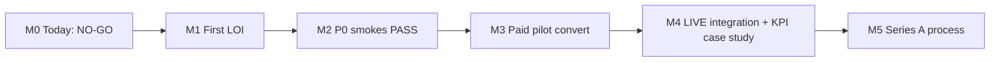

# Series A narrative prep — OS Kitchen

**Policy:** `series-a-narrative-v1`  
**Date:** 2026-06-02  
**Owner:** Founder + PM  
**Status:** **NOT fundraise-ready** — internal narrative draft only  
**Sources:** [`artifacts/pilot-gono-go-summary.json`](../artifacts/pilot-gono-go-summary.json) · [`artifacts/competitor-feature-tracker.json`](../artifacts/competitor-feature-tracker.json) · [`reportjune2.md`](./reportjune2.md)

This document is the **honest Series A story arc** — what OS Kitchen is, why it could win, what proof is missing today, and the **milestones that unlock a credible raise**. It is not a pitch deck; it is the narrative spine for decks, data room, and partner conversations.

**Hard rule (June 2026):** Do **not** start a Series A process until Gate C in [`pilot-acceptance-criteria.md`](./pilot-acceptance-criteria.md) or equivalent paid-pilot conversion. Current decision: **NO-GO** (`pilot-gono-go-summary.json`, `reportjune2.md` § Go/No-Go Gates).

---

## Executive summary

| Question | Honest answer (June 2026) |
|----------|---------------------------|
| **What is OS Kitchen?** | Cloud operating system for multi-channel food operators — order hub → kitchen → production → packing → routes, plus B2B HoReCa marketplace and **7 proprietary AI modules** in one codebase. |
| **Stage** | Pre-revenue · **0 signed LOI** · **0 LIVE integrations** · broad engineering surface (770 app routes, 878+ commits) |
| **Why now?** | Commissaries, ghost kitchens, and hybrid commerce operators outgrow POS-first stacks; AI hype needs **operational grounding** and honest integration labels. |
| **Why us?** | Depth on fulfillment + AI module breadth + marketplace buyer vision — **not** hardware scale or customer logos yet. |
| **Series A today?** | **NO-GO** — no paid pilots, no live metrics, P0 staging proof SKIPPED |
| **Series A when?** | After **1–3 paying design partners**, **≥1 LIVE integration**, repeatable pilot KPIs, and SOC2 path credible |

**Elevator pitch (investor-safe today):**

> OS Kitchen is building the **operating system for commissaries and multi-channel food businesses** — unified order-to-fulfillment software with seven AI modules and a B2B supply marketplace. We’re **pre-customer** with strong engineering scaffolding and honest BETA posture; we’re raising **design partners and seed extension runway**, not a Series A, until pilot proof converts.

---

## The thesis

### Problem

Food operators running production kitchens juggle **disconnected channels** (storefront, marketplaces, catering, wholesale), **opaque integration status**, and **AI products that overpromise**. Commissaries and ghost kitchens need one **order truth** from sale through pack-out — not another terminal brochure.

### Solution

OS Kitchen unifies:

1. **Commerce & ops** — storefront, POS, KDS, production board, packing, routes  
2. **Owner command** — Today Command Center + deterministic AI briefing  
3. **Seven AI modules** — costing, purchasing, menu, simulation, benchmarks, camera-ready stations (see [`ai-moats-honest-positioning.md`](./ai-moats-honest-positioning.md))  
4. **B2B marketplace** — buyer catalog → cart → PO (vendor side via Stripe Connect)  
5. **Trust layer** — BETA badges, Integration Health, forbidden-claims CI

### Wedge vs incumbents

| Incumbent strength | OS Kitchen angle |
|--------------------|------------------|
| Toast / Square hardware + payments | Software-first, BYO device, **production depth** |
| Toast IQ / xtraCHEF narrative | **7 modules in one repo** — pilot-unproven but broader surface |
| App marketplaces | **Native HoReCa buyer marketplace** (BETA) — different from Toast apps |

Deep dive: [`toast-gap-analysis.md`](./toast-gap-analysis.md) · [`competitor-comparison-honest.md`](./competitor-comparison-honest.md)

---

## Market & ICP

### Target operator (Series A story ICP)

| Segment | Why they care | Proof we need |
|---------|---------------|---------------|
| **Commissary / central kitchen** | Multi-brand production, PO volume | Pilot: order accuracy, prep throughput |
| **Ghost / virtual kitchen** | Channel chaos, one feed | Pilot: channel ingest + KDS reliability |
| **Meal prep / catering hybrid** | Production calendar + storefront | Pilot: on-time pack rate |
| **Small multi-unit (≤5 locations)** | Owner command center | Pilot: cross-location dashboard usage |

**Not primary Series A ICP (yet):** Enterprise franchise (100+ units), full-service dine-in hardware-first, processor-of-record payments plays.

### TAM framing (directional — not audited)

Use **serviceable** language only:

> US food service software + operator tools — POS, kitchen, inventory, and B2B procurement — is a **multi-billion** category dominated by Toast, Square, and Lightspeed. OS Kitchen targets the **production-heavy subset** (commissary, ghost, meal prep) where fulfillment depth is underserved — **single-digit % of total POS TAM** until we prove expansion.

Do not cite precise TAM/CAM numbers without third-party source.

---

## Product & moats (engineering vs market)

### What is shipped (engineering truth)

| Pillar | Evidence | Sales-safe? |
|--------|----------|:-----------:|
| Today Command Center | `/dashboard/today`, briefing panel | Partial — illustrative stats need labels |
| 7 AI modules | 22/22 in `ai-moats-tracker.json` | Partial — BETA/preview mix |
| Marketplace buyer UX | Catalog → checkout → PO | Partial — migration + seeding |
| Integration wiring | 7 BETA + 1 PLACEHOLDER | **No LIVE claims** |
| Nav / ops breadth | 566 dashboard routes | Engineering — not all GTM |

### What is **not** proven (market truth)

- Customer ROI · retention · NRR  
- LIVE partner integrations · 24h uptime  
- Rush-hour KDS at scale  
- Marketplace GMV or take rate  
- AI module adoption beyond demo

**Investor line:** *"Engineering-complete on seven AI modules; market-unproven until design partners land."*

---

## Traction & metrics (honest)

| Metric | June 2026 | Series A target (indicative) |
|--------|-----------|------------------------------|
| Signed LOI / design partners | **0** | ≥3 |
| Paid pilots | **0** | ≥1 converted |
| LIVE integrations | **0** | ≥2 (Woo + 1 delivery or accounting) |
| ARR / MRR | **$0** | ≥$500K ARR or clear path in 12 mo |
| Pilot KPIs published | None | 2+ case studies with written approval |
| P0 staging smokes | **SKIPPED** | **PASS** in CI + staging |
| SOC2 | Not started | Readiness assessment + roadmap |

Source: [`pilot-gono-go-summary.json`](../artifacts/pilot-gono-go-summary.json) · [`reportjune2.md`](./reportjune2.md)

---

## Business model (narrative)

| Stream | Today | Series A story |
|--------|-------|----------------|
| **SaaS tiers** | Starter / Pro / Team / Enterprise on `/pricing` | Per-location + module gates |
| **Marketplace** | BETA — no public take-rate claim | Buyer subscription + vendor commission (see Task 96 pricing strategy) |
| **Payments** | Stripe Connect — not processor-of-record | Facilitation; no Toast Capital parity |
| **Services** | Design partner / implementation | Land-and-expand via pilot SOW |

**Unit economics:** Do not model LTV/CAC until ≥1 paid cohort. Use pilot SOW pricing as anchor.

---

## Milestones to Series A readiness

| Milestone | Definition | Owner | Target |
|-----------|------------|-------|--------|
| **M1** | Signed design partner LOI | Founder / Sales | Q3 2026 |
| **M2** | P0 staging proof PASS (not SKIPPED) | Eng + Ops | Q3 2026 |
| **M3** | Gate C pilot → paid conversion | CS + Founder | Q4 2026 |
| **M4** | WooCommerce LIVE + 1 case study | Integrations + Marketing | Q4 2026 |
| **M5** | SOC2 readiness doc + SSO staging PASS | Eng | Q1 2027 |
| **M6** | **Series A narrative → active fundraise** | Founder | After M3 + M4 |

Checklists: [`pilot-execution-checklist.md`](./pilot-execution-checklist.md) · [`beta-to-live-roadmap.md`](./beta-to-live-roadmap.md) · [`q3-2026-okrs.md`](./q3-2026-okrs.md) (Task 98)

---

## Use of funds (template — activate at fundraise)

**Do not publish dollar amounts until board-approved plan.**

| Bucket | % (indicative) | Purpose |
|--------|:--------------:|---------|
| **Product & eng** | 50–55% | LIVE integrations, marketplace hardening, AI pilot metrics |
| **GTM & design partners** | 20–25% | Founder-led sales, case studies, ICP landings |
| **Ops & compliance** | 10–15% | SOC2, staging, on-call, bus-factor mitigation |
| **G&A / runway buffer** | 10–15% | Finance, legal, 18+ mo runway target |

**Anti-patterns:** Do not allocate to hardware terminal program, fake enterprise sales team, or marketing spend before first paid pilot.

---

## Risks (lead with these in diligence)

| Risk | Mitigation |
|------|------------|
| **Zero customers** | Design partner LOI pipeline · [`loi-design-partner-template.md`](./loi-design-partner-template.md) |
| **0 LIVE integrations** | Woo → DoorDash queue · [`beta-to-live-roadmap.md`](./beta-to-live-roadmap.md) |
| **AI overclaim backlash** | Public honesty policy (Task 100) · BETA badges · synthetic camera banner |
| **Toast/Square displacement** | Software-first ICP · [`toast-gap-analysis.md`](./toast-gap-analysis.md) |
| **Bus factor 1** | [`bus-factor-mitigation.md`](./bus-factor-mitigation.md) |
| **Nav / complexity** | 566 routes — focus demo on Today + 3 modules |
| **Staging proof SKIPPED** | Ops vault + P0 CI · [`staging-environment-checklist.md`](./staging-environment-checklist.md) |

---

## Deck outline (10 slides — when fundraise opens)

1. **Title** — OS Kitchen: Operating system for production food businesses  
2. **Problem** — Channel sprawl + AI hype without ops truth  
3. **Solution** — One screen: orders → kitchen → pack → routes + marketplace  
4. **Product demo** — Today Command Center (90 sec) — [`demo-video-script-today.md`](./demo-video-script-today.md)  
5. **AI modules** — 7 modules, honest maturity table  
6. **Marketplace** — Buyer + vendor vision (BETA today)  
7. **Traction** — **Honest**: LOI count, pilot status, LIVE integrations — no vanity logos  
8. **Competition** — Qualified wins vs Toast/Square — not parity  
9. **Business model** — SaaS + marketplace path  
10. **Ask & milestones** — Use of funds tied to M1–M4

Appendix: architecture diagram, integration registry, pilot acceptance gates, competitor tracker excerpt.

---

## What to say / what not to say

### Do say (investor conversations today)

- "We're recruiting design partners, not closing a Series A yet."  
- "Seven AI modules shipped in code; pilot proof is the gap."  
- "Zero LIVE integrations — here's our BETA-to-LIVE roadmap."  
- "Our wedge is fulfillment depth + B2B marketplace, not payment terminals."

### Do not say

- "Series A ready" · "Production-certified integrations" · "Thousands of restaurants"  
- "Toast-class" or "beat Toast on everything"  
- "SOC2 certified" · "Profitable unit economics" without cohort data  
- "Autonomous AI manager" · "Live computer vision" (camera is synthetic by default)

Run `npm run verify-claims` before any deck or data room update.

---

## Fundraise sequencing (recommended)

| Round | When | Narrative |
|-------|------|-----------|
| **Now** | June 2026 | Seed extension / angel — **runway to first paid pilot** |
| **Post-M3** | Paid pilot + KPIs | Seed+ or pre-A — **repeatable pilot playbook** |
| **Post-M4** | LIVE integrations + case study | **Series A** — scale GTM + integrations |

---

## Verification checklist (before opening Series A)

- [ ] ≥1 paid customer or ≥3 LOI with weekly engagement logs  
- [ ] `pilot-gono-go-summary.json` → customer gate PASS  
- [ ] P0 staging smokes PASS (not SKIPPED)  
- [ ] ≥1 integration LIVE per [`live-integration-definition-of-done.md`](./live-integration-definition-of-done.md)  
- [ ] Case study approved per [`case-study-template.md`](./case-study-template.md)  
- [ ] [`soc2-readiness-assessment.md`](./soc2-readiness-assessment.md) complete (Task 95)  
- [ ] Board alignment on NO-GO → GO transition  
- [ ] Forbidden claims CI green on all deck strings

---

## Related docs

| Doc | Use |
|-----|-----|
| [`founding-customer-story.md`](./founding-customer-story.md) | Pre-customer narrative |
| [`toast-gap-analysis.md`](./toast-gap-analysis.md) | Competitive diligence |
| [`ai-moats-honest-positioning.md`](./ai-moats-honest-positioning.md) | AI slide content |
| [`sales-safe-claims-registry.md`](./sales-safe-claims-registry.md) | Claims gate |
| [`pilot-acceptance-criteria.md`](./pilot-acceptance-criteria.md) | Proof gates |
| [`bus-factor-mitigation.md`](./bus-factor-mitigation.md) | Team risk |

---

*Generated as Task 94 — P2 PM. Next: [`soc2-readiness-assessment.md`](./soc2-readiness-assessment.md) (Task 95).*
