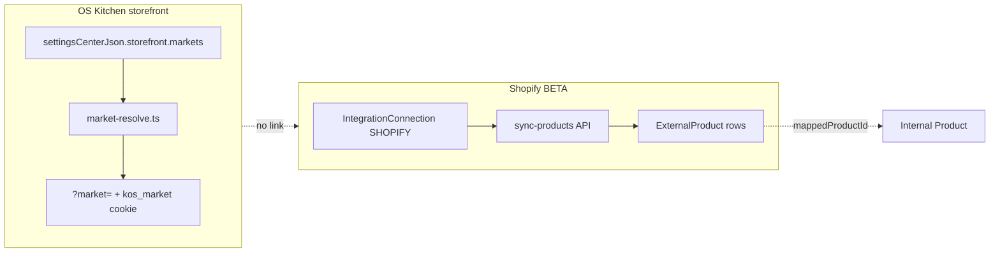

# Shopify Markets RFC — Multi-Region Commerce Integration

**Status:** Phase 1–6 shipped (discovery + mapping + import + webhooks + push + bidirectional + catalog publication BETA)  
**Audience:** Integrations, Storefront, Product, Commercial  
**Tracker:** `shopify-markets-rfc` (competitor parity cycle 16)  
**Related:** [`roadmap/STOREFRONT_SHOPIFY_PARITY.md`](./roadmap/STOREFRONT_SHOPIFY_PARITY.md) · [`storefront-audit-21may.md`](./storefront-audit-21may.md) · [`services/integrations/shopify.ts`](../services/integrations/shopify.ts) · [`lib/storefront/markets.ts`](../lib/storefront/markets.ts)

---

## Summary

**Shopify Markets** lets merchants sell in multiple countries/regions with localized pricing, catalogs, domains, duties, and tax behavior from a single Shopify admin. KitchenOS today ships an **internal storefront Markets scaffold** (`?market=` routing, JSON in `settingsCenterJson`) but has **no researched or implemented bridge** to Shopify Markets APIs, webhooks, or catalog sync.

This RFC documents the gap, compares integration options, and recommends a **phased, honest pilot path**: read-only market discovery first, then one-way catalog/price import, then optional push of OS Kitchen inventory/pricing only where merchant opts in.

**Recommendation:** Do **not** promise Shopify Markets parity in sales decks until Phase 1 (read-only discovery + admin UI) ships. Pilot ICP should continue using native OS Kitchen Markets unless the merchant is Shopify-primary with an existing Markets setup.

---

## Problem

| Requirement | Merchant expectation | KitchenOS today |
|-------------|---------------------|-----------------|
| Sell in CA + US with different menus/prices | Shopify Markets or native multi-market | Native markets JSON only |
| Shopify is system of record for catalog | Prices/inventory flow from Shopify | Product sync imports rows; **no market dimension** |
| Local domains (`ca.brand.com`, `brand.co.uk`) | Shopify managed domains + redirects | `hostSubdomain` + custom domain per OS Kitchen market |
| Duties/taxes at checkout | Shopify Markets + Markets Pro | OS Kitchen tax settings per storefront |
| Reporting by market | Shopify analytics + KitchenOS ops | Partial — market cookie on orders if wired |

**Competitive context:** Toast/Square focus on in-venue ops; **Shopify-native meal prep / DTC kitchens** expect Markets when they already run Shopify Plus. Without this RFC we risk overselling the existing Shopify BETA integration.

---

## Shopify Markets — platform surface (reference)

Shopify exposes Markets through Admin GraphQL (API versions 2024-10+):

| Concept | Shopify | KitchenOS analog |
|---------|---------|------------------|
| Market | Country/region group with catalog rules | `StorefrontMarket` in `settingsCenterJson` |
| Catalog | Product availability per market | `activeMenuId` + `productIds` filter |
| Price list | Market-specific pricing | Product `price` + currency on market |
| Web presence | Domain/subfolder per market | `hostSubdomain`, `storeSlug`, custom domain |
| Primary market | Shop default | `defaultPilotMarket()` |
| Inventory | Location-aware (not always market-scoped) | `StorefrontInventoryItem`, ingredient stock |

Relevant GraphQL areas (names may vary by API version):

- `markets` / `Market` — list enabled markets, regions, status
- `catalogs` / `Catalog` — publication scopes
- `priceLists` / `PriceList` — fixed prices per variant
- `marketLocalizations` — content/locale
- Webhooks: `markets/create`, `markets/update`, product/market publication changes (verify scopes at implementation time)

**Honesty:** KitchenOS Shopify integration today covers **orders + products (flat)** via `fetchProductsGraphQL` / `fetchOrdersGraphQL` — no `marketId`, no price lists, no publication scopes.

---

## Current KitchenOS architecture



| Component | Path |
|-----------|------|
| Markets schema | `lib/storefront/markets.ts` |
| Admin editor | `app/dashboard/storefront/markets/page.tsx`, `StorefrontMarketsEditor` |
| Routing | `lib/storefront/market-resolve.ts`, middleware subdomain |
| Checkout market context | `lib/storefront/order-hub-commerce.ts` |
| Shopify products | `app/api/integrations/shopify/sync-products/route.ts` |
| Inventory sync (cycle 15) | `services/integrations/inventory-sync-load.ts` — **no market scope** |

**Storage risk (known):** Markets live in JSON blob, not first-class tables (`docs/storefront-audit-21may.md` L3). Shopify Markets sync would either duplicate into JSON or force a migration to `StorefrontMarket` model.

---

## Options compared

### Option A — No Shopify Markets bridge (status quo)

Merchants use OS Kitchen Markets only; Shopify connection remains orders + flat catalog.

| Pros | Cons |
|------|------|
| Zero integration cost | Shopify-primary merchants maintain two market configs |
| Clear honesty in BETA docs | Cannot claim Shopify Markets support |

**Fit:** Pilot ICP on native storefront.

---

### Option B — Read-only discovery + admin mapping (recommended Phase 1)

Pull Shopify Markets list via Admin GraphQL; show side-by-side with OS Kitchen markets; allow manual link (`shopifyMarketId` ↔ `StorefrontMarket.id`).

| Dimension | Assessment |
|-----------|------------|
| Effort | **2–3 weeks** — GraphQL query, UI panel, mapping JSON |
| Risk | Low — no write path to Shopify |
| Sales honesty | “Markets awareness — manual mapping” |

Deliverables:

- `services/integrations/shopify-markets-service.ts` — `listShopifyMarkets(creds)`
- Dashboard card on `/dashboard/integrations/shopify` + `/dashboard/storefront/markets`
- Extend `StorefrontMarket` schema with optional `shopifyMarketId`, `shopifyCatalogId`

---

### Option C — One-way import (Shopify → KitchenOS)

On sync, import market-specific prices and publication flags into OS Kitchen markets.

| Dimension | Assessment |
|-----------|------------|
| Effort | **4–6 weeks** — price lists, variant mapping, cache invalidation |
| Risk | Medium — stale prices if webhook gaps |
| Depends on | Product mapping completeness, per-market cache tags (Phase 5 partial) |

Rules:

- Shopify wins on **price** when mapping exists and `syncDirection = import`
- OS Kitchen wins on **menu composition** unless `productIds` empty (import fills)

---

### Option D — Bidirectional sync (KitchenOS ↔ Shopify Markets)

Push OS Kitchen market price/menu changes to Shopify price lists and publications.

| Dimension | Assessment |
|-----------|------------|
| Effort | **8–12 weeks** — conflict resolution, rate limits, Plus-only features |
| Risk | High — tax/duty misconfiguration, double-write |
| Prerequisite | Option C stable + inventory sync market-scoped |

**Not recommended for pilot.** Revisit post-PMF for Shopify Plus partners only.

---

## Recommended phased roadmap

| Phase | Scope | Exit criteria |
|-------|--------|---------------|
| **0 (this RFC)** | Document gap + options | RFC merged; tracker `shopify-markets-rfc: done` |
| **1** | Read-only `listMarkets` + manual mapping UI | Merchant sees Shopify markets; can link to OS market |
| **2** | Import price lists on product sync | Mapped variants show market price on storefront |
| **3** | Webhooks for market/price changes | <15 min staleness SLA (best effort) |
| **4** | Optional push (KitchenOS → Shopify) | Feature flag; explicit merchant opt-in |
| **5** | Bidirectional reconcile (pilot BETA) | `syncMode=bidirectional`, conflict queue, `priceAuthority` per market |
| **6** | Catalog publication sync | Import/push publications, `catalogAuthority`, storefront `productIds` overlay |

### Phase 5 — Bidirectional reconcile (shipped BETA)

Pilot slice of Option D — **price-only**, not full catalog publication bi-sync.

| Field | Values | Behavior |
|-------|--------|----------|
| `syncMode` | `bidirectional` | Enables reconcile engine on webhooks + product price updates |
| `priceAuthority` | `shopify` \| `kitchenos` \| `manual` | Auto-resolve conflicts: accept import, push to Shopify, or queue for operator |

**Flow:**

1. Webhook or product-update trigger runs `reconcileBidirectionalShopifyMarketsForConnection`.
2. Import Shopify price list (skip unchanged hash — same as Phase 3).
3. Compare imported amounts vs KitchenOS product prices per mapped variant.
4. Auto-resolve per `priceAuthority`; `manual` conflicts persist in `settingsJson.marketsSync.marketPriceConflicts`.
5. Operator resolves via Shopify integration panel: **Use Shopify** or **Use KitchenOS**.

**Services:** `shopify-markets-bidirectional-service.ts` · **UI:** `shopify-markets-panel.tsx`, `storefront-markets-editor.tsx`

**Conscious limits (Phase 5):** Price-only bidirectional; catalog handled in Phase 6.

### Phase 6 — Catalog publication (shipped BETA)

Extends market sync to **menu composition** via Shopify catalog publications.

| Field | Purpose |
|-------|---------|
| `catalogAuthority` | Bidirectional conflict resolution for published product sets |
| `marketCatalogImports` | Cached Shopify publication product IDs per OS market |
| `marketCatalogConflicts` | Per-product publish/unpublish mismatches |

**RFC rule:** KitchenOS wins on `productIds` when set; empty `productIds` fills from Shopify import.

**Services:** `shopify-market-catalog-service.ts`, `shopify-market-catalog-push-service.ts`, `shopify-markets-catalog-bidirectional-service.ts`

**Conscious limits:** No tax/duty sync, publication scopes only (not full Catalog CRUD).

## Proposed data model (Phase 1+)

Extend `storefrontMarketSchema` (`lib/storefront/markets.ts`):

```typescript
shopifyMarketId: z.string().max(64).optional(),
shopifyCatalogId: z.string().max(64).optional(),
shopifyPriceListId: z.string().max(64).optional(),
syncMode: z.enum(["none", "import", "bidirectional"]).optional().default("none"),
```

Long-term: migrate to `StorefrontMarket` Prisma model with `workspaceId`, `connectionId`, foreign keys — aligns with multi-store workspace UI.

Connection `settingsJson` extension:

```json
{
  "marketsSync": {
    "enabled": false,
    "lastDiscoveryAt": null,
    "primaryShopifyMarketId": null
  }
}
```

---

## API & permissions

| Action | Permission | Notes |
|--------|------------|-------|
| Discover markets | `integrations.manage` | Uses stored Admin API token |
| Save mapping | `storefront.manage` | Writes settings center |
| Trigger import | `integrations.manage` + `storefront.manage` | Batch job |

Required Shopify scopes (verify at implementation):

- `read_markets`, `read_products`, `read_price_rules` / price list scopes (API-version specific)
- Write scopes only for Phase 4

---

## Testing strategy

| Layer | Coverage |
|-------|----------|
| Unit | Parse GraphQL fixtures → normalized `ShopifyMarketRow[]` |
| Integration | Mock Admin API — mapping persistence |
| E2E | Shopify dev store with 2 markets → discovery UI smoke |
| Honesty | Docs must state phase; no “full Markets sync” in registry until Phase 2 |

---

## Risks & open questions

1. **Shopify Plus vs standard** — Some Markets features (catalogs, B2B) are tier-gated. Document in integration health card.
2. **Currency FX** — OS Kitchen checkout uses single storefront currency per market; Shopify may use presentment vs shop currency.
3. **Tax/duty** — KitchenOS tax engine ≠ Shopify Markets tax; never silently overwrite tax settings on import.
4. **Channel registry** — Update `lib/channels/channel-registry.ts` capability `inventory_sync` separately; add `markets_sync: preview` when Phase 1 ships.
5. **JSON vs table** — Phase 2+ may require migration; track as storefront tech debt.

**Open questions for product:**

- Is pilot ICP Shopify-primary enough to prioritize Phase 1 in Q3?
- Should mapped Shopify market drive **hostname** automatically or stay manual?
- Do meal-prep merchants need **subscription boxes per market** (see WooCommerce Subscriptions RFC)?

---

## Conscious non-goals (pilot)

- Shopify Markets Pro / duties paid automation
- Replacing OS Kitchen native markets for non-Shopify merchants
- Full catalog publication bi-sync in Phase 1–2
- Shopify B2B company locations (separate RFC if needed)

---

## References

- [Shopify Markets docs](https://shopify.dev/docs/apps/build/markets)
- [Shopify Admin GraphQL — Market object](https://shopify.dev/docs/api/admin-graphql/latest/objects/Market)
- KitchenOS: `docs/roadmap/STOREFRONT_SHOPIFY_PARITY.md` Phase 3 backlog
- KitchenOS: `app/dashboard/integrations/shopify/page.tsx` (BETA integration)

---

## Decision log

| Date | Decision |
|------|----------|
| 2026-05-31 | RFC accepted as Phase 0; implementation deferred; recommend Option B for first engineering slice |
| 2026-05-31 | **Phase 1 shipped:** `shopify-markets-service`, discovery cache on connection, mapping UI on storefront markets + Shopify integration card |
| 2026-05-31 | **Phase 2 shipped:** `shopify-market-prices-service`, price list import, storefront catalog overrides for syncMode=import |
| 2026-05-31 | **Phase 3 shipped:** webhook-driven price re-import (`products/update`, `markets/*`), 60s debounce, SHA price-hash skip, catalog cache revalidation |
| 2026-05-31 | **Phase 4 shipped:** KitchenOS → Shopify price list push (`syncMode=push`), manual + product-update trigger, 30s debounce, write_products scope |
| 2026-05-31 | **Phase 5 (bidirectional) shipped:** `syncMode=bidirectional` with `priceAuthority`, conflict queue, reconcile engine, webhook + product-update auto-reconcile |
| 2026-05-31 | **Phase 6 (catalog publication) shipped:** catalog import/push, `catalogAuthority`, publication conflicts, storefront overlay |
| 2026-05-31 | **Phase 7 (tax/duty guard) shipped:** read-only Shopify tax hint import, `taxAuthority`, conflict queue (`RATE_MISMATCH`, `JURISDICTION_MISSING`, `DUTY_UNCONFIGURED`, `MODE_MISMATCH`), checkout honesty — KitchenOS tax engine always wins |
| 2026-05-31 | **Phase 8 (market hostname) shipped:** Shopify handle → suggested subdomain/slug, `hostnameAuthority`, conflict queue, manual Apply + reconcile auto-apply when shopify wins |
| 2026-06-01 | **Phase 9 (webhook registry) shipped:** Admin subscription sync, drift detection, register missing, delivery health from webhook event log |
| 2026-06-01 | **Phase 10 (health dashboard) shipped:** weighted health score, domain status cards, full reconcile orchestration on Storefront → Markets |
| 2026-06-01 | **Phase 11 (B2B company guard) shipped:** Shopify companies import, KitchenOS CompanyAccount linking, conflict guard, health domain |
| 2026-06-01 | **Phase 12 (B2B location routing) shipped:** location→market mapping, order `_kitchenosB2bRouting` hints, full reconcile step |
| 2026-06-01 | **Phase 13 (B2B order import enrichment) shipped:** staging badges, validation downgrade, channel conflicts, enrichment stats |

---

## Phase 7 — Tax/duty guard (shipped)

**Goal:** Surface Shopify Markets tax/duty hints without silently overwriting KitchenOS `storefront.tax`.

| Component | Path |
|-----------|------|
| Feature flag | `SHOPIFY_MARKETS_TAX_GUARD=1` (default on in non-production) |
| Import service | `shopify-market-tax-service.ts` |
| Reconcile / conflicts | `shopify-markets-tax-guard-bidirectional-service.ts` |
| Storefront overlay | `shopify-market-tax-overrides.ts` — reference only; `taxSource` on `ResolvedMarketContext` |
| UI | Shopify integration panel + Storefront → Markets `taxAuthority` |

**Conflict types:** `RATE_MISMATCH`, `JURISDICTION_MISSING`, `DUTY_UNCONFIGURED`, `MODE_MISMATCH`

**Conscious limits:** No automatic tax settings overwrite; no Shopify Tax API write; duties are informational only.

---

## Phase 8 — Market hostname auto-routing (shipped)

**Goal:** Surface Shopify market handle → suggested vanity subdomain/slug for multi-market routing without automatic DNS changes.

| Component | Path |
|-----------|------|
| Feature flag | `SHOPIFY_MARKETS_HOSTNAME_GUARD=1` (default on in non-production) |
| Import service | `shopify-market-hostname-service.ts` — uses discovery cache `handle` |
| Reconcile / conflicts | `shopify-markets-hostname-guard-bidirectional-service.ts` |
| Storefront overlay | `shopify-market-hostname-overrides.ts` — `hostnameSource`, `suggestedHostSubdomain` on `ResolvedMarketContext` |
| Routing integration | Existing `market-host-resolve.ts` + middleware `resolve-host` API |
| UI | Shopify panel (import/reconcile/apply) + Storefront → Markets `hostnameAuthority` |

**Conflict types:** `HANDLE_MISMATCH`, `SUBDOMAIN_TAKEN`, `SLUG_COLLISION`

**Conscious limits:** DNS never auto-provisioned; apply writes `hostSubdomain`/`storeSlug` in settings center only when user clicks Apply or `hostnameAuthority=shopify` reconcile wins.

---

## Phase 9 — Webhook registry & health (shipped)

**Goal:** Observe and provision Shopify Admin webhook subscriptions for Markets sync topics with drift detection.

| Component | Path |
|-----------|------|
| Feature flag | `SHOPIFY_MARKETS_WEBHOOK_REGISTRY=1` (default on in non-production) |
| Registry service | `shopify-markets-webhook-registry-service.ts` — list/create via GraphQL |
| Settings cache | `marketWebhookRegistry` on connection `marketsSync` |
| Delivery health | `webhookEvent` log + `touchShopifyMarketsWebhookDelivery` on process |
| UI | `shopify-markets-webhook-registry-panel.tsx` on Shopify integration page |
| Auto-sync | Runs after market discovery |

**Topics:** `markets/create`, `markets/update`, `markets/delete`, `products/update`

**Drift statuses:** `missing`, `wrong_url`, `stale` (>24h), `never_delivered`

**Scopes:** `read_webhooks`, `write_webhooks` for programmatic registration.

---

## Phase 10 — Markets health dashboard (shipped)

**Goal:** Single operational cockpit for Phases 1–9 with weighted health score and one-click full reconcile.

| Component | Path |
|-----------|------|
| Feature flag | `SHOPIFY_MARKETS_HEALTH_DASHBOARD=1` (default on in non-production) |
| Snapshot builder | `shopify-markets-health-service.ts` — `buildShopifyMarketsHealthSnapshot` |
| Full reconcile | `runFullShopifyMarketsReconcileForConnection` — discovery → webhooks → prices → catalog → tax → hostname → b2b → b2b-locations |
| UI | `shopify-markets-health-dashboard.tsx` on Storefront → Markets |
| Settings audit | `lastFullMarketsReconcileAt/Result/Error` on `marketsSync` |

**Health domains:** discovery, prices, catalog, tax, hostname, webhooks, b2b

**Score weights:** open price/catalog conflicts (−20 each), tax/hostname (−10), b2b (−8), webhook missing/wrong (−15), stale delivery (−5)

---

## Phase 11 — B2B company guard (shipped)

**Goal:** Read-only import of Shopify B2B companies with suggested links to KitchenOS `CompanyAccount` records — never auto-creates accounts unless `b2bAuthority=shopify`.

| Component | Path |
|-----------|------|
| Feature flag | `SHOPIFY_MARKETS_B2B_GUARD=1` (default on in non-production) |
| Import service | `shopify-market-b2b-service.ts` — GraphQL `companies` query |
| Guard reconcile | `shopify-markets-b2b-guard-bidirectional-service.ts` |
| Settings cache | `b2bCompanyImports`, `b2bCompanyLinks`, `b2bCompanyConflicts` on `marketsSync` |
| UI | `#shopify-markets-b2b-guard` on Integrations → Shopify panel |
| Health domain | `b2b` on Storefront → Markets health dashboard |
| KitchenOS CRM | Links to `/dashboard/customers/companies` |

**Conflict types:** `UNMAPPED`, `NAME_MISMATCH`, `EMAIL_MISMATCH`, `DUPLICATE_LINK`

**Scopes:** `read_companies` (Shopify Plus B2B required)

**Conscious limits:** No outbound company creation in Shopify; catering quotes rollup is a follow-on.

---

## Phase 12 — B2B company location routing (shipped)

**Goal:** Map Shopify B2B company locations to OS Kitchen markets and attach routing hints on inbound B2B orders.

| Component | Path |
|-----------|------|
| Feature flag | `SHOPIFY_MARKETS_B2B_LOCATION_ROUTING=1` (default on in non-production) |
| Location import | `shopify-market-b2b-location-service.ts` |
| Routing reconcile | `shopify-markets-b2b-location-routing-service.ts` |
| Order enrichment | `shopify-b2b-order-routing.ts` → `_kitchenosB2bRouting` on order raw payload |
| Settings cache | `b2bLocationImports`, `b2bLocationLinks`, `b2bLocationConflicts` |
| UI | `#shopify-markets-b2b-location-routing` on Integrations → Shopify |
| Full reconcile | After B2B company guard |

**Conflict types:** `REGION_UNMAPPED`, `MARKET_MISMATCH`, `LOCATION_ORPHAN`, `COMPANY_UNLINKED`

**Market suggestion:** ship-to `country` → OS market `region` or linked Shopify market `regionCodes`

**Conscious limits:** No outbound location writes to Shopify; net terms / PO numbers deferred to Phase 14.

---

## Phase 13 — B2B order import enrichment (shipped)

**Goal:** Apply `_kitchenosB2bEnrichment` to Shopify B2B webhook orders in channel staging with validation, conflicts, and operator-visible badges.

| Component | Path |
|-----------|------|
| Feature flag | `SHOPIFY_MARKETS_B2B_ORDER_IMPORT=1` (default on in non-production) |
| Enrichment builder | `shopify-b2b-order-import-enrichment-service.ts` |
| Staging hook | `import-staging.ts` — `suggestedFixJson`, `conflictJson`, `b2b_routing_unresolved` conflicts |
| Stats | `b2bOrderEnrichmentStats` + `lastB2bOrderEnrichmentAt` on `marketsSync` |
| UI | B2B routing column on Sales channels → Import batch |
| Health | B2B domain shows unresolved staging count |

**Enrichment statuses:** `complete`, `partial`, `unresolved`

**Validation:** partial/unresolved/stale → `WARNING` (still approvable when otherwise VALID)

**Conscious limits:** Kitchen `Order` rows not auto-created; GraphQL sync orders lack REST `company` block until Phase 14.

---

## Phase 14 — Kitchen Order B2B metadata (shipped)

**Goal:** When channel staging records are approved, promote into kitchen `Order` rows with B2B company, market, and routing context.

| Component | Path |
|-----------|------|
| Feature flag | `SHOPIFY_MARKETS_KITCHEN_ORDER_B2B=1` (default on in non-production) |
| Promote service | `channel-import-promote-service.ts` — approve → `persistResolvedOrder` |
| Metadata builders | `shopify-b2b-kitchen-order-metadata.ts` — `sourceMetadataJson.b2b`, `channelTraceJson` |
| GraphQL shape | `shopify-graphql-b2b-order-shape.ts` — `purchasingEntity` → REST `company` block |
| Approve hook | `channel-command-center.ts` — VALID + WARNING approvable |
| Customer link | `KitchenCustomer.companyAccountId` + `OFFICE_CLIENT` type when linked |
| Health | `b2bKitchenOrderStats.missingCompanyLink` on markets health dashboard |
| UI | B2B badge on Order hub internal rows; kitchen-order stats on Integrations → Shopify |

**Metadata fields:** `companyAccountId`, `osMarketId`, `shopifyCompanyId`, `shopifyLocationId`, `orderNotesBadge`, `status`

**Conscious limits:** No auto catering quote rollup (Phase 15); no net terms / PO numbers (Phase 16).

---

## Phase 15 — B2B catering quote rollup (shipped)

**Goal:** Complete B2B kitchen orders above threshold append into a weekly DRAFT `CateringQuote` per company account.

| Component | Path |
|-----------|------|
| Feature flag | `SHOPIFY_MARKETS_B2B_CATERING_ROLLUP=1` (default on in non-production) |
| Rollup service | `shopify-b2b-catering-quote-rollup-service.ts` — post-promote hook |
| Metadata | `shopify-b2b-catering-rollup-metadata.ts` — week key, quote marker, order link |
| Trigger | After Phase 14 promote when `b2b.status=complete`, total ≥ `b2bCateringRollupMinTotal` (default 300) |
| Quote aggregation | Same company + ISO week → append lines; else create DRAFT `OFFICE_EVENT` quote |
| Order link | `sourceMetadataJson.b2b.cateringQuoteRollup` |
| Settings | `b2bCateringRollupStats`, `b2bCateringRollupMinTotal`, `lastB2bCateringRollupAt` |
| UI | Order detail banner → `/dashboard/catering-quotes/[id]` |
| Health | Recommends reviewing auto-generated rollup drafts |

**Conscious limits:** No auto-send proposal to client; no net terms / PO numbers (Phase 16).
