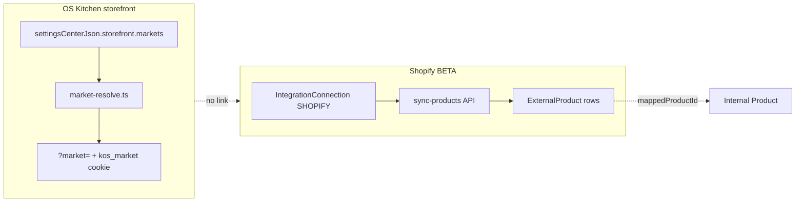

# Shopify Markets RFC — Multi-Region Commerce Integration

**Status:** Phase 1–3 shipped (discovery + mapping + price import + webhook re-sync BETA) — Phase 4 push optional  
**Audience:** Integrations, Storefront, Product, Commercial  
**Tracker:** `shopify-markets-rfc` (competitor parity cycle 16)  
**Related:** [`roadmap/STOREFRONT_SHOPIFY_PARITY.md`](./roadmap/STOREFRONT_SHOPIFY_PARITY.md) · [`storefront-audit-21may.md`](./storefront-audit-21may.md) · [`services/integrations/shopify.ts`](../services/integrations/shopify.ts) · [`lib/storefront/markets.ts`](../lib/storefront/markets.ts)

---

## Summary

**Shopify Markets** lets merchants sell in multiple countries/regions with localized pricing, catalogs, domains, duties, and tax behavior from a single Shopify admin. KitchenOS today ships an **internal storefront Markets scaffold** (`?market=` routing, JSON in `settingsCenterJson`) but has **no researched or implemented bridge** to Shopify Markets APIs, webhooks, or catalog sync.

This RFC documents the gap, compares integration options, and recommends a **phased, honest pilot path**: read-only market discovery first, then one-way catalog/price import, then optional push of OS Kitchen inventory/pricing only where merchant opts in.

**Recommendation:** Do **not** promise Shopify Markets parity in sales decks until Phase 1 (read-only discovery + admin UI) ships. Pilot ICP should continue using native OS Kitchen Markets unless the merchant is Shopify-primary with an existing Markets setup.

---

## Problem

| Requirement | Merchant expectation | KitchenOS today |
|-------------|---------------------|-----------------|
| Sell in CA + US with different menus/prices | Shopify Markets or native multi-market | Native markets JSON only |
| Shopify is system of record for catalog | Prices/inventory flow from Shopify | Product sync imports rows; **no market dimension** |
| Local domains (`ca.brand.com`, `brand.co.uk`) | Shopify managed domains + redirects | `hostSubdomain` + custom domain per OS Kitchen market |
| Duties/taxes at checkout | Shopify Markets + Markets Pro | OS Kitchen tax settings per storefront |
| Reporting by market | Shopify analytics + KitchenOS ops | Partial — market cookie on orders if wired |

**Competitive context:** Toast/Square focus on in-venue ops; **Shopify-native meal prep / DTC kitchens** expect Markets when they already run Shopify Plus. Without this RFC we risk overselling the existing Shopify BETA integration.

---

## Shopify Markets — platform surface (reference)

Shopify exposes Markets through Admin GraphQL (API versions 2024-10+):

| Concept | Shopify | KitchenOS analog |
|---------|---------|------------------|
| Market | Country/region group with catalog rules | `StorefrontMarket` in `settingsCenterJson` |
| Catalog | Product availability per market | `activeMenuId` + `productIds` filter |
| Price list | Market-specific pricing | Product `price` + currency on market |
| Web presence | Domain/subfolder per market | `hostSubdomain`, `storeSlug`, custom domain |
| Primary market | Shop default | `defaultPilotMarket()` |
| Inventory | Location-aware (not always market-scoped) | `StorefrontInventoryItem`, ingredient stock |

Relevant GraphQL areas (names may vary by API version):

- `markets` / `Market` — list enabled markets, regions, status
- `catalogs` / `Catalog` — publication scopes
- `priceLists` / `PriceList` — fixed prices per variant
- `marketLocalizations` — content/locale
- Webhooks: `markets/create`, `markets/update`, product/market publication changes (verify scopes at implementation time)

**Honesty:** KitchenOS Shopify integration today covers **orders + products (flat)** via `fetchProductsGraphQL` / `fetchOrdersGraphQL` — no `marketId`, no price lists, no publication scopes.

---

## Current KitchenOS architecture



| Component | Path |
|-----------|------|
| Markets schema | `lib/storefront/markets.ts` |
| Admin editor | `app/dashboard/storefront/markets/page.tsx`, `StorefrontMarketsEditor` |
| Routing | `lib/storefront/market-resolve.ts`, middleware subdomain |
| Checkout market context | `lib/storefront/order-hub-commerce.ts` |
| Shopify products | `app/api/integrations/shopify/sync-products/route.ts` |
| Inventory sync (cycle 15) | `services/integrations/inventory-sync-load.ts` — **no market scope** |

**Storage risk (known):** Markets live in JSON blob, not first-class tables (`docs/storefront-audit-21may.md` L3). Shopify Markets sync would either duplicate into JSON or force a migration to `StorefrontMarket` model.

---

## Options compared

### Option A — No Shopify Markets bridge (status quo)

Merchants use OS Kitchen Markets only; Shopify connection remains orders + flat catalog.

| Pros | Cons |
|------|------|
| Zero integration cost | Shopify-primary merchants maintain two market configs |
| Clear honesty in BETA docs | Cannot claim Shopify Markets support |

**Fit:** Pilot ICP on native storefront.

---

### Option B — Read-only discovery + admin mapping (recommended Phase 1)

Pull Shopify Markets list via Admin GraphQL; show side-by-side with OS Kitchen markets; allow manual link (`shopifyMarketId` ↔ `StorefrontMarket.id`).

| Dimension | Assessment |
|-----------|------------|
| Effort | **2–3 weeks** — GraphQL query, UI panel, mapping JSON |
| Risk | Low — no write path to Shopify |
| Sales honesty | “Markets awareness — manual mapping” |

Deliverables:

- `services/integrations/shopify-markets-service.ts` — `listShopifyMarkets(creds)`
- Dashboard card on `/dashboard/integrations/shopify` + `/dashboard/storefront/markets`
- Extend `StorefrontMarket` schema with optional `shopifyMarketId`, `shopifyCatalogId`

---

### Option C — One-way import (Shopify → KitchenOS)

On sync, import market-specific prices and publication flags into OS Kitchen markets.

| Dimension | Assessment |
|-----------|------------|
| Effort | **4–6 weeks** — price lists, variant mapping, cache invalidation |
| Risk | Medium — stale prices if webhook gaps |
| Depends on | Product mapping completeness, per-market cache tags (Phase 5 partial) |

Rules:

- Shopify wins on **price** when mapping exists and `syncDirection = import`
- OS Kitchen wins on **menu composition** unless `productIds` empty (import fills)

---

### Option D — Bidirectional sync (KitchenOS ↔ Shopify Markets)

Push OS Kitchen market price/menu changes to Shopify price lists and publications.

| Dimension | Assessment |
|-----------|------------|
| Effort | **8–12 weeks** — conflict resolution, rate limits, Plus-only features |
| Risk | High — tax/duty misconfiguration, double-write |
| Prerequisite | Option C stable + inventory sync market-scoped |

**Not recommended for pilot.** Revisit post-PMF for Shopify Plus partners only.

---

## Recommended phased roadmap

| Phase | Scope | Exit criteria |
|-------|--------|---------------|
| **0 (this RFC)** | Document gap + options | RFC merged; tracker `shopify-markets-rfc: done` |
| **1** | Read-only `listMarkets` + manual mapping UI | Merchant sees Shopify markets; can link to OS market |
| **2** | Import price lists on product sync | Mapped variants show market price on storefront |
| **3** | Webhooks for market/price changes | <15 min staleness SLA (best effort) |
| **4** | Optional push (KitchenOS → Shopify) | Feature flag; explicit merchant opt-in |

---

## Proposed data model (Phase 1+)

Extend `storefrontMarketSchema` (`lib/storefront/markets.ts`):

```typescript
shopifyMarketId: z.string().max(64).optional(),
shopifyCatalogId: z.string().max(64).optional(),
shopifyPriceListId: z.string().max(64).optional(),
syncMode: z.enum(["none", "import", "bidirectional"]).optional().default("none"),
```

Long-term: migrate to `StorefrontMarket` Prisma model with `workspaceId`, `connectionId`, foreign keys — aligns with multi-store workspace UI.

Connection `settingsJson` extension:

```json
{
  "marketsSync": {
    "enabled": false,
    "lastDiscoveryAt": null,
    "primaryShopifyMarketId": null
  }
}
```

---

## API & permissions

| Action | Permission | Notes |
|--------|------------|-------|
| Discover markets | `integrations.manage` | Uses stored Admin API token |
| Save mapping | `storefront.manage` | Writes settings center |
| Trigger import | `integrations.manage` + `storefront.manage` | Batch job |

Required Shopify scopes (verify at implementation):

- `read_markets`, `read_products`, `read_price_rules` / price list scopes (API-version specific)
- Write scopes only for Phase 4

---

## Testing strategy

| Layer | Coverage |
|-------|----------|
| Unit | Parse GraphQL fixtures → normalized `ShopifyMarketRow[]` |
| Integration | Mock Admin API — mapping persistence |
| E2E | Shopify dev store with 2 markets → discovery UI smoke |
| Honesty | Docs must state phase; no “full Markets sync” in registry until Phase 2 |

---

## Risks & open questions

1. **Shopify Plus vs standard** — Some Markets features (catalogs, B2B) are tier-gated. Document in integration health card.
2. **Currency FX** — OS Kitchen checkout uses single storefront currency per market; Shopify may use presentment vs shop currency.
3. **Tax/duty** — KitchenOS tax engine ≠ Shopify Markets tax; never silently overwrite tax settings on import.
4. **Channel registry** — Update `lib/channels/channel-registry.ts` capability `inventory_sync` separately; add `markets_sync: preview` when Phase 1 ships.
5. **JSON vs table** — Phase 2+ may require migration; track as storefront tech debt.

**Open questions for product:**

- Is pilot ICP Shopify-primary enough to prioritize Phase 1 in Q3?
- Should mapped Shopify market drive **hostname** automatically or stay manual?
- Do meal-prep merchants need **subscription boxes per market** (see WooCommerce Subscriptions RFC)?

---

## Conscious non-goals (pilot)

- Shopify Markets Pro / duties paid automation
- Replacing OS Kitchen native markets for non-Shopify merchants
- Full catalog publication bi-sync in Phase 1–2
- Shopify B2B company locations (separate RFC if needed)

---

## References

- [Shopify Markets docs](https://shopify.dev/docs/apps/build/markets)
- [Shopify Admin GraphQL — Market object](https://shopify.dev/docs/api/admin-graphql/latest/objects/Market)
- KitchenOS: `docs/roadmap/STOREFRONT_SHOPIFY_PARITY.md` Phase 3 backlog
- KitchenOS: `app/dashboard/integrations/shopify/page.tsx` (BETA integration)

---

## Decision log

| Date | Decision |
|------|----------|
| 2026-05-31 | RFC accepted as Phase 0; implementation deferred; recommend Option B for first engineering slice |
| 2026-05-31 | **Phase 1 shipped:** `shopify-markets-service`, discovery cache on connection, mapping UI on storefront markets + Shopify integration card |
| 2026-05-31 | **Phase 2 shipped:** `shopify-market-prices-service`, price list import, storefront catalog overrides for syncMode=import |
| 2026-05-31 | **Phase 3 shipped:** webhook-driven price re-import (`products/update`, `markets/*`), 60s debounce, SHA price-hash skip, catalog cache revalidation |
