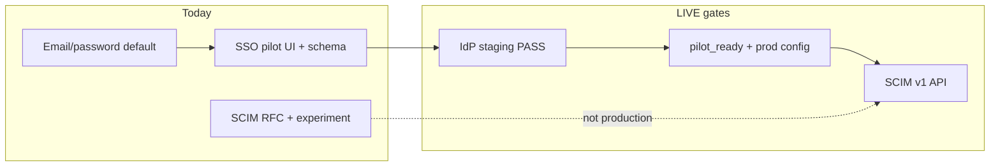

# SSO + SCIM LIVE plan — OS Kitchen

**Policy:** `sso-scim-live-plan-v1`  
**Date:** 2026-06-02  
**Owner:** Founder + Engineering + Enterprise CS  
**Scope:** Path from **SSO pilot foundation** → **production SAML/OIDC (LIVE)** → **SCIM 2.0 provisioning (LIVE)** for Okta, Microsoft Entra ID (Azure AD), and Auth0  
**Status:** **Plan only** — SSO **`pilot_foundation`** · SCIM **`not_implemented`** · staging IdP smoke **SKIPPED** · pilot NO-GO

This document is the **enterprise customer and implementation guide** for identity: how to configure Okta or Entra ID, what “LIVE” means, when SCIM ships, and what operators must do in OS Kitchen. It consolidates existing Era 16–18 SSO work and the SCIM RFC into a single LIVE roadmap.

**Hard rule:** Do **not** sell “SSO included,” “Azure AD integrated,” or “SCIM provisioning” until the gates in § LIVE definition of done are met and artifacts are green.

**Related:** [`enterprise-sso-idp-staging-smoke-plan.md`](./enterprise-sso-idp-staging-smoke-plan.md) · [`scim-provisioning-rfc.md`](./scim-provisioning-rfc.md) · [`enterprise-mvp-spec.md`](./enterprise-mvp-spec.md) · [`soc2-readiness-assessment.md`](./soc2-readiness-assessment.md) · [`enterprise-procurement-pack.md`](./enterprise-procurement-pack.md)

---

## Executive summary

| Capability | Today | LIVE target |
|------------|-------|-------------|
| **SAML/OIDC SSO** | Schema, admin UI, callback, staging orchestrator | Q4 2026 pilot → Q1 2027 production default for Enterprise add-on |
| **Okta** | Documented staging setup | L1 validated IdP + `pilot_ready` artifact |
| **Microsoft Entra ID (Azure AD)** | Documented staging setup | Same as Okta |
| **Auth0** | SAML addon path documented | Optional third IdP |
| **SCIM 2.0** | Experiment webhook only — **not RFC 7644** | Q2 2027 after SSO LIVE + 4–6 eng weeks |
| **Break-glass owner login** | Supported in pilot policy | Required drill before LIVE |

**Safe headline:** “Enterprise SSO pilot available on staging with your IdP — SCIM provisioning on the roadmap after SSO is proven.”

**Forbidden:** “SSO live in production,” “SCIM enabled,” “Works like Okta SCIM out of the box today.”

---

## Current platform state

| Layer | Status | Evidence |
|-------|--------|----------|
| Workspace SSO settings | **Pilot foundation** | `/dashboard/settings/security/sso` · `WorkspaceSsoSettings` |
| IdP vendors | **OKTA · ENTRA_ID · AUTH0** | `SsoIdpVendor` enum |
| Login entry | **Partial** | `components/auth/sso-login-entry.tsx` |
| Staging smoke | **SKIPPED** (no operator proof) | `artifacts/enterprise-sso-idp-staging-smoke-summary.json` |
| SCIM API | **Not implemented** | [`scim-provisioning-rfc.md`](./scim-provisioning-rfc.md) |
| SCIM experiment | **Non-production** | `POST /api/webhooks/scim/experiment-auditor` — auditor scope only |

---

## Enterprise administrator guide

### Prerequisites

| Requirement | Notes |
|-------------|-------|
| **Plan** | Enterprise contract + SSO add-on in SOW |
| **Workspace** | Single pilot workspace UUID — SSO is **tenant-bound** |
| **IdP admin access** | Okta, Entra, or Auth0 with SAML app create rights |
| **Supabase project** | Staging first, then production — SAML provider per environment |
| **Allowed email domain** | e.g. `@yourbrand.com` — enforced at login |
| **Break-glass owner** | Non-SSO owner email for lockout recovery |

### OS Kitchen setup (pilot)

1. **Settings → Security → SSO pilot** — enable pilot, pick IdP vendor (`OKTA` | `ENTRA_ID` | `AUTH0`).
2. Enter **allowed domain**, **Supabase SAML provider reference**, and optional **break-glass owner email**.
3. Complete wizard steps in `sso-pilot-setup-wizard` — follow in-app “next action” strip.
4. Run **negative test**: wrong domain, disabled SSO, wrong workspace — must deny.
5. Run **positive test**: IdP login → dashboard → audit event `sso.login_success`.
6. Store proof paths per [`enterprise-sso-idp-staging-smoke-plan.md`](./enterprise-sso-idp-staging-smoke-plan.md) — **do not commit secrets or screenshots to git**.

### Operator runbook commands

| Action | Command / surface |
|--------|-------------------|
| Staging IdP smoke | `npm run smoke:enterprise-sso-idp-staging` |
| Pilot-ready gate cert | `npm run cert:enterprise-sso-pilot-ready` (when Cycle 2 artifact exists) |
| E2E SSO path | `e2e/sso-idp-smoke.spec.ts` (staging secrets required) |
| Procurement sync | `lib/enterprise/enterprise-sso-procurement-sync-era17-policy.ts` — blocks forbidden claims |

---

## Okta setup (staging → production)

### Staging (Developer Edition)

1. Create **Okta Developer** org (free tier).
2. **Applications → Create App Integration → SAML 2.0**.
3. **Single sign-on URL:** Supabase Auth ACS URL (`Authentication → SSO` in Supabase dashboard).
4. **Audience URI (SP Entity ID):** Supabase project entity ID from same screen.
5. **Name ID format:** EmailAddress.
6. Assign test user with email `@<allowed-domain>`.
7. Download IdP metadata → upload to Supabase **Add SAML provider**.
8. Copy provider UUID → `SSO_STAGING_SUPABASE_PROVIDER_REF` / workspace SSO settings.
9. Set `SSO_STAGING_IDP_VENDOR=OKTA`.

Full checklist: [`enterprise-sso-idp-staging-smoke-plan.md`](./enterprise-sso-idp-staging-smoke-plan.md#okta-test-tenant-setup).

### Production cutover

| Step | Owner | Gate |
|------|-------|------|
| Duplicate SAML app in **production Okta** org | Customer IT | Separate from dev org |
| Production Supabase SAML provider | OS Kitchen Eng | Not shared with staging ref |
| DNS / email domain verification | Customer IT | Matches `allowedDomain` |
| Break-glass drill documented | Joint | Owner login without IdP |
| Rollback plan | OS Kitchen CS | Disable SSO flag + email login |

---

## Microsoft Entra ID (Azure AD) setup

### Staging (test tenant)

1. **Microsoft Entra admin center** → **Enterprise applications → New application → Non-gallery**.
2. **Single sign-on → SAML** — configure URLs from Supabase (same as Okta ACS / entity ID).
3. **User Attributes & Claims** — `email` → `user.mail` or `user.userprincipalname`.
4. Assign test user in `SSO_STAGING_ALLOWED_DOMAIN`.
5. Upload **Federation Metadata XML** to Supabase SAML provider.
6. Set `SSO_STAGING_IDP_VENDOR=ENTRA_ID` (aliases `ENTRA`, `AZURE`, `MICROSOFT` accepted in smoke script).

### Entra-specific notes

| Topic | Guidance |
|-------|----------|
| **Multi-tenant vs single** | Prefer **single-tenant** Entra app per customer workspace |
| **Conditional Access** | Customer may require compliant device — test before LIVE |
| **Group claims** | Used for **future SCIM/role mapping** — not honored in SSO v1 |
| **Guest users** | Block if email domain does not match `allowedDomain` |

Detail: [`enterprise-sso-idp-staging-smoke-plan.md`](./enterprise-sso-idp-staging-smoke-plan.md) Entra section.

---

## Auth0 (optional third IdP)

1. Enable **SAML2 addon** on Auth0 application.
2. Map Supabase SP URLs per [`auth0-supabase-saml-setup.md`](./auth0-supabase-saml-setup.md).
3. Set workspace vendor to `AUTH0`.
4. Use only when customer standardizes on Auth0 — Okta/Entra cover most enterprise RFPs.

---

## SCIM provisioning plan

SCIM is **orthogonal** to SSO login: SSO establishes session; SCIM syncs **Users** and **Groups** into workspace membership.

### Why SCIM is not LIVE

| Gap | Mitigation |
|-----|------------|
| No RFC 7644 `/scim/v2/Users` API | Build per [`scim-provisioning-rfc.md`](./scim-provisioning-rfc.md) |
| Experiment webhook is non-standard | Do not point Okta SCIM at experiment URL |
| Group → RBAC mapping undefined | v1: map IdP group displayName → `WorkspaceMemberRole` suggestion |
| Deprovision latency | Target &lt; 15 min from `active=false` |

### SCIM architecture (target)

| Component | Path |
|-----------|------|
| SCIM API | `https://api.os-kitchen.com/scim/v2/{workspaceId}/Users` (illustrative) |
| Auth | Per-workspace bearer token (rotatable) |
| User lifecycle | `admin.inviteUserByEmail` + `WorkspaceMember` upsert |
| Audit | `scim.user.created` · `scim.user.deactivated` |
| IdP config | Okta **SCIM 2.0** app · Entra **Provisioning** → SCIM endpoint |

### SCIM delivery phases

| Phase | Milestone | Duration |
|-------|-----------|----------|
| **S0** | SSO staging smoke **PASS** | Prerequisite |
| **S1** | RFC 7644 Users CRUD + PATCH deactivate | 2–3 weeks |
| **S2** | Groups + role mapping + audit | 1–2 weeks |
| **S3** | Okta + Entra SCIM app templates + docs | 1 week |
| **S4** | Enterprise pilot with 50+ provisioned users | 2 weeks |

**Target LIVE:** Q2 2027 — **after** SSO production add-on ships.

### Okta SCIM (when LIVE)

1. **Applications → Create App Integration → SCIM 2.0**.
2. Base URL: OS Kitchen SCIM endpoint for workspace.
3. Bearer token: issued in **Settings → Security → SCIM** (future).
4. Provisioning features: Create, Update, Deactivate (not hard-delete v1).
5. Attribute mapping: `userName` → email, `active` → membership, extension `role`.

### Entra SCIM (when LIVE)

1. Enterprise app → **Provisioning** → **Automatic**.
2. Tenant URL + secret token from OS Kitchen.
3. Scope: sync assigned users and groups only.
4. Test with single group before full directory sync.

---

## LIVE definition of done

### SSO LIVE

| # | Criterion | Artifact |
|---|-----------|----------|
| 1 | Staging IdP login PASS (Okta **or** Entra) | `enterprise-sso-idp-staging-smoke-summary.json` → `PASSED` |
| 2 | `pilot_ready` gate certified | `cert:enterprise-sso-pilot-ready` green |
| 3 | Negative tests documented | Smoke summary `negativeTestNote` |
| 4 | Break-glass drill PASS | Optional field populated |
| 5 | Production SAML provider separate from staging | Ops checklist signed |
| 6 | Audit: `sso.login_success` on prod pilot | Audit export ref |
| 7 | `verify-claims` — no forbidden SSO strings | CI green |
| 8 | Enterprise SOW addendum template published | Legal |

### SCIM LIVE

| # | Criterion | Artifact |
|---|-----------|----------|
| 1 | SSO LIVE complete | Above |
| 2 | RFC 7644 Users + Groups endpoints | Integration tests green |
| 3 | Per-workspace SCIM token rotation documented | Security review |
| 4 | Okta + Entra SCIM guides (this doc § updated) | Docs |
| 5 | Deprovision &lt; 15 min SLA (internal target) | Staging drill log |
| 6 | No traffic to `experiment-auditor` in prod | Config guard |
| 7 | Procurement pack updated | `enterprise-procurement-pack.md` |

---

## Roadmap timeline

| Quarter | SSO | SCIM |
|---------|-----|------|
| **Q3 2026** | Complete staging smoke + operator proof | RFC review only |
| **Q4 2026** | First paid Enterprise SSO add-on (pilot) | Engineering kickoff |
| **Q1 2027** | SSO LIVE for new Enterprise contracts | SCIM S1–S2 build |
| **Q2 2027** | Hardening + Entra Conditional Access playbooks | SCIM LIVE + templates |

Aligns with [`soc2-readiness-assessment.md`](./soc2-readiness-assessment.md) CC6 access control evidence collection.

---

## Enterprise questionnaire snippets

**Do you support SSO?**

> Yes, for Enterprise add-on pilots. We support SAML via Supabase Auth with Okta, Microsoft Entra ID, and Auth0. Production SSO follows a documented staging validation. Email/password remains available for break-glass owners.

**Do you support SCIM?**

> SCIM 2.0 user provisioning is on our roadmap (target Q2 2027) after SSO is LIVE. We do not claim SCIM is available today. Manual staff invite is the supported path for pilots.

**Azure AD specifically?**

> We integrate with **Microsoft Entra ID** (formerly Azure AD) using SAML 2.0 — same LIVE gates as Okta.

---

## Sales guardrails

| Claim | Allowed? |
|-------|----------|
| “SSO with Okta and Azure AD” | **Pilot only** — with staging validation |
| “SCIM provisioning included” | **No** until SCIM LIVE |
| “SOC 2 covers SSO” | **No** — see SOC2 assessment |
| “Same-day IdP cutover” | **No** — plan 2–4 weeks with IT |

Enforced: `enterprise-sso-procurement-sync-era17-policy.ts` · `npm run verify-claims`

---

## Related documents

| Doc | Use |
|-----|-----|
| [`enterprise-sso-r2-pilot-design.md`](./enterprise-sso-r2-pilot-design.md) | Session bridge architecture |
| [`sso-idp-smoke-test-plan.md`](./sso-idp-smoke-test-plan.md) | Shorter smoke checklist |
| [`ENTERPRISE_SECURITY_ROADMAP.md`](./ENTERPRISE_SECURITY_ROADMAP.md) | Identity pillar |
| [`GITHUB_E2E_STAGING_SECRETS.md`](./GITHUB_E2E_STAGING_SECRETS.md) | CI secrets for SSO E2E |
| [`support-tier-plan.md`](./support-tier-plan.md) | SSO cutover support SLAs (T3) |

---

## Revision history

| Version | Date | Change |
|---------|------|--------|
| `sso-scim-live-plan-v1` | 2026-06-02 | Initial LIVE plan — Market Domination feature 32 |

**Next action:** Run Okta staging smoke on pilot workspace · file `enterprise-sso-idp-staging-smoke-summary.json` · schedule SCIM RFC eng kickoff after SSO PASS.
