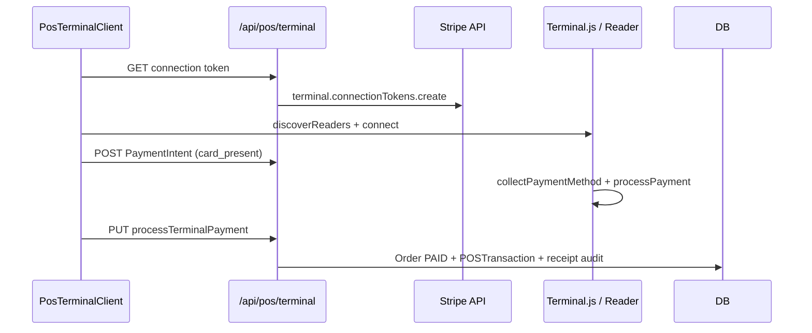

# Stripe Terminal Implementation Plan

**Status:** Preview — pilot implementation track (2–3 weeks to certification-ready staging)  
**Audience:** Payments engineering, POS product, DevOps  
**Full reference:** [`stripe-terminal-plan.md`](./stripe-terminal-plan.md) (hardware matrix, PCI, phases 1–4)

---

## Goal

Move Stripe Terminal from **PREVIEW** to **pilot-certified card-present checkout** on counter POS: POS → Reader → Payment → Receipt, without claiming production certification until staging proof passes.

| Today | Target (this plan) |
|-------|-------------------|
| `CARD_TERMINAL_PLACEHOLDER` + API scaffold | Simulated reader E2E PASS on staging |
| `discoverReaders` not wired | Reader discovery + connect UX |
| Capability `ROADMAP` | Honest **PREVIEW** with pilot runbook |
| No staging smoke artifact | `artifacts/stripe-terminal-staging-smoke.json` |

**Timeline:** **2–3 weeks** engineering + **Stripe Terminal account setup** (parallel DevOps).

---

## SDK and stack

| Layer | Package / path |
|-------|----------------|
| Browser SDK | `@stripe/terminal-js` v0.26 (`loadStripeTerminal`, `collectPaymentMethod`, `processPayment`) |
| Server SDK | `stripe` Node SDK — `terminal.connectionTokens.create`, `paymentIntents` card_present |
| API routes | `app/api/pos/terminal/route.ts` (GET/POST/PUT/DELETE) |
| Server service | `services/payments/stripe-terminal-service.ts` |
| POS UI | `components/pos/pos-payment-methods.tsx` (`TapToPayButton`), `components/dashboard/pos-terminal-client.tsx` |
| Permissions | `pos.checkout` on all Terminal routes |

**Integration flow:**



---

## Pilot hardware

| Device | Cost | Use case |
|--------|------|----------|
| **Stripe Reader M2** | **~$59** | Mobile / handheld pilot stations (recommended first) |
| Stripe Reader S700 | ~$299 | Fixed counter (Phase 2 scale-out) |
| **Simulated reader** | $0 | Staging + CI — **required before physical hardware** |

**Pilot recommendation:** 1× **M2** per mobile station + **simulated reader** for all staging/CI. Add S700 when counter volume justifies.

**Not in web pilot:** Tap to Pay on iPhone (native SDK — defer to Phase 4 in full plan).

---

## Certification checklist (2–3 weeks)

### Week 1 — Staging + simulated reader

| Task | Owner | Exit |
|------|-------|------|
| Enable Terminal in Stripe Dashboard (test mode) | DevOps | Test location registered |
| `STRIPE_SECRET_KEY` + publishable key on staging | DevOps | Vault / Vercel env |
| Wire `discoverReaders` + connect in `TapToPayButton` | Eng | UI selects simulated reader |
| Simulated capture script | Eng | 10× success → audit events |
| Error UX (decline, timeout, disconnect) | Eng | Operator-visible messages |
| Align `lib/pos/pos-hardware.ts` | Eng | Terminal = `preview` not `supported` |

```bash
# Staging smoke (after vault Stripe keys)
npm run smoke:stripe-terminal-staging -- --execute --write  # when script exists
```

### Week 2 — Integration hardening

| Task | Owner | Exit |
|------|-------|------|
| Register `STRIPE_TERMINAL_LOCATION_ID` per pilot site | DevOps | Location in Stripe Dashboard |
| Store location on `POSRegister.settingsJson` (encrypted) | Eng | Admin hardware page |
| Refund path UI → `refundTerminalPayment` | Eng | One refund E2E |
| Reconcile `externalPaymentReference` vs Stripe Dashboard | Ops | Runbook row |
| Extend `e2e/pos-checkout-staging.spec.ts` | QA | CARD_TERMINAL path — skip without keys |

### Week 3 — Certification gate

| Task | Owner | Exit |
|------|-------|------|
| Stripe Terminal integration review (if required for MCC) | Compliance | Stripe sign-off |
| PCI scope note (SAQ A / A-EP — confirm with QSA) | Legal | One-pager in pilot packet |
| Staging smoke artifact | Eng | `overall: PASSED` |
| Capability matrix | Product | `stripe_terminal` stays PREVIEW until pilot sign-off |
| Forbidden claims audit | GTM | No "certified" until Phase 2 exit in full plan |

**Certification duration:** Stripe account Terminal enablement is often **same-day**; KitchenOS staging proof is **2–3 weeks** with simulated reader before physical M2 pilot.

---

## Environment variables

| Variable | Required | Notes |
|----------|----------|-------|
| `STRIPE_SECRET_KEY` | Yes | Test → live promotion separate |
| `NEXT_PUBLIC_STRIPE_PUBLISHABLE_KEY` | Recommended | Client bootstrap |
| `STRIPE_TERMINAL_LOCATION_ID` | Week 2+ | Per store/register |
| `STRIPE_TERMINAL_SIMULATED` | Staging | Force simulated reader in CI |

Vault items 1–2 (DATABASE_URL, ENCRYPTION_KEY) required for order persistence after capture; Stripe keys typically Phase 2+ in ops vault matrix.

---

## Offline and security (non-negotiable)

- **No offline card capture** — `posPaymentAllowedWhileOffline` blocks Terminal when queue offline (`POS_OFFLINE_MODE.md`).
- **Auth:** `pos.checkout` on every `/api/pos/terminal` method.
- **Audit:** `POS_TERMINAL_TOKEN_ISSUED`, `POS_TERMINAL_PAYMENT_CAPTURED`, etc.
- **Pen test:** Include Terminal API in `docs/pen-test-plan.md` scope.

---

## Success metrics

| Metric | Target |
|--------|--------|
| Simulated staging captures | 10/10 success |
| Failed capture rate (pilot week 1) | &lt; 5% (declines excluded) |
| API 503 rate on `/api/pos/terminal` | &lt; 0.1% |
| Marketing claim | "Preview — pilot sites with Stripe-approved readers only" |

---

## Forbidden until pilot sign-off

- "Stripe Terminal certified" / "PCI certified for hardware"
- "Works with any card reader"
- "Offline card payments supported"

---

## References

- Full plan: `docs/stripe-terminal-plan.md`
- Service: `services/payments/stripe-terminal-service.ts`
- Capability truth: `lib/capabilities/capability-matrix.ts`
- POS audit: `docs/POS_TERMINAL_AUDIT.md`
