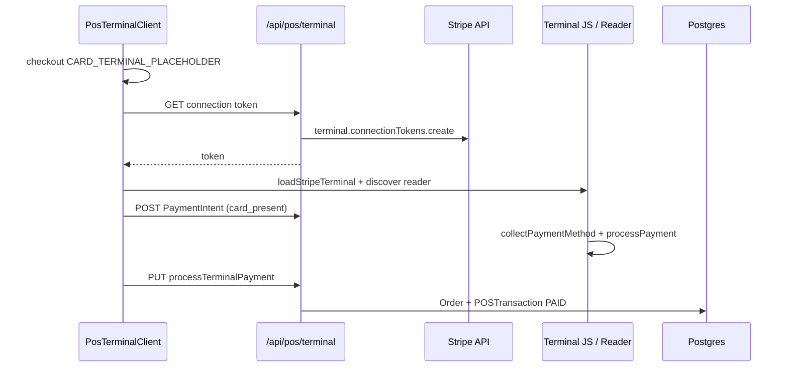

# Stripe Terminal Integration Plan

**Status:** Preview — server + browser SDK scaffolded; **not production-certified**  
**Audience:** Payments engineering, POS product, VP Operations, Compliance  
**Policy:** `lib/capabilities/capability-matrix.ts` (`stripe_terminal` = ROADMAP)  
**Related:** [`POS_OFFLINE_MODE.md`](./POS_OFFLINE_MODE.md) · [`POS_TERMINAL_AUDIT.md`](./POS_TERMINAL_AUDIT.md) · [`kds-slo-definition.md`](./kds-slo-definition.md)

---

## Executive summary

KitchenOS has a **preview** Stripe Terminal path: connection tokens, card-present PaymentIntents, and POS capture recording are implemented server-side, with `@stripe/terminal-js` wired in the POS UI. **Native reader certification, PCI scope, and pilot hardware proof are not complete.** Marketing must continue to state that Stripe Terminal hardware is **not production-certified** until this plan’s exit criteria are met.

| Layer | Status |
|-------|--------|
| Stripe Checkout / billing webhooks | BETA (when keys configured) |
| Counter POS (cash / comp / pay later) | BETA on entitled plans |
| **Stripe Terminal (card-present)** | **PREVIEW** — code exists, certification pending |
| Offline card while disconnected | **Blocked** by design (`posPaymentAllowedWhileOffline`) |

---

## Current codebase (as shipped)

| Component | Path |
|-----------|------|
| Browser SDK | `@stripe/terminal-js` (`package.json`) |
| Tap-to-pay UI | `components/pos/pos-payment-methods.tsx` (`TapToPayButton`) |
| POS integration | `components/dashboard/pos-terminal-client.tsx` (`pendingTerminal`, `CARD_TERMINAL_PLACEHOLDER`) |
| API routes | `app/api/pos/terminal/route.ts` (GET/POST/PUT/DELETE) |
| Server service | `services/payments/stripe-terminal-service.ts` |
| Hardware settings | `app/dashboard/pos/settings/hardware/page.tsx` |
| Capability truth | `lib/capabilities/capability-matrix.ts` → ROADMAP |

**Honesty gap to fix:** `lib/pos/pos-hardware.ts` lists Stripe Terminal as `supported` — should align to `placeholder` or `preview` when this plan ships (separate hygiene PR).

---

## Stripe SDK surface

### Server (Node — `stripe` package)

| API | KitchenOS usage |
|-----|-----------------|
| `stripe.terminal.connectionTokens.create()` | `createTerminalConnectionToken()` — reader auth |
| `stripe.paymentIntents.create({ payment_method_types: ['card_present'] })` | `createTerminalPaymentIntent()` |
| `stripe.paymentIntents.retrieve()` | Post-capture verification |
| `stripe.paymentIntents.cancel()` | `cancelTerminalPayment()` |
| `stripe.refunds.create()` | `refundTerminalPayment()` |

**Required Stripe account capabilities:** Terminal enabled, card-present payments, country/currency support.

### Client (`@stripe/terminal-js` v0.26)

| Method | Usage in `TapToPayButton` |
|--------|---------------------------|
| `loadStripeTerminal()` | Dynamic import |
| `StripeTerminal.create({ onFetchConnectionToken })` | Connection lifecycle |
| `terminal.discoverReaders()` | *Not yet wired* — assumes simulated/registered reader |
| `terminal.collectPaymentMethod(clientSecret)` | Card present flow |
| `terminal.processPayment(paymentIntent)` | Reader capture |

**Gap:** Production needs explicit **reader discovery**, **location registration**, and error UX for disconnect/reconnect.

---

## Environment variables

| Variable | Purpose | Required for preview |
|----------|---------|----------------------|
| `STRIPE_SECRET_KEY` | Server Terminal + PaymentIntent | Yes |
| `NEXT_PUBLIC_STRIPE_PUBLISHABLE_KEY` | Client (if needed for Terminal.js) | Recommended |
| `STRIPE_WEBHOOK_SECRET` | Billing webhooks (separate from Terminal) | For subscription/storefront |
| `STRIPE_TERMINAL_LOCATION_ID` | *Proposed* — register readers to location | Phase 2 |
| `STRIPE_TERMINAL_SIMULATED` | *Proposed* — dev simulated reader | Phase 1 staging |

Existing vault matrix covers core Stripe keys; Terminal pilot adds **location ID per register** (stored encrypted per `POSRegister` when Phase 2 ships).

---

## Hardware options (2026 Stripe Terminal)

| Device | Use case | Notes |
|--------|----------|-------|
| **Stripe Reader S700** | Counter, Ethernet/Wi-Fi | Full-featured; US/CA/EU/UK/AU/NZ |
| **Stripe Reader M2** | Mobile / handheld | Bluetooth; pairs with phone/tablet |
| **WisePOS E** | Legacy counter | Still supported; plan migration to S700 for new deployments |
| **Tap to Pay on iPhone** | Phone-as-terminal | Requires Apple entitlement + Stripe Terminal iOS SDK (not in web repo today) |
| **Simulated reader** | Dev/staging | Stripe Dashboard simulated reader — **required for CI** |

**KitchenOS v1 target:** Browser POS + **S700 or M2** via Terminal.js (USB/BT/Ethernet per Stripe docs). Tap to Pay on iPhone is **Phase 4** (native app or Stripe-hosted flow).

### Peripherals (out of scope for Terminal SDK)

| Device | Status in KitchenOS |
|--------|----------------------|
| Receipt printer (Epson/Star) | Browser print only — `POS_HARDWARE_CATEGORIES` |
| Cash drawer kick | Placeholder |
| Customer display | Placeholder |

---

## Certification and compliance

### Stripe-side

1. **Enable Terminal** in Stripe Dashboard (test → live).
2. **Register location(s)** — physical address per store/register.
3. **Register readers** to location (serial number or pairing code).
4. **Complete Stripe Terminal integration review** if required for your MCC/volume.
5. **Go-live checklist:** [Stripe Terminal deployment](https://docs.stripe.com/terminal/overview).

### PCI / SAQ

| Mode | PCI scope |
|------|-----------|
| **Stripe Terminal (card-present)** | Stripe handles card data; merchant typically **SAQ A** or **SAQ A-EP** depending on integration — confirm with QSA |
| **Browser POS cash / external terminal mark-paid** | No card data in KitchenOS — lower scope |
| **STRIPE_PLACEHOLDER / hosted checkout** | Stripe Elements / Checkout — SAQ A when fully delegated |

KitchenOS does **not** store PAN/CVC. Card-present metadata (brand, last4) lands in `pOSAuditEvent.metadataJson` after capture.

### KitchenOS internal gates

| Gate | Owner | Exit artifact |
|------|-------|---------------|
| End-to-end test reader capture (staging) | Eng | `artifacts/stripe-terminal-staging-smoke.json` (future) |
| Permission audit | Security | `pos.checkout` on `/api/pos/terminal` (already wired) |
| Offline block for card | Eng | `posPaymentAllowedWhileOffline` — verified |
| Marketing claims | GTM | No “Stripe Terminal certified” until pilot sign-off |
| Capability matrix | Product | `stripe_terminal` → BETA after pilot |

---

## Implementation phases

### Phase 1 — Staging proof (4–6 weeks)

| Task | Deliverable |
|------|-------------|
| Simulated reader E2E | Script or Playwright: GET token → POST intent → simulated capture → PUT process |
| Reader discovery UI | `discoverReaders` + connect in `TapToPayButton` |
| Error states | Reader disconnect, declined card, timeout |
| Align `pos-hardware.ts` | Stripe Terminal → `preview` |
| Document register→location mapping | Design note in `POSRegister.settingsJson` |

**Exit:** One staging tenant completes 10 successful simulated captures; audit events present.

### Phase 2 — Pilot hardware (6–8 weeks)

| Task | Deliverable |
|------|-------------|
| S700/M2 pairing runbook | Ops doc + dashboard hardware page actions |
| `STRIPE_TERMINAL_LOCATION_ID` per register | Encrypted settings + admin UI |
| Refund path UI | Link to existing `refundTerminalPayment` |
| Reconciliation | Match `externalPaymentReference` to Stripe Dashboard |

**Exit:** 1 pilot site, 30 days live captures, &lt; 1% failed capture rate.

### Phase 3 — Production hardening (4 weeks)

| Task | Deliverable |
|------|-------------|
| Webhook `payment_intent.succeeded` backup | Idempotent reconcile if PUT fails |
| Monitoring | Alert on 503 rate on `/api/pos/terminal` |
| Capability promotion | `stripe_terminal` → BETA in matrix |
| Pen test scope | Include Terminal API in `docs/pen-test-plan.md` |

### Phase 4 — Mobile Tap to Pay (optional)

| Task | Notes |
|------|-------|
| Evaluate Stripe Terminal iOS SDK vs web-only | Likely separate native shell or Stripe App |
| Not required for web POS pilot | Defer until Phase 2 green |

---

## API contract (existing)

| Method | Route | Auth | Body |
|--------|-------|------|------|
| GET | `/api/pos/terminal` | `pos.checkout` | — → `{ token }` |
| POST | `/api/pos/terminal` | `pos.checkout` | `{ amount, orderId, currency? }` → `{ clientSecret, paymentIntentId }` |
| PUT | `/api/pos/terminal` | `pos.checkout` | `{ paymentIntentId, orderId }` → `{ success, transaction }` |
| DELETE | `/api/pos/terminal` | `pos.checkout` | `{ paymentIntentId }` → cancel intent |

Audit actions: `POS_TERMINAL_TOKEN_ISSUED`, `POS_TERMINAL_PAYMENT_INTENT_CREATED`, `POS_TERMINAL_PAYMENT_CAPTURED`, `POS_TERMINAL_PAYMENT_CANCELLED`.

---

## Testing strategy

| Layer | Approach |
|-------|----------|
| Unit | `tests/unit/pos-terminal-service.test.ts` (extend for Terminal service mocks) |
| Integration | Stripe test mode + simulated reader |
| E2E | Extend `e2e/pos-checkout-staging.spec.ts` with CARD_TERMINAL path — **skip without reader/simulator** |
| Offline | Confirm card terminal blocked offline (`e2e/pos-offline-queue.spec.ts` uses cash only) |

**Honesty:** E2E must **skip** when `STRIPE_SECRET_KEY` missing or Terminal not enabled — never fake green.

---

## Cost estimate (pilot)

| Item | Est. cost |
|------|-----------|
| Stripe Reader S700 | ~$299 one-time per counter |
| Stripe Reader M2 | ~$59 one-time per mobile station |
| Stripe processing | Interchange + 2.7% + $0.05 (US card-present; verify current Stripe pricing) |
| Engineering (Phase 1–2) | ~8–14 eng-weeks |
| PCI / legal review | $2k–$8k if QSA consultation needed |

---

## Forbidden claims (until Phase 2 exit)

- “Stripe Terminal certified” / “PCI certified for hardware”
- “Works with any card reader”
- “Tap to Pay on iPhone included”
- “Offline card payments supported”

Approved: **“Stripe Terminal integration in preview — card-present flow available for pilot sites with Stripe-approved readers.”**

---

## References

- Stripe Terminal docs: https://docs.stripe.com/terminal
- Terminal.js: https://docs.stripe.com/terminal/js
- `services/payments/stripe-terminal-service.ts`
- `components/pos/pos-payment-methods.tsx`
- `lib/capabilities/capability-matrix.ts`
- `marketing/forbidden-claims-training.md`
