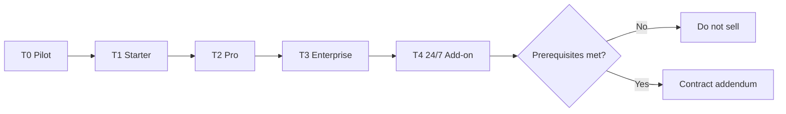

# 24/7 support tier plan — OS Kitchen

**Policy:** `support-tier-plan-v1`  
**Date:** 2026-06-02  
**Owner:** Founder + Customer Success + Finance  
**Scope:** Restaurant workspace support SLAs, channels, and **roadmap to 24/7** — not vendor marketplace ops  
**Status:** **Plan only** — **0 paid customers · founder on-call · no contracted 24/7 · pilot NO-GO**

This document defines **what support OS Kitchen offers today**, **what each subscription tier includes**, and **what must exist before we sell 24/7 or enterprise SLAs**. Use it in SOWs, `/pricing` footnotes, and RFP responses.

**Honesty rule:** Default pilot and Starter/Pro plans are **business-hours best-effort**. Do **not** quote 24/7 phone, P1 <15 min, or dedicated CSM until **Tier 4** prerequisites in § Roadmap are met and signed in an addendum.

**Related:** [`customer-success-playbook.md`](./customer-success-playbook.md) · [`incident-response-process.md`](./incident-response-process.md) · [`enterprise-mvp-spec.md`](./enterprise-mvp-spec.md) · [`bus-factor-mitigation.md`](./bus-factor-mitigation.md) · [`sales-limitation-sheet.md`](./sales-limitation-sheet.md) · [`sales-safe-claims-registry.md`](./sales-safe-claims-registry.md)

---

## Current reality (June 2026)

| Fact | Implication |
|------|-------------|
| Engineering headcount **1** | On-call = founder |
| **0 signed LOIs / 0 paid tenants** | All SLAs are **targets**, not proven track record |
| [`pilot-gono-go-summary.json`](../artifacts/pilot-gono-go-summary.json) **NO-GO** | No external SLA marketing until GO |
| Sentry optional | Sev-1 detection may lag — see [`observability-setup.md`](./observability-setup.md) |
| Business hours assumed **Mon–Fri 9–6 ET** | Off-hours = best effort only unless Tier 4 contracted |

**Safe headline:** “Business-hours support with documented incident process — 24/7 available as a future Enterprise add-on when staffed.”

**Forbidden today:** “24/7 support included,” “Always-on NOC,” “15-minute P1 guaranteed overnight,” “Dedicated CSM on Starter.”

---

## Support tier matrix (restaurant workspace)

| Tier | Plan / audience | Channels | Coverage window | SEV-1 ack | SEV-2 ack | Included in base price |
|:----:|-----------------|----------|-----------------|:---------:|:---------:|:----------------------:|
| **T0** | Design partner / pilot | Email, in-app `/dashboard/support` | Business hours | 15 min *target* | 4h *target* | Pilot SOW (no fee) |
| **T1** | **STARTER** | Email, in-app, KB | Business hours | 2h *target* | 1 business day | Yes |
| **T2** | **PRO / TEAM** | T1 + priority queue tag | Business hours + **Sat 10–2 ET** (planned) | 1h *target* | 4h *target* | Yes |
| **T3** | **ENTERPRISE** (contract) | T2 + scheduled sync slot | Business hours extended **7–7 ET** (planned) | 30 min *target* | 2h *target* | Custom SOW |
| **T4** | **Enterprise Plus — 24/7** | T3 + phone + PagerDuty | **24/7/365** | **15 min** | **1h** | **Add-on — not sold yet** |

**Legend:** *Target* = internal goal pre-first-customer; becomes contractual only when listed in signed SOW.

---

## Severity alignment

Support response targets map to [`incident-response-process.md`](./incident-response-process.md):

| Severity | Customer-visible symptom | T0–T1 response | T2 response | T3 response | T4 (24/7) response |
|----------|-------------------------|----------------|----------------|-------------|-------------------|
| **SEV-1** | Outage, data concern, payment failure | Best effort off-hours | 1h business | 30 min business | **15 min any time** |
| **SEV-2** | Checkout blocked, cron stopped | 1 business day | 4h | 2h | **1h any time** |
| **SEV-3** | Degraded UX, BETA integration flake | 2 business days | 1 business day | 1 business day | 1 business day |
| **SEV-4** | Cosmetic | Backlog | Backlog | Backlog | Backlog |

**CS rule:** Any cross-tenant or data question → treat as **SEV-1** and escalate per incident process — regardless of tier.

---

## Channels

| Channel | Surface | Tiers | Notes |
|---------|---------|-------|-------|
| **Email** | support@ / founder alias | T0–T4 | Primary line; ticket ID in subject |
| **In-app** | `/dashboard/support` | T0–T4 | Same SLA as email |
| **Knowledge base** | `/dashboard/support/kb` | T0–T4 | Self-serve first — reduces ticket load |
| **Weekly sync** | Calendar (pilot) | T0, T3 | Required for design partners |
| **Slack Connect** | Shared channel | T3+ *optional* | Not default — bandwidth risk |
| **Phone / SMS** | On-call roster | **T4 only** | Requires PagerDuty + backup engineer |
| **Status page** | Public `/status` (future) | All | Planned post-first-customer |

---

## Marketplace vendor support (separate track)

Vendor-facing support is **lighter** and tied to [`marketplace-pricing-strategy.md`](./marketplace-pricing-strategy.md) vendor tiers — not restaurant workspace SLAs.

| Vendor tier | Support | Response target |
|-------------|---------|-----------------|
| **FREE** | Email + docs | 2 business days |
| **GROWTH** | Priority email | 1 business day |
| **ENTERPRISE** | Priority + onboarding call | 4h business (target) |

Vendor payout / Stripe Connect issues escalate to platform engineering — same incident process.

---

## Pricing & packaging (restaurant)

| Item | Status | Notes |
|------|--------|-------|
| T0–T2 support | **Included** in SaaS subscription | No line-item fee |
| T3 Enterprise support | **Custom** in Enterprise SOW | References this doc + limitation sheet |
| T4 24/7 add-on | **Not priced publicly** | Model: +$X/mo/location or % of ACV — Finance to set at hire #2 |
| Professional services | **Separate SOW** | Implementation, training — not support SLA |

Do **not** list T4 pricing on `/pricing` until operational readiness checklist (§ Roadmap) is complete.

---

## Roadmap — when 24/7 (Tier 4) becomes sellable

All items required before **any** customer signs a 24/7 SLA:

| # | Prerequisite | Owner | Status |
|---|--------------|-------|--------|
| 1 | **Engineering headcount ≥ 2** with documented on-call rotation | Founder | ☐ |
| 2 | PagerDuty (or equivalent) integrated with Sentry + `/api/health` | Eng | ☐ |
| 3 | Public status page + subscriber notifications | Eng + CS | ☐ |
| 4 | Runbook coverage for top 10 Sev-1 scenarios tested quarterly | Eng | ☐ |
| 5 | Backup on-call who can deploy + rollback without founder | Eng | ☐ |
| 6 | CS coverage for customer comms within 30 min of Sev-1 page | CS hire or contractor | ☐ |
| 7 | Legal review of SLA credits / remedies | Legal | ☐ |
| 8 | 30-day **internal** fire drill (simulated Sev-1 off-hours) | Founder | ☐ |
| 9 | [`bus-factor-mitigation.md`](./bus-factor-mitigation.md) bus factor **≥ 2** for prod ops | Founder | ☐ |
| 10 | At least **1 paid Enterprise** customer on T3 without SLA breach | CS | ☐ |

**Earliest honest target:** Q1 2027 — **only if** hire #2 closes in H2 2026.

Until then, Enterprise MVP contracts reference **T3 business-hours** only — see [`enterprise-mvp-spec.md`](./enterprise-mvp-spec.md).

---

## Sales & marketing guardrails

| Question | Approved answer |
|----------|-----------------|
| “Do you offer 24/7 support?” | “Not by default. Design partners get business-hours support. Enterprise can discuss extended hours; true 24/7 is a future add-on when we're staffed for it.” |
| “What's your P1 SLA?” | “During business hours we target rapid ack for outages; exact numbers are in your SOW — we don't guarantee overnight P1 on Starter/Pro.” |
| “Is Slack included?” | “Optional for Enterprise pilots — not on Starter.” |
| “Same support for marketplace vendors?” | “Vendor tiers have separate response targets — see vendor agreement.” |

Run all public copy through `verify-claims` and [`sales-safe-claims-registry.md`](./sales-safe-claims-registry.md).

---

## Operational metrics (internal)

Track monthly once first customer is live:

| Metric | Target (T1–T2) | Target (T3) | Target (T4 — future) |
|--------|------------------|-------------|----------------------|
| First response time (median) | < 8h business | < 2h business | < 15 min |
| Sev-1 ack compliance | > 90% business | > 95% business | > 99% 24/7 |
| Ticket backlog age | < 5 days | < 3 days | < 1 day P2+ |
| CSAT (post-close survey) | Baseline | > 4.0/5 | > 4.2/5 |
| Escalations to founder | Decreasing | < 20% tickets | < 10% tickets |

**June 2026 baseline:** No tickets — metrics **SKIPPED**.

---

## Risks & mitigations

| Risk | Mitigation |
|------|------------|
| Sales promises 24/7 pre-staffing | This doc + limitation sheet + forbidden claims CI |
| Founder burnout on Sev-1 | Hire #2 + rotation before T4 sales |
| Vendor vs restaurant SLA confusion | Separate § Marketplace vendor support |
| Off-hours customer emergency | Document “best effort” in pilot SOW; no credit language |
| RFP demands 24/7 day-one | Disqualify or price T4 as **paid + 6-month lead time** |

---

## Related documents

| Doc | Use |
|-----|-----|
| [`customer-success-playbook.md`](./customer-success-playbook.md) | Pilot channels & CS escalation |
| [`incident-response-process.md`](./incident-response-process.md) | Sev definitions & lifecycle |
| [`integration-escalation-matrix.md`](./integration-escalation-matrix.md) | BETA integration incidents |
| [`enterprise-mvp-spec.md`](./enterprise-mvp-spec.md) | Enterprise support pillar |
| [`bus-factor-mitigation.md`](./bus-factor-mitigation.md) | On-call backup plan |
| [`hardware-partner-program.md`](./hardware-partner-program.md) | Device validation — not support SLA |
| [`sales-limitation-sheet.md`](./sales-limitation-sheet.md) | Prospect-facing caps |

---

## Revision history

| Version | Date | Change |
|---------|------|--------|
| `support-tier-plan-v1` | 2026-06-02 | Initial tier plan — Task 114 |

**Next action:** Keep T0–T3 language in pilot SOW template · do not sell T4 until § Roadmap complete · revisit pricing at hire #2.
