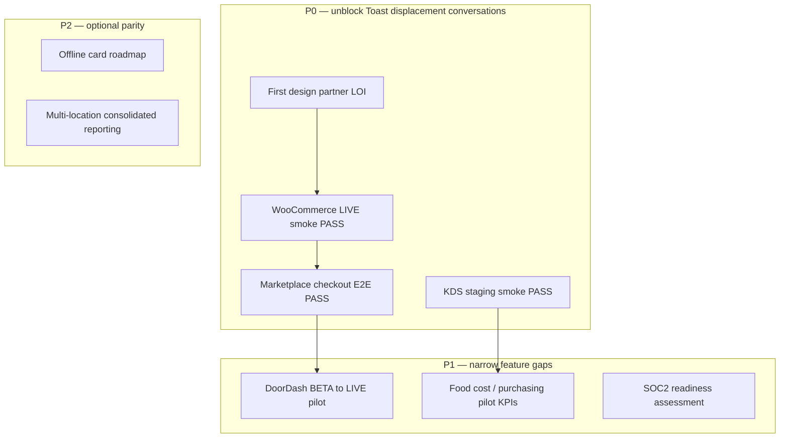

# Toast gap analysis — OS Kitchen

**Policy:** `toast-gap-analysis-v1`  
**Date:** 2026-06-02  
**Owner:** PM + Sales + Engineering  
**Scope:** Structured gap inventory vs **Toast POS** — not Square/Lightspeed (see [`competitor-comparison-honest.md`](./competitor-comparison-honest.md))  
**Sources:** [`artifacts/competitor-feature-tracker.json`](../artifacts/competitor-feature-tracker.json) · [`compare/toast`](../lib/marketing/compare-content.ts) · [`beta-to-live-roadmap.md`](./beta-to-live-roadmap.md) · [`sales-safe-claims-registry.md`](./sales-safe-claims-registry.md)

This doc is the **Toast-specific** diligence artifact for sales, product, and Series A narrative. It separates **Toast advantages we must acknowledge**, **qualified OS Kitchen wedges**, and **closed-loop mitigation** with owners.

**Honesty rule:** Toast has thousands of reference customers and mature hardware — OS Kitchen has **0 signed LOI** and **0 LIVE integrations** as of June 2026. Never imply parity.

---

## Executive summary

| Dimension | Toast | OS Kitchen | Gap severity |
|-----------|-------|------------|:------------:|
| Reference customers | Thousands | **0 signed LOI** | **Critical** |
| Payment hardware | Toast Go, terminals, certified stack | Browser/tablet + Stripe Connect | **Critical** |
| Field install & support | Mature local network | Email/chat tiers | **High** |
| LIVE delivery ingest | Mature partner marketplace | DoorDash/Uber/Grubhub **BETA** | **High** |
| KDS at rush hour | Certified devices + ops proof | Shipped — **not rush-hour certified** | **High** |
| AI brand (Toast IQ / xtraCHEF) | Mature GTM narrative | 7 modules shipped — **pilot unproven** | **Medium** |
| B2B supply buying | xtraCHEF + app ecosystem | HoReCa marketplace **BETA scaffold** | **Medium** (different angle) |
| Production / commissary depth | Limited native | **Broad** — order hub → packing → routes | **Low gap** (our wedge) |
| Enterprise SSO / SOC2 | Mature | Roadmap / pilot wiring | **Critical** (enterprise deals) |

**Safe one-liner:** Toast wins **in-restaurant hardware, payments scale, and install base**. OS Kitchen competes on **unified order-to-fulfillment software**, **B2B buyer marketplace vision**, and **seven AI modules in one codebase** — all **pre-customer** until pilot proof lands.

---

## When Toast wins (do not fight here)

| Scenario | Why Toast | OS Kitchen response |
|----------|-----------|---------------------|
| Full-service restaurant wants bundled terminals + payments | Certified hardware, Toast Capital, field reps | Disqualify or defer — software-first story only |
| Operator needs Day-1 offline card capture | Toast/Square terminal offline modes | Honest: cash queue + external terminal — no offline card |
| Buyer asks "who else uses this?" | Toast reference logos | No named logos — offer design partner LOI path |
| Enterprise RFP requires SOC2 + SSO day one | Toast mature compliance | Roadmap only — see [`enterprise-mvp-spec.md`](./enterprise-mvp-spec.md) (Task 103) |
| Rush-hour KDS SLA in contract | Toast KDS at scale | Do not sign rush-hour SLA — see KDS qualified one-pager |

**Disqualify early** when hardware bundle + field install is non-negotiable. Saves pilot churn.

---

## When OS Kitchen can win (qualified)

| Scenario | Wedge | Required proof |
|----------|-------|----------------|
| Meal prep, ghost kitchen, commissary | Production board, packing, routes, multi-brand Today hub | Pilot KPI on order accuracy + prep throughput |
| Hybrid commerce (Shopify/Woo + kitchen) | Channel ingest + production truth (BETA → LIVE) | WooCommerce LIVE smoke PASS |
| B2B procurement (supplies, packaging) | Dashboard marketplace catalog → PO | Vendor seeding + checkout E2E PASS |
| Operator allergic to hardware lock-in | Stripe Connect BYO device | Demo `/compare/toast` matrix |
| AI-curious owner wants one briefing screen | Today Command Center + Restaurant Brain | Show deterministic briefing — label illustrative stats |

---

## Gap matrix — by category

### 1. Market proof & brand

| Gap | Toast | OS Kitchen | Mitigation | Priority | Target |
|-----|-------|------------|------------|:--------:|--------|
| Reference customers | Thousands | 0 LOI | Design partner LOI + pilot checklist | P0 | Q3 2026 |
| Case studies | Published | None | [`case-study-template.md`](./case-study-template.md) after first pilot | P0 | Post-LOI |
| Brand trust | National POS leader | Unknown | Honest compare page + founding story | P1 | Ongoing |
| Toast Capital | Lending product | Referral hub only — not originator | Keep capital disclaimers | — | N/A |

### 2. Hardware & payments

| Gap | Toast | OS Kitchen | Mitigation | Priority | Target |
|-----|-------|------------|------------|:--------:|--------|
| Proprietary terminals | Toast Go, handheld, KDS devices | None — BYO tablet/browser | Document software-first in `/compare/toast` | — | Acknowledge |
| Payment processing scale | Processor-at-scale narrative | Stripe Connect | Never claim processor-of-record parity | — | Acknowledge |
| Offline card | Supported on hardware | Not supported | [`offline-pos-plan.md`](./offline-pos-plan.md) (Task 115) | P2 | H2 2026 |
| Tip pooling / structured tipping | Mature | Partial BETA | Labor module maturity | P2 | Q4 2026 |

### 3. In-restaurant operations

| Gap | Toast | OS Kitchen | Mitigation | Priority | Target |
|-----|-------|------------|------------|:--------:|--------|
| Floor plan / table service | Mature | BETA editor — not realtime occupancy | Partial caveat in sales sheet | P1 | — |
| KDS rush hour | Field-proven | Shipped — not certified | KDS staging smoke + honesty banner | P0 | Staging PASS |
| Handheld native app | Toast handheld | PWA BETA | Label BETA on integration cards | P1 | — |
| Bill splitting | Mature | **YES** — only sales-safe yes | Use as narrow win in demos | — | Leverage |

### 4. Delivery & channels

| Gap | Toast | OS Kitchen | Mitigation | Priority | Target |
|-----|-------|------------|------------|:--------:|--------|
| DoorDash LIVE | Customer-ready | BETA | [`doordash-live-integration-plan.md`](./doordash-live-integration-plan.md) | P0 | Q3–Q4 2026 |
| Uber Eats / Grubhub LIVE | Mature | BETA partner-gated | Beta-to-live queue after Woo + DD | P1 | 2027 |
| Uber Direct courier | Offered in ecosystem | PLACEHOLDER | [`uber-direct-implementation-plan.md`](./uber-direct-implementation-plan.md) | P2 | Roadmap |
| WooCommerce / Shopify LIVE | Via partners | BETA — smokes SKIPPED | Ops vault + P0 staging smokes | **P0** | Q3 2026 |

### 5. AI & analytics

| Gap | Toast | OS Kitchen | Mitigation | Priority | Target |
|-----|-------|------------|------------|:--------:|--------|
| Toast IQ / xtraCHEF brand | Market-facing AI narrative | 7 modules code-complete | [`ai-moats-honest-positioning.md`](./ai-moats-honest-positioning.md) | P1 | Pilot metrics |
| Food cost / inventory AI | xtraCHEF mature | Food Cost AI + Purchasing BETA | Pilot on recipe accuracy | P1 | Design partner |
| Benchmark network | Toast analytics scale | Benchmark BETA — needs cohort N>1 | Contribute data after pilots | P2 | 2027 |
| Kitchen vision AI | Limited | Camera-ready + synthetic default | [`kitchen-camera-honest-positioning.md`](./kitchen-camera-honest-positioning.md) | — | Honest preview |

### 6. B2B supply & marketplace

| Gap | Toast | OS Kitchen | Mitigation | Priority | Target |
|-----|-------|------------|------------|:--------:|--------|
| xtraCHEF / purchasing integrations | Established | AI Purchasing BETA | Vendor seeding + PO automation plan | P1 | Q3 2026 |
| HoReCa B2B marketplace (buyer) | Third-party apps | Native scaffold shipped | Migration + checkout E2E | P0 | Pilot tenant |
| Vendor payouts | Partner ecosystem | Stripe Connect test mode | [`stripe-connect-vendor-test-plan.md`](./stripe-connect-vendor-test-plan.md) | P1 | Staging |

### 7. Enterprise & compliance

| Gap | Toast | OS Kitchen | Mitigation | Priority | Target |
|-----|-------|------------|------------|:--------:|--------|
| SOC2 Type II | Mature | Not certified | [`soc2-readiness-assessment.md`](./soc2-readiness-assessment.md) (Task 95) | P1 | Assessment |
| Enterprise SSO / SCIM | Production | Pilot foundation | SSO IdP smoke plan | P1 | Staging PASS |
| Uptime SLA | Contracted | Unproven | LIVE integration 24h gate | P0 | Per LIVE DoD |
| Multi-location at scale | Proven | PlanGate partial | Multi-location reporting plan | P2 | H2 2026 |

---

## Feature-level gap table (Toast parity lens)

From `competitorComparison.featureParitySelected` + sales-safe ledger — **Toast typical = mature unless noted**.

| Area | Toast (typical) | OS Kitchen | Sales-safe | Close gap by |
|------|-----------------|------------|:----------:|--------------|
| KDS bump/recall | Mature | Shipped, not rush certified | Partial | KDS load test + staging smoke |
| Delivery ingest | LIVE | BETA wiring | Partial | DoorDash LIVE plan |
| Offline mode | Stronger | Cash queue only | Partial | Offline POS plan |
| Multi-location | Mature | PlanGate | Partial | Executive multi-location dashboard |
| Bill splitting | Mature | **Complete** | **Yes** | Demo in POS flow |
| AI scheduling | Varies | Heuristic planner | Partial | Pilot labor % accuracy |
| Marketplace buying | xtraCHEF / apps | BETA scaffold | Partial | Marketplace checkout E2E |
| Enterprise SSO | Production | Pilot | No | Enterprise MVP spec |

---

## Compare-page alignment

Public matrix: [`/compare/toast`](../lib/marketing/compare-content.ts) · SEO: [`seo-audit.md`](./seo-audit.md)

| Row | OS Kitchen claim | Toast reality check | Honest? |
|-----|------------------|---------------------|:-------:|
| Payment hardware | Stripe Connect BYO | Toast native terminals | ✓ |
| KDS | Native + production board | Toast native KDS | ✓ with rush caveat |
| Production / commissary | ✅ | ❌ Toast weak | ✓ — primary wedge |
| Multi-brand / ghost | ✅ Command center | Limited | ✓ — ICP specific |
| Online storefront | ✅ Theme builder | Add-ons | ✓ — verify Toast bundle |

**Action:** Keep disclaimer visible — "Toast is a strong fit for full-service restaurants that want bundled hardware."

---

## Mitigation roadmap (Toast-specific)

| Quarter | Milestone | Closes Toast gap |
|---------|-----------|------------------|
| **Q3 2026** | 1 LOI + Woo LIVE + marketplace pilot | "No customers" + channel proof |
| **Q3–Q4 2026** | DoorDash reference tenant LIVE | Delivery ops vs Toast marketplace |
| **Q4 2026** | QuickBooks LIVE + pilot case study draft | Back-office parity narrative |
| **2027** | 3+ LIVE integrations + SOC2 path | Enterprise RFP eligibility |

Full integration queue: [`beta-to-live-roadmap.md`](./beta-to-live-roadmap.md).

---

## Sales talk tracks

### Discovery (when Toast is incumbent)

> "Toast is excellent when you want certified hardware and a payments-first rollout. We're not asking you to rip out terminals on day one — we're asking whether your **production, packing, and multi-channel orders** live in one system or three. If commissary or ghost kitchen complexity is the pain, that's our wedge."

### When prospect cites Toast IQ

> "Toast IQ is a mature brand story. We ship **seven AI modules in one OS** — briefing, food cost, purchasing, digital twin, and more — but we're honest: they're **engineering-complete, market-unproven**. We'll show Integration Health and BETA badges so you see what's preview vs live."

### When prospect needs hardware

> "We won't out-Toast Toast on hardware. We're **software-first**: browser POS, Stripe Connect, your tablets. If proprietary terminals are mandatory, Toast may be the better fit today."

**Forbidden:** "We beat Toast on everything" · "Toast-class rush hour" · "Production-certified DoorDash"

Run `npm run verify-claims` before updating compare or deck copy.

---

## Verification checklist

Before using this doc in investor or enterprise materials:

- [ ] `artifacts/competitor-feature-tracker.json` → `headToHead.toast` unchanged or updated with evidence
- [ ] `/compare/toast` disclaimer present and Uber Direct not sold as live
- [ ] `salesSafeFeatures` — only bill splitting at **yes**; delivery rows **partial**
- [ ] Pilot NO-GO artifacts referenced when claiming staging readiness
- [ ] No customer count without signed LOI or case study

---

## Related docs

| Doc | Use |
|-----|-----|
| [`competitor-comparison-honest.md`](./competitor-comparison-honest.md) | Multi-competitor summary |
| [`sales-limitation-sheet.md`](./sales-limitation-sheet.md) | Rep quick reference |
| [`beta-to-live-roadmap.md`](./beta-to-live-roadmap.md) | Integration promotion order |
| [`ai-moats-honest-positioning.md`](./ai-moats-honest-positioning.md) | vs Toast IQ |
| [`loi-design-partner-template.md`](./loi-design-partner-template.md) | Close reference-customer gap |
| [`series-a-narrative.md`](./series-a-narrative.md) | Investor framing (Task 94) |

---

*Generated as Task 93 — P2 PM. Next: [`series-a-narrative.md`](./series-a-narrative.md) (Task 94).*
