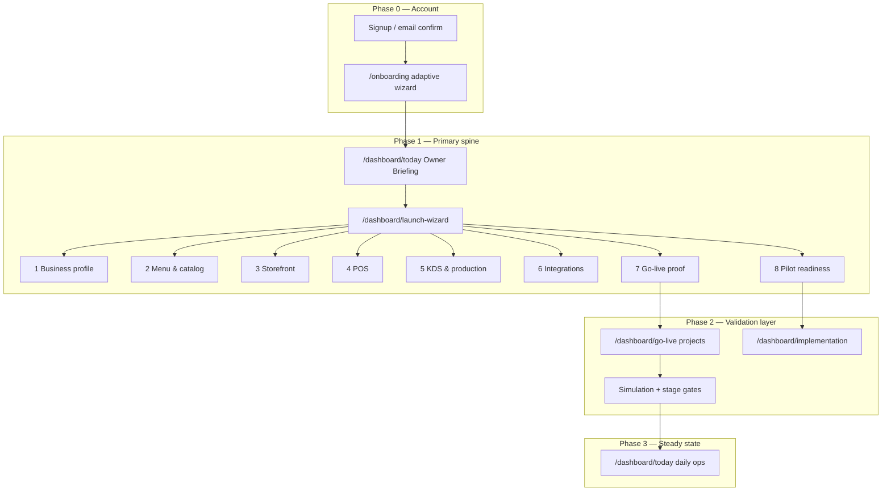

# Unified Onboarding IA

**Status:** IA specification — Launch Wizard is primary spine; Go-live is validation layer  
**Audience:** Product, UX, CS, engineering  
**Problem:** Three parallel onboarding surfaces confuse operators and inflate TTV  
**Parent:** [`ONBOARDING_ARCHITECTURE.md`](./ONBOARDING_ARCHITECTURE.md) · [`commercial-pilot-runbook.md`](./commercial-pilot-runbook.md)

---

## Problem statement

Operators today encounter **three separate onboarding paths**:

| Surface | Route | Purpose today |
|---------|-------|---------------|
| **Signup onboarding** | `/onboarding` | Adaptive first-run wizard (business mode, channels, modules) |
| **Launch Wizard** | `/dashboard/launch-wizard` | 8-step pilot setup with honest blockers |
| **Go-live hub** | `/dashboard/go-live` | Launch projects, stages, simulation, legacy checklist |

**Symptoms (audit June 1):**

- Owners land on Go-live and get redirected to Launch Wizard — but nav still shows both entries
- Go-live step 7 in Launch Wizard links back to Go-live — circular mental model
- Signup onboarding completes before dashboard; Launch Wizard restarts overlapping steps (menu, storefront, integrations)
- CS scripts reference different entry URLs depending on doc age

**Goal:** One **recommended spine** with clear secondary paths — not three competing “start here” flows.

---

## Unified information architecture

### Canonical roles

| Layer | Canonical entry | Secondary / advanced |
|-------|-----------------|-------------------|
| **First login** | `/onboarding` → `/dashboard/today` | Resume banner if incomplete |
| **Pilot setup** | **`/dashboard/launch-wizard`** | Compact mode `?mode=compact` |
| **Launch validation** | Go-live **project** (from wizard step 7) | Go-live hub `?mode=advanced` |
| **Commercial gates** | Implementation hub (wizard step 8) | GO/NO-GO artifacts |

**Rule:** Nav, emails, and CS scripts should say **“Open Launch Wizard”** — not “Go to Go-live” — unless the operator is in validation/simulation phase.

---

## Launch Wizard — primary spine (8 steps)

Source: `lib/launch-wizard/launch-wizard-era19-policy.ts`

| # | Step ID | Title | Workflow route | Owner |
|---|---------|-------|----------------|-------|
| 1 | `business-profile` | Business profile | `/dashboard/settings` | Owner |
| 2 | `menu-catalog` | Menu & catalog | `/dashboard/menus/new` | Owner |
| 3 | `storefront` | Storefront | `/dashboard/storefront` | Owner |
| 4 | `pos` | POS | `/dashboard/pos/terminal` | Manager |
| 5 | `kds-production` | KDS & production | `/dashboard/production` | Kitchen |
| 6 | `integrations` | Integrations | `/dashboard/integration-health` | Owner |
| 7 | `go-live-proof` | Go-live proof | `/dashboard/go-live` | Owner |
| 8 | `pilot-readiness` | Pilot readiness | `/dashboard/implementation` | Owner |

Each step shows **honest status**: complete · in progress · blocked · not started — with P0/vault blockers surfaced, not hidden.

---

## Go-live hub — validation layer (not duplicate onboarding)

**When to use Go-live directly:**

- Multi-location launch project with stage progression (13 stages: Discovery → Post-launch monitoring)
- Simulation runs and incident logging
- Advanced operators who need project history beyond wizard linear path

**When NOT to use as first entry:**

- New pilot operator on day 1 — use Launch Wizard
- Owner without `?mode=advanced` — auto-redirect to Launch Wizard (see `app/dashboard/go-live/page.tsx`)

**Mapping wizard → go-live:**

| Launch Wizard step | Go-live equivalent |
|--------------------|-------------------|
| Steps 1–6 | Pre-work for launch project stages 1–8 |
| Step 7 `go-live-proof` | Open or create go-live project; run simulation |
| Step 8 `pilot-readiness` | Implementation pilot readiness + commercial GO/NO-GO |

---

## Signup onboarding — pre-dashboard only

**Route:** `/onboarding` (`components/onboarding/onboarding-wizard.tsx`)

| Concern | Signup onboarding | Launch Wizard |
|---------|-------------------|---------------|
| When | Before first dashboard | After workspace exists |
| Data | `KitchenSettings.onboardingAdaptiveJson` | Workspace activation signals + artifacts |
| Scope | Business mode, channel intent, module prefs | Operational proof (POS used, KDS touched, channel connected) |
| Skip | Allowed per step | Blocked steps show reason (vault, GO/NO-GO) |

**IA rule:** Signup onboarding **does not replace** Launch Wizard steps — it **narrows** them (e.g. meal-prep mode hides irrelevant modules). After signup, Today briefing should show **“Continue Launch Wizard”** as primary CTA.

---

## Navigation IA (target state)

| Nav item | Label | Audience | Notes |
|----------|-------|----------|-------|
| `/dashboard/today` | Today | All | Briefing + wizard progress strip |
| `/dashboard/launch-wizard` | **Launch** | Owner | **Primary onboarding entry** |
| `/dashboard/go-live` | Go-live | Owner / PM | Secondary; badge “Advanced” or collapsed under Launch |
| `/dashboard/implementation` | Implementation | Owner | Step 8 + commercial gates |
| `/onboarding` | — | New users only | Not in sidebar post-complete |

**Current nav (both visible):** `final-navigation-groups.ts` lists Launch Wizard and Go-live as siblings — **merge UX is doc-first**; hide Go-live from default sidebar for Owner role until step 7 unlocked (future code change).

**Existing bridge:** `LaunchWizardPrimaryEntryBanner` on Go-live hub — keep and extend to Implementation hub.

---

## Operator journeys

### Journey A — Meal prep pilot (ICP)

1. Signup onboarding → select meal prep mode  
2. Today briefing → Launch Wizard step 1  
3. Steps 1–3: profile, menu, storefront publish  
4. Step 4–5: POS sale + production board  
5. Step 6: Shopify or Woo connect (staging proof SKIPPED until vault)  
6. Step 7: Go-live project simulation  
7. Step 8: Pilot readiness + Week 1 checklist ([`pilot-week1-checklist.md`](./pilot-week1-checklist.md))

### Journey B — Counter service only (no ecommerce)

1. Signup → skip storefront-heavy steps in adaptive flow  
2. Launch Wizard: emphasize steps 1, 2, 4, 5  
3. Step 6 integrations: optional — mark N/A with honest label  
4. Step 7–8: reduced go-live project scope

### Journey C — Multi-location enterprise (post-pilot)

1. Launch Wizard for location 1  
2. Go-live hub **advanced mode** for stage-gated rollout  
3. Implementation hub for SSO / commercial gates when contract requires

---

## CS / training scripts

**Say:**

> “Start in **Launch Wizard** — it walks you through eight steps in order. Go-live projects open automatically when you reach launch validation.”

**Do not say:**

> “Use Go-live and Launch Wizard interchangeably.”  
> “Onboarding is finished after signup” (Launch Wizard may still be blocked on vault).

**Deep links:**

| Situation | URL |
|-----------|-----|
| Default pilot kickoff | `/dashboard/launch-wizard` |
| From Go-live redirect | `/dashboard/launch-wizard?from=go-live` |
| Advanced go-live only | `/dashboard/go-live?mode=advanced` |
| Resume signup | `/onboarding` |

---

## Engineering merge backlog (post-doc)

| Priority | Change | Owner |
|----------|--------|-------|
| P1 | Collapse Go-live nav for Owner until wizard step 7 | UX |
| P1 | Today briefing: single “Next wizard step” CTA | Product |
| P2 | Dedupe signup vs wizard step 1 signals | Eng |
| P2 | Go-live project auto-create when step 7 unlocked | Eng |
| P3 | Retire legacy 13-row checklist on Go-live hub for wizard users | Eng |

**No code in this action** — IA spec only. Track in implementation backlog as `unified-onboarding-ia-v1`.

---

## Success metrics

| Metric | Target | Measure |
|--------|--------|---------|
| TTV — signup to first order | ↓ vs baseline | Launch Wizard `pos` step complete timestamp |
| Wizard abandonment | < 20% at step 3 | Step funnel analytics |
| Support tickets “where do I start?” | ↓ 50% post-merge | Support tags |
| Dual-path confusion | 0 CS scripts citing Go-live first | Doc audit |

---

## Honesty guardrails

- Vault 0/11 → integration and pilot-readiness steps show **SKIPPED WITH REASON**
- Pilot NO-GO → step 8 blocked; do not show “Ready for production”
- Go-live simulation PASS ≠ live channel proof
- Signup complete ≠ launch complete

---

## References

- Launch Wizard policy: `lib/launch-wizard/launch-wizard-era19-policy.ts`
- Go-live stages: `lib/go-live/launch-stages.ts`
- Go-live redirect: `app/dashboard/go-live/page.tsx` (Owner → Launch Wizard)
- Primary entry banner: `components/dashboard/launch-wizard-primary-entry-banner.tsx`
- Signup architecture: [`ONBOARDING_ARCHITECTURE.md`](./ONBOARDING_ARCHITECTURE.md)
- Pilot Week 1: [`pilot-week1-checklist.md`](./pilot-week1-checklist.md)
