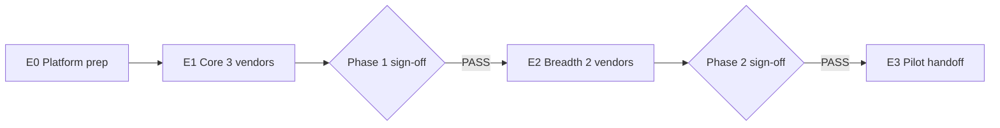

# Vendor seeding execution plan — OS Kitchen

**Policy:** `vendor-seeding-execution-v1`  
**Date:** 2026-06-02  
**Owner:** PM + Ops + Engineering  
**Status:** **Not started** — marketplace catalog empty; pilot **NO-GO** · **0 signed LOI suppliers**  
**Strategy:** [`vendor-seeding-strategy.md`](./vendor-seeding-strategy.md) — roster, criteria, phases  
**Parent:** [`pilot-execution-checklist.md`](./pilot-execution-checklist.md) · [`stripe-connect-vendor-test-plan.md`](./stripe-connect-vendor-test-plan.md)

This document is the **operational runbook** for seeding the first **3–5 marketplace vendors** on staging. It turns the strategy into day-by-day commands, checklists, sign-offs, and smoke gates — not a sales claim of a live supplier network.

**Honesty rule:** Until Phase 1 sign-off PASS, say *“Pilot marketplace — limited design-partner suppliers in staging”* — never *“national vendor network.”*

---

## Execution overview

| Phase | Window | Outcome | Sign-off owner |
|-------|--------|---------|----------------|
| **E0 — Platform prep** | Day 0 | Categories + migration + env | DevOps |
| **E1 — Vendor 1–3** | Days 1–7 | 30+ ACTIVE SKUs · checkout E2E green | Eng + PM |
| **E2 — Vendor 4–5** | Days 8–14 | 50+ SKUs · 5 categories · first test PO | Ops + design partner |
| **E3 — Pilot handoff** | Week 3+ | Real LOI supplier replaces demo vendor | PM + Legal |



---

## E0 — Platform prep (Day 0)

**Goal:** Staging DB ready for vendor rows and catalog browse.

### Checklist

| # | Step | Command / path | Owner | Done |
|---|------|----------------|-------|:----:|
| E0.1 | Marketplace migration applied | `npx prisma migrate deploy` · `prisma/migrations/20260602133000_marketplace_core/` | DevOps | ☐ |
| E0.2 | Seed 8 HoReCa categories | `npm run db:seed:marketplace-categories` | Dev | ☐ |
| E0.3 | Verify category picker | `/vendor/products/new` shows 8 parents | QA | ☐ |
| E0.4 | Staging env checklist | [`staging-environment-checklist.md`](./staging-environment-checklist.md) Tier 1 | DevOps | ☐ |
| E0.5 | Stripe test keys + Connect flag | `MARKETPLACE_VENDOR_STRIPE_CONNECT=1` · `sk_test_…` | DevOps | ☐ |
| E0.6 | Buyer + vendor test workspaces | 2 workspaces: buyer ops + supplier side | Ops | ☐ |
| E0.7 | Record baseline | Note vendor count = 0, SKU count = 0 in execution log | PM | ☐ |

### E0 verification

```bash
# Category count (expect 8 parent + children)
npm run db:seed:marketplace-categories -- --dry-run 2>/dev/null || true

# Marketplace migration regression (if present)
npm test -- tests/unit/marketplace-migration-regression.test.ts

# Cross-tenant baseline
npm test -- e2e/cross-tenant-isolation.spec.ts
```

**E0 sign-off:** DevOps + Eng confirm migration + categories on staging URL recorded in [`pilot-execution-checklist.md`](./pilot-execution-checklist.md).

---

## E1 — Core three vendors (Days 1–7)

**Target vendors:** EcoPack Supplies · CleanPro HoReCa · ChefTools Direct (or regional equivalents per [`vendor-seeding-strategy.md`](./vendor-seeding-strategy.md)).

Repeat **Vendor onboarding sprint** below for each vendor (parallel allowed after E0 PASS).

### Vendor onboarding sprint (per vendor)

| Day | Action | Route / artifact | Owner | Exit |
|-----|--------|------------------|-------|------|
| D0 | Kickoff email + LOI / design-partner ack | [`design-partner-email-sequence.md`](./design-partner-email-sequence.md) | PM | Supplier committed |
| D0 | Create supplier workspace or invite | Admin / invite flow | Ops | Workspace id recorded |
| D1 | Vendor application submitted | `/vendor/register` | Supplier | `PENDING_REVIEW` |
| D1 | Upload compliance doc (≥1) | Application form | Supplier | Doc in verification queue |
| D2 | Platform approval | `/platform/marketplace/vendor-verification` | Ops | `APPROVED` |
| D2–D3 | Stripe Connect Express | `/vendor/finance` · L2 in Connect plan | Supplier + Dev | `stripeAccountId` set |
| D3–D5 | Upload 8–15 products | `/vendor/products/new` | Supplier | SKUs `ACTIVE` |
| D5 | Moderation pass | Platform product review (if enabled) | Ops | All target SKUs live |
| D6 | Buyer smoke | `/dashboard/marketplace/catalog` → cart → checkout | QA | PO created |
| D7 | Vendor PO confirm | `/vendor/orders` | Supplier | PO acknowledged |

### Connect gate (per vendor)

Follow [`stripe-connect-vendor-test-plan.md`](./stripe-connect-vendor-test-plan.md):

| Level | Check | Pass |
|-------|-------|:----:|
| L0 | `tests/unit/marketplace-stripe-connect.test.ts` | ☐ |
| L2 | Account Link completes; status not `disabled` | ☐ |
| L3 | Test checkout PaymentIntent succeeds | ☐ |

### E1 aggregate targets

| Metric | Target | Actual (fill at sign-off) |
|--------|:------:|---------------------------|
| Approved vendors | **3** | |
| ACTIVE SKUs | **≥ 30** | |
| Parent categories with ≥1 vendor | **≥ 3** | |
| `e2e/marketplace-checkout.spec.ts` | **PASS** | |
| `e2e/vendor-registration.spec.ts` | **PASS** (unskipped) | |

### E1 sign-off template

```text
Phase 1 vendor seeding — SIGN-OFF
Date: ___________
Staging URL: ___________
Vendors approved: ___________ (names)
ACTIVE SKU count: ___________
Checkout E2E: PASS / FAIL
Connect L3 (all 3): PASS / FAIL
Signed: PM ___________  Eng ___________  Ops ___________
```

**Block external sales demos** until E1 sign-off PASS — cite [`sales-limitation-sheet.md`](./sales-limitation-sheet.md).

---

## E2 — Breadth vendors (Days 8–14)

**Target vendors:** DryPantry Wholesale · UniformCo Workwear (or substitutes).

| # | Step | Detail |
|---|------|--------|
| E2.1 | Run same onboarding sprint | 8 SKUs minimum each |
| E2.2 | Category coverage audit | ≥ 5 parent categories have ≥1 vendor |
| E2.3 | Catalog filter smoke | Filter by Packaging, Cleaning, Uniforms — non-empty |
| E2.4 | First cross-vendor cart | Buyer PO with lines from 2 vendors (if supported) or 2 POs same session |
| E2.5 | Design-partner test PO | Real supplier confirms within 24h |
| E2.6 | Pilot metrics R1 prep | [`pilot-metrics-review-process.md`](./pilot-metrics-review-process.md) baseline |

### E2 aggregate targets

| Metric | Target |
|--------|:------:|
| Approved vendors | **5** |
| ACTIVE SKUs | **≥ 50** |
| First test PO (real ack) | **≥ 1** |
| Cross-tenant isolation E2E | **PASS** |

### E2 sign-off

PM records vendor names + SKU counts in pilot checklist. Eng attaches E2E run URLs / CI green screenshot.

---

## E3 — Pilot handoff (Week 3+)

| Step | Action | Owner |
|------|--------|-------|
| E3.1 | Replace or demote **KitchenOS Demo Supply Co.** | Ops — label staging-only |
| E3.2 | Onboard first **LOI-signed** supplier | PM + Legal — [`loi-design-partner-template.md`](./loi-design-partner-template.md) |
| E3.3 | Finance sign-off before live Connect | Founder — no `sk_live_` until DoD |
| E3.4 | Update sales-safe claims | Only name vendors with signed LOI — [`sales-safe-claims-registry.md`](./sales-safe-claims-registry.md) |
| E3.5 | Pilot kickoff | [`pilot-execution-checklist.md`](./pilot-execution-checklist.md) step 12+ |

**Production gate:** Marketplace checkout on prod requires E1+E2 staging PASS + migration deployment process + cross-tenant E2E on prod smoke.

---

## Demo vendor (staging only)

Use when design partners are delayed — **never** in production.

| Field | Value |
|-------|-------|
| Display name | KitchenOS Demo Supply Co. |
| Description footer | *Staging demo catalog — not a live supplier.* |
| Categories | Packaging + Cleaning |
| SKUs | 10 synthetic products with test pricing |
| Connect | Test mode only |
| Removal | Before E3 or any investor demo with “real network” narrative |

Create via same onboarding sprint; Ops marks row `demo=true` in internal tracker (spreadsheet — not yet in product UI).

---

## Daily standup tracker (PM)

Copy into execution log or pilot checklist during E1/E2:

| Date | Vendor | Stage | Blocker | Next action |
|------|--------|-------|---------|-------------|
| | EcoPack | Application / Connect / SKUs / PO | | |
| | CleanPro | | | |
| | ChefTools | | | |
| | DryPantry | | | |
| | UniformCo | | | |

**Escalation:** Connect stall > 3 days → [`integration-escalation-matrix.md`](./integration-escalation-matrix.md) L1 + Stripe support. Platform approval > 2 days → Ops priority queue.

---

## Smoke & regression matrix

Run after **each** vendor reaches ACTIVE SKUs:

| Test | Command | When |
|------|---------|------|
| Marketplace checkout E2E | `npx playwright test e2e/marketplace-checkout.spec.ts` | After vendor 1, 3, 5 |
| Vendor registration E2E | `npx playwright test e2e/vendor-registration.spec.ts` | After first APPROVED vendor |
| Cross-tenant isolation | `npx playwright test e2e/cross-tenant-isolation.spec.ts` | After any platform approval change |
| Connect unit | `npm test -- tests/unit/marketplace-stripe-connect.test.ts` | Before Connect onboarding |
| Migration regression | `npm test -- tests/unit/marketplace-migration-regression.test.ts` | After E0 |

---

## Rollback & failure modes

| Failure | Response |
|---------|----------|
| Vendor withdraws mid-seed | Activate backup from strategy roster; extend E1 by 3 days |
| Connect webhook misconfigured | Pause checkout demos; fix env per Connect plan L1 |
| Empty catalog in demo | Abort demo; run E0.2 category seed; check APPROVED + ACTIVE |
| Cross-tenant leak in QA | **Stop seeding** — incident process SEV-1 |
| Over-claiming supplier count in sales | Forbidden-claims CI + limitation sheet review |

---

## Roles & RACI (execution)

| Activity | PM | Ops | Dev | Design partner |
|----------|:--:|:---:|:---:|:--------------:|
| E0 platform prep | C | R | R | — |
| Vendor kickoff | A | R | I | A |
| Application + docs | C | R | I | A |
| Platform approval | I | R | I | C |
| Connect + checkout smoke | C | C | R | A |
| E1/E2 sign-off | A | R | R | C |
| E3 LOI production | A | C | C | A |

---

## Related documents

| Doc | Use |
|-----|-----|
| [`vendor-seeding-strategy.md`](./vendor-seeding-strategy.md) | Roster, criteria, phases |
| [`vendor-registration-flow-design.md`](./vendor-registration-flow-design.md) | UX + status machine |
| [`stripe-connect-vendor-test-plan.md`](./stripe-connect-vendor-test-plan.md) | Connect L0–L4 |
| [`marketplace-pricing-strategy.md`](./marketplace-pricing-strategy.md) | Fees + pilot pricing |
| [`bug-triage-process.md`](./bug-triage-process.md) | Marketplace bugs during seed |

---

## Revision history

| Version | Date | Change |
|---------|------|--------|
| `vendor-seeding-execution-v1` | 2026-06-02 | Initial execution runbook — Task 105 |

**Next action:** Complete E0 on staging → schedule EcoPack kickoff (Day 1).
