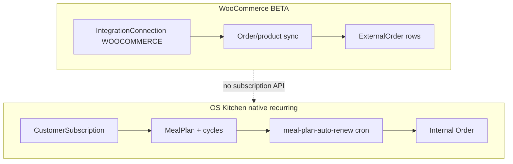

# WooCommerce Subscriptions RFC — Recurring Commerce Integration

**Status:** Draft for engineering review — **not implemented**  
**Audience:** Integrations, Storefront, CRM, Product, Commercial  
**Tracker:** `woocommerce-subscriptions-rfc` (competitor parity cycle 17)  
**Related:** [`shopify-markets-rfc.md`](./shopify-markets-rfc.md) · [`services/integrations/woocommerce.ts`](../services/integrations/woocommerce.ts) · [`docs/STOREFRONT_COMMERCE_EVOLUTION.md`](./STOREFRONT_COMMERCE_EVOLUTION.md) · [`prisma/schema.prisma`](../prisma/schema.prisma) (`CustomerSubscription`, `MealPlan`)

---

## Summary

**WooCommerce Subscriptions** (official extension) adds recurring billing, renewal orders, subscription statuses, and customer self-service on top of WooCommerce. KitchenOS already supports **native meal-prep subscriptions** (`CustomerSubscription`, `MealPlan` cycles, cron renewals) and a **WooCommerce BETA** channel for one-time orders/products — but there is **no bridge** between Woo subscription entities and KitchenOS production/CRM objects.

This RFC documents the gap, maps Woo subscription concepts to KitchenOS models, and recommends a **phased path**: read-only subscription import → renewal order ingest → optional native subscription push for merchants who use OS Kitchen as system of record.

**Recommendation:** Do **not** list “WooCommerce Subscriptions sync” in channel registry until Phase 1 ships. Meal-prep pilot ICP should use **native OS Kitchen meal plans** unless the merchant is Woo-primary with an existing subscription base.

---

## Problem

| Requirement | Merchant expectation | KitchenOS today |
|-------------|---------------------|-----------------|
| Weekly meal box billed automatically | Woo Subscriptions renewal orders | Native `MealPlan` + cron `meal-plan-auto-renew` |
| Subscription status in kitchen ops | Active / on-hold / cancelled visible | `CustomerSubscription.status` — **native only** |
| Renewal → production queue | Each renewal creates prep demand | Woo renewals import as generic orders (if at all) |
| Customer self-service pause/skip | Woo customer account | OS Kitchen storefront account (partial) |
| Single source of truth | Woo **or** KitchenOS, not both | Two parallel systems with no mapping |

**Competitive context:** Meal-prep operators on WordPress often run **WooCommerce + Subscriptions + Stripe**. KitchenOS wins on **kitchen ops** but loses deals when recurring billing must stay on Woo. Without this RFC we cannot honestly scope integration effort or set procurement expectations.

---

## WooCommerce Subscriptions — platform surface (reference)

The extension adds REST API endpoints (requires plugin + appropriate keys). Typical resources:

| Woo concept | Description | KitchenOS analog |
|-------------|-------------|------------------|
| Subscription | Recurring agreement (product, interval, status) | `CustomerSubscription` / `MealPlan` |
| Renewal order | Child order generated each cycle | `Order` with `creationSource` + cycle link |
| Billing interval | day / week / month + period | `CustomerSubscriptionFrequency` |
| Status | active, on-hold, pending-cancel, cancelled, expired | `CustomerSubscriptionStatus` |
| Line items | Product/variation + qty | Meal plan template items |
| Payment method | Tokenized via Woo gateways | Stripe on OS Kitchen storefront |

Representative REST paths (version/plugin dependent — verify at implementation):

- `GET /wp-json/wc/v3/subscriptions`
- `GET /wp-json/wc/v3/subscriptions/{id}`
- Webhooks: `subscription.created`, `subscription.updated`, `subscription.deleted`, renewal order hooks

**Honesty:** KitchenOS `services/integrations/woocommerce.ts` implements **products + orders only** — no subscription endpoints, no renewal metadata normalization.

---

## Current KitchenOS architecture



| Component | Path |
|-----------|------|
| Native subscription CRUD | `CustomerSubscription` model, customer dashboard |
| Meal plans | `/dashboard/meal-plans`, `services/forecast/forecast-service.ts` (MEAL_PLANS source) |
| Woo orders/products | `services/integrations/woocommerce.ts`, webhooks |
| Billing (platform SaaS) | Stripe `Subscription` model — **not** merchant customer subs |
| Storefront honesty | `docs/STOREFRONT_COMMERCE_EVOLUTION.md` — subscriptions **placeholder** |

---

## Options compared

### Option A — No Woo Subscriptions bridge (status quo)

Native meal plans only; Woo remains one-time order channel.

| Pros | Cons |
|------|------|
| Simplest; matches pilot docs | Woo-primary merchants duplicate subscription admin |
| Native cron already drives production | Renewal orders may not map to prep windows |

**Fit:** Greenfield meal-prep on OS Kitchen storefront.

---

### Option B — Read-only subscription discovery (recommended Phase 1)

Import Woo subscriptions as read-only `ExternalSubscription` staging rows (or extend `ExternalOrder` metadata); display in integration UI with link suggestions to `KitchenCustomer`.

| Dimension | Assessment |
|-----------|------------|
| Effort | **2–4 weeks** — REST list/detail, normalization, admin UI |
| Risk | Low — no billing writes |
| Sales honesty | “Subscription visibility — manual link to customer” |

Deliverables:

- `services/integrations/woocommerce-subscriptions-service.ts`
- Normalizer: Woo status → `CustomerSubscriptionStatus` mapping table
- Dashboard panel on `/dashboard/integrations/woocommerce`

---

### Option C — Renewal order ingest (recommended Phase 2)

Webhook + poll: each Woo renewal creates/updates internal `Order` + flags `sourceMetadataJson.wooSubscriptionId` for production/forecast.

| Dimension | Assessment |
|-----------|------------|
| Effort | **4–6 weeks** — idempotent renewal import, product mapping |
| Risk | Medium — duplicate orders if webhook retries |
| Depends on | Product mapping, order normalization pipeline |

Rules:

- Renewal orders **never** double-create if `externalOrderIdExt` matches
- Status changes (on-hold) propagate to native `CustomerSubscription` when linked

---

### Option D — Bidirectional subscription sync

Create/update/pause subscriptions in Woo from OS Kitchen meal plans (or vice versa).

| Dimension | Assessment |
|-----------|------------|
| Effort | **10–14 weeks** — payment tokens, proration, tax, dunning |
| Risk | **High** — billing correctness, PCI scope, plugin version matrix |
| Prerequisite | Phase 2 stable + legal/compliance review |

**Not recommended for pilot.** Treat as partner/services engagement for Woo-heavy enterprises.

---

## Recommended phased roadmap

| Phase | Scope | Exit criteria |
|-------|--------|---------------|
| **0 (this RFC)** | Document gap + mapping | RFC merged; tracker done |
| **1** | List/import subscriptions read-only | Merchant sees Woo subs in dashboard |
| **2** | Renewal order → internal Order ingest | Renewals appear in Order Hub + production |
| **3** | Link Woo sub ↔ `CustomerSubscription` | Single customer view with external id |
| **4** | Optional push (OS Kitchen → Woo) | Feature flag; explicit opt-in + SOW |

---

## Status & field mapping (Phase 1–2)

| Woo status | KitchenOS `CustomerSubscriptionStatus` | Notes |
|------------|----------------------------------------|-------|
| active | ACTIVE | Default |
| on-hold | PAUSED (new enum?) or ACTIVE + metadata | May need schema extension |
| pending-cancel | ACTIVE | Flag `cancelAtPeriodEnd` in JSON |
| cancelled | CANCELLED | |
| expired | CANCELLED | |

| Woo interval | `CustomerSubscriptionFrequency` |
|--------------|--------------------------------|
| week | WEEKLY |
| month | MONTHLY (if added) or map to custom |
| day | Custom / unsupported — log warning |

**Schema note:** Today `CustomerSubscriptionFrequency` is narrow (`WEEKLY`, etc. per enum). Phase 1 may store raw Woo interval in `notes` or `metadataJson` until enum expansion is justified.

---

## Proposed data model (Phase 1+)

**Option 1 — Staging table (preferred for Phase 2+):**

```prisma
model ExternalSubscription {
  id                    String   @id @default(uuid())
  userId                String
  connectionId          String
  provider              IntegrationProvider
  externalSubscriptionId String
  customerEmail         String?
  status                String
  billingInterval       String
  mappedCustomerId      String?
  mappedSubscriptionId  String?
  rawPayloadJson        Json
  lastSyncedAt          DateTime
}
```

**Option 2 — Connection settings JSON (Phase 1 minimal):**

```json
{
  "subscriptionsSync": {
    "enabled": false,
    "lastDiscoveryAt": null,
    "importedCount": 0
  }
}
```

Connection `settingsJson` extension mirrors inventory sync pattern (`lib/integrations/inventory-sync-settings.ts`).

---

## API & permissions

| Action | Permission |
|--------|------------|
| Discover subscriptions | `integrations.manage` |
| Link to customer | `customers.manage` |
| Import renewal order | `integrations.manage` + order ingest RBAC |

Required Woo capabilities:

- REST API read/write keys with subscription endpoints (plugin must be active)
- Webhook secret for subscription topics

---

## Testing strategy

| Layer | Coverage |
|-------|----------|
| Unit | Normalize Woo subscription fixtures → internal DTO |
| Integration | Mock Woo REST — renewal idempotency |
| E2E | Woo test store with simple weekly sub → dashboard smoke |
| Honesty | Registry capability `subscriptions_sync: preview` only after Phase 1 |

---

## Risks & open questions

1. **Plugin variants** — WooCommerce Subscriptions vs third-party (YITH, etc.) — scope official extension only in v1.
2. **Payment gateways** — Renewals depend on Woo gateway tokens; OS Kitchen must not store card data.
3. **Allotments / bundled meals** — Woo line items may not map 1:1 to meal plan templates; manual mapping UI required.
4. **Double billing** — Phase 4 push could create parallel Stripe charges; strict mutual-exclusion flag required.
5. **Native vs external** — `MealPlan` cron and Woo renewals must not both generate orders for same customer without guard.

**Open questions for product:**

- Is Woo-primary ICP large enough to prioritize Phase 2 before reservations/waitlist?
- Should linked Woo subscriptions **drive forecast** (`MEAL_PLANS` source) automatically?
- Migrate merchants off Woo Subscriptions to native OS Kitchen billing (Stripe Connect) as end-state?

---

## Conscious non-goals (pilot)

- Replacing Woo payment gateways or dunning emails
- Full subscription product builder in OS Kitchen admin (use native meal plans instead)
- Third-party subscription plugins beyond official WooCommerce Subscriptions
- Shopify Subscriptions (separate initiative; see Shopify Markets RFC for cross-sell timing)

---

## References

- [WooCommerce Subscriptions docs](https://woocommerce.com/document/subscriptions/)
- [WooCommerce REST API](https://woocommerce.github.io/woocommerce-rest-api-docs/)
- KitchenOS: `services/integrations/woocommerce.ts`
- KitchenOS: `services/cron/cron-ops-catalog.ts` (`meal-plan-auto-renew`)
- KitchenOS: `docs/STOREFRONT_RELEASE_READINESS_PLAN.md` — subscriptions not day-1

---

## Decision log

| Date | Decision |
|------|----------|
| 2026-05-31 | RFC accepted as Phase 0; implementation deferred; recommend Option B then C |
